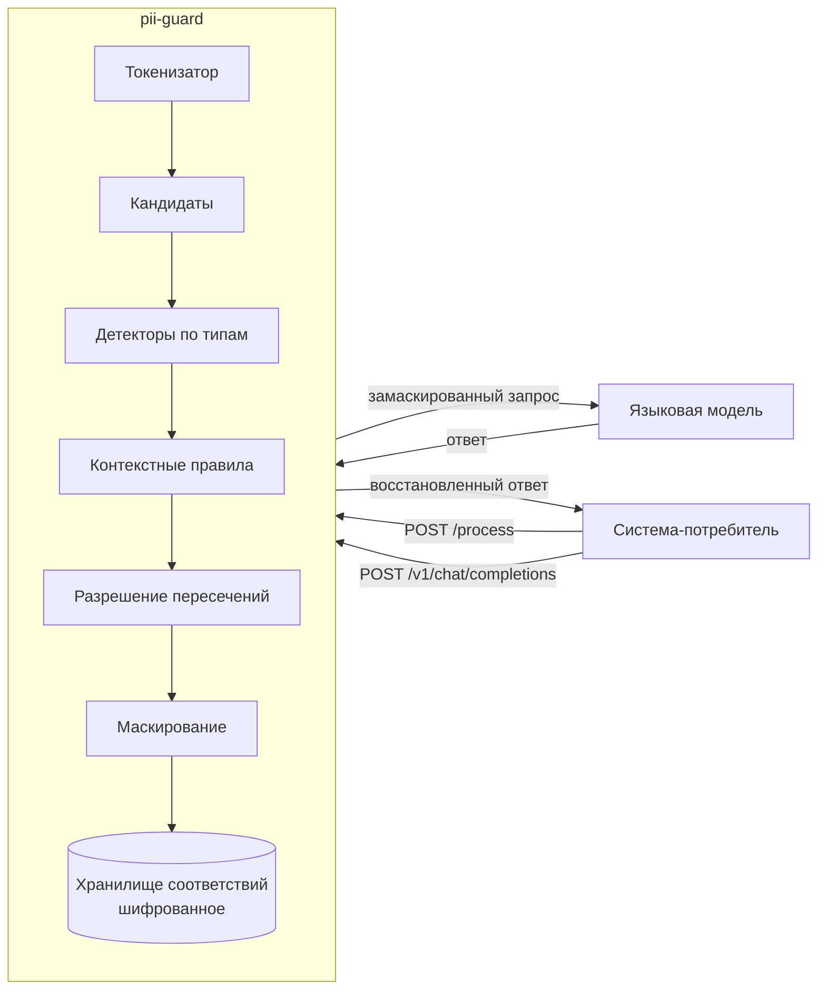

# pii-guard — модуль безопасности персональных данных

Сервис-прокси между системой-потребителем и языковой моделью. Находит
персональные данные в тексте, маскирует их перед отправкой в модель и
возвращает исходные значения в ответе.

```
Система-потребитель → pii-guard (поиск → маскирование) → LLM → pii-guard (обратное преобразование) → Потребитель
```

Написан на Go. Ядро поиска и маскирования использует только стандартную
библиотеку; три зависимости на всё остальное — метрики, разбор настроек,
один примитив синхронизации.

---

## Стенд уже развёрнут: можно открыть прямо сейчас

Ничего собирать не нужно, всё перечисленное отвечает.

| Что | Адрес | Зачем открывать |
|---|---|---|
| **Страница проверки** | http://84.201.166.35/ui | Самое наглядное. Вставить текст и увидеть, что нашлось, по какому признаку и почему что-то не стали маскировать. Здесь же заводятся свои типы данных и правится, что маскирует каждая система |
| **Мониторинг** | http://84.201.166.35:3000 | Grafana, дашборд «PII Guard: обзор стенда»: частота запросов, задержки по долям, ошибки, занятость хранилища |
| **Контракт проверки** | http://84.201.166.35/process | `POST` с полями `payload` и `payload_id` — тот самый эндпоинт из приложения A к заданию |
| **Метрики** | http://84.201.166.35/metrics | Сырые показатели в формате Prometheus |
| **Проба живости** | http://84.201.166.35/healthz | Готов ли сервис принимать запросы |

Проверить контракт одной командой:

```bash
# прямой шаг: маскирование
curl -s -X POST http://84.201.166.35/process \
  -H 'Content-Type: application/json' \
  -d '{"payload":"Клиент Иванов Иван Иванович, паспорт 4509 123456","payload_id":"demo-1"}'
# {"result":"Клиент ********************, паспорт ***********"}

# обратный шаг: тот же payload_id, присылаем свою же маску
curl -s -X POST http://84.201.166.35/process \
  -H 'Content-Type: application/json' \
  -d '{"payload":"Клиент ********************, паспорт ***********","payload_id":"demo-1"}'
# {"result":"Клиент Иванов Иван Иванович, паспорт 4509 123456"}
```

Направление задаёт содержимое запроса, а не порядковый номер: повтор с тем же
идентификатором и тем же исходным текстом вернёт ту же маску, а запрос с ранее
выданной маской вернёт исходную строку. Эндпоинт идемпотентен и безопасен к
повторам — ретраи проверяющей системы ничего не ломают.

---

## Как поднять у себя

Нужен либо Docker, либо Go 1.26. Оба способа поднимают сервис на порту 8080.

### Способ 1 — Docker (поднимает и наблюдение тоже)

```bash
cp .env.example .env
# в .env обязательно заполнить одну строку:
#   PII_STORE_KEY=$(openssl rand -base64 32)
# остальные ключи нужны только для профилей с авторизацией и прокси к модели

docker compose up -d --build
```

Поднимется три контейнера: сам сервис на 8080, Prometheus на 9090, Grafana на
3000 с уже загруженным дашбордом.

### Способ 2 — без Docker

```bash
export PII_STORE_KEY=$(openssl rand -base64 32)
go run ./cmd/pii-guard -config configs/config.yaml
```

### Проверить, что поднялось

```bash
make verify          # контракт: маска и обратное преобразование
curl localhost:8080/healthz
open http://localhost:8080/ui
```

`make verify` печатает исходный текст, маску и восстановленную строку и
возвращает ненулевой код, если что-то разошлось.

### Если что-то не завелось

| Симптом | Причина и что делать |
|---|---|
| `PII_STORE_KEY не задан` | Переменная обязательна: без неё нечем шифровать соответствия. `openssl rand -base64 32` |
| Порт 8080 занят | Поправить `server.http` в `configs/config.yaml` либо `PII_HTTP_ADDR` |
| `система выключена: пуст key_sha256` | Это предупреждение, не ошибка. Профили с авторизацией выключаются, если их ключи не заданы в `.env`. Профиль `alfasonar` работает без ключа, его достаточно |
| Страница `/ui` пустая | Сервис отдаёт её со своего адреса, внешних ссылок на странице нет: контур закрытый, интернет не нужен |

---

## Что посмотреть в первую очередь

Быстрее всего — страница `/ui`. Одна страница, на которой видно решение целиком.

| Что на странице | Зачем |
|---|---|
| Готовые примеры одним нажатием | Полная анкета, текст в нижнем регистре, историческое лицо и адрес отделения, латиница. Придумывать текст не нужно |
| Исходный текст с подсветкой | Видно, что именно нашлось и к какому типу отнесено |
| Таблица находок с причиной | По каждому фрагменту видно, какое правило сработало: слово-подсказка рядом, форма записи, словарь, контрольная сумма |
| Таблица снятого с маскирования | Решение умеет не только находить, но и осознанно отказываться. Тут видно, почему Пушкин и адрес отделения остались нетронутыми |
| Кнопка «Прогнать через модель» | Весь путь в четырёх состояниях текста: исходный, что ушло модели, что она ответила, что вернулось. Второе состояние и есть доказательство, что модель персональных данных не видела |
| Выбор системы-потребителя | У профилей разные маски, наборы типов и права на обратное преобразование — гибкость видна нагляднее, чем из описания |
| Матрица покрытия | Какие типы каким системам маскируются и где дыры |
| Раздел «Правила» | Там же дыры и закрываются: завести свой тип, убрать его, выбрать, что маскирует каждая система |

---

## Проверка по критериям задания

Все сценарии собраны в один скрипт, каждый отвечает одному критерию. Целиком:
`make jury-check`. По отдельности: `bash scripts/jury.sh <адрес> 1` и так далее.
Вместо `<адрес>` подойдёт и `http://84.201.166.35`, и свой `http://localhost:8080`.

| Критерий | Команда | Что увидите |
|---|---|---|
| 1. Качество идентификации и маскирования | `scripts/jury.sh <адрес> 1` | десять предложений со всеми обязательными типами из задания, включая латиницу |
| 2. Корректность демаскирования | `scripts/jury.sh <адрес> 2` | побайтовое восстановление, отказ системе без права на обратный шаг, отказ на чужую запись |
| 3. Точность и устойчивость к вариациям | `scripts/jury.sh <адрес> 3` | Пушкин и адрес отделения не тронуты, тёзка-клиент замаскирован, разные регистры и форматы дат |
| 4. Гибкая настройка | `scripts/jury.sh <адрес> 4` | выключение системы, отключение типа, запрет обратного шага, добавление нового типа без перезапуска |
| 5. Производительность | `scripts/jury.sh <адрес> 5` | задержка одного запроса, доли задержки из показателей, текст на сто тысяч токенов |
| 6. Безопасность, журнал, показатели | `scripts/jury.sh <адрес> 6` | журнал одного запроса с типами и без значений, показатели, ответы на неверный запрос |
| 7. Расширенные сценарии | `scripts/jury.sh <адрес> 7` | плейсхолдеры для модели, свой вид маски на систему, дополнительные документы, правило сочетаний |

Журнал сервиса: `make logs` либо `docker compose logs -f app`.

---

## Что получилось: числа

Все замеры и условия, в которых они сняты, — в [BENCHMARKS.md](BENCHMARKS.md).
Ниже главное.

### Качество поиска

| | |
|---|---|
| Среднее по 17 типам из задания | **0.9688** |
| Худший тип из задания | **0.9528** (порог задания — 0.95) |
| Среднее по 11 типам сверх задания | 0.9083 |
| На чужой разметке (Hugging Face, 141 873 фрагмента) | **0.9839**, ложных срабатываний 0.95% |

Метрика та же, что в задании: нормированное расстояние Левенштейна на каждом
размеченном фрагменте. Считается доля изменённых знаков внутри эталонного
фрагмента — 1.0 означает, что фрагмент закрыт целиком.

Повторить замер: `make quality` (соберёт набор и посчитает).

### Ложные срабатывания

46 отрицательных наборов — тексты, где похожее есть, а защищать нечего.
32 из них дают ровно ноль, среднее по всем — 1.27%.

### Нагрузка

Подъём частоты, восемь ядер:

| Цель | Держим | 95-я доля | Ответов 429 |
|---|---|---|---|
| 1 000 | 983 | 28 мс | 0 |
| 2 000 | 1 986 | 53 мс | 0 |
| 3 000 | 2 990 | 150 мс | 0 |
| 4 000 | 3 590 | 230 мс | 103 |

Потолок — около 3 600 запросов в секунду. Выше сервис не падает, а просит
повторить: 429 с заголовком `Retry-After`. Ошибок нет ни на одной ступени.

Рост от числа ядер почти линейный: 1 ядро — 992, 2 — 1 659, 4 — 2 728,
8 — 4 481 запрос в секунду. **Одного ядра уже хватает на требование задания.**

Текст на 100 000 токенов (400 000 знаков): маскирование 2.5 с, обратный шаг
5 мс, восстановление побайтовое.

Повторить: `make bench`, подробности — в [docs/LOAD-TESTING.md](docs/LOAD-TESTING.md).

### Обратное преобразование

100.00% точного восстановления на 5 996 элементах имитатора проверяющей
системы. Местоположение знаков сохраняется: маска занимает ровно столько же
места, сколько исходное значение.

---

## На чём проверяем качество

Свой набор показывает только то, что мы и так знаем, поэтому больше половины
проверки — данные с чужой разметкой.

| Источник | Записей | Что даёт |
|---|---|---|
| Hugging Face `russian-pii-66k` | 63 249 | Разметка чужая, к нашим детекторам отношения не имеет |
| Википедия | 17 913 | Живой текст; 6 555 из них вовсе без персональных данных |
| Отзывы | 7 500 | Неформальная речь: опечатки, сокращения, нижний регистр |
| Свой генератор | 30 000 | Управляемое покрытие: редкие типы и ловушки, которых в жизни мало |

Сами данные в архив с кодом не кладутся: каталог `corpus/` исключён, причины
лицензионные. В репозитории лежат программы сбора и одна проба
`testdata/sample.jsonl`. Подробнее — [docs/CORPUS-SOURCES.md](docs/CORPUS-SOURCES.md).

---

## Ворота качества

Семнадцать проверок одной командой: `make gate`. Формат исходников,
статический анализ, тесты с детектором гонок, качество по каждому типу,
отрицательные наборы, скорость горячего пути, контракт на живом сервисе,
поиск персональных данных в журнале, целостность архива.

Две особенности, ради которых ворота и сделаны:

- **Базовую линию качества нельзя подвинуть вместе с кодом** — это отдельная
  проверка. Иначе тот, кто правит детектор, мог бы просто занизить планку.
- **Проверки проверяют сами себя**: `make gate-selfcheck` подсовывает в каждую
  заведомую поломку, и проверка обязана покраснеть. Проверка, которая всегда
  зелёная, неотличима от отсутствующей.

---

## Документация

Точка входа одна: **[docs/SYSTEM-DESIGN.md](docs/SYSTEM-DESIGN.md)** — десять
минут чтения о том, что за сервис, из чего состоит, как течёт запрос и почему
сделано именно так. Остальное читается по надобности.

| Документ | О чём |
|---|---|
| [docs/SYSTEM-DESIGN.md](docs/SYSTEM-DESIGN.md) | Точка входа: окружение, состав, потоки данных, принятые и отвергнутые решения |
| [docs/QUICKSTART.md](docs/QUICKSTART.md) | Адреса стенда, три команды `curl`, запуск у себя |
| [docs/ARCHITECTURE.md](docs/ARCHITECTURE.md) | Устройство кода: конвейер разбора, пакеты, хранилище, отказоустойчивость |
| [docs/MASK-FORMAT.md](docs/MASK-FORMAT.md) | Во что превращается найденный фрагмент: виды маскирования, границы, примеры |
| [docs/BALANCING.md](docs/BALANCING.md) | Группа копий: балансировка, готовность, вывод копии, поведение под перегрузкой |
| [docs/SCALING.md](docs/SCALING.md) | Расчёт ядер и машин под нагрузку, пороги роста, память под хранилище |
| [docs/LOGGING.md](docs/LOGGING.md) | Поля журнала, уровни, защита от утечки значений, журнал аудита |
| [docs/OBSERVABILITY.md](docs/OBSERVABILITY.md) | Справочник показателей, панель Grafana, запросы PromQL |
| [docs/LOAD-TESTING.md](docs/LOAD-TESTING.md) | Как повторить замеры: режимы прогонов, ключи, разбор результата |
| [BENCHMARKS.md](BENCHMARKS.md) | Все замеры и условия, в которых они сняты |
| [docs/CORPUS-SOURCES.md](docs/CORPUS-SOURCES.md) | Из чего собран набор для проверки и почему чужая разметка честнее |

Рядом с кодом инфраструктуры лежат свои описания: `deploy/terraform/README.md`
про стенд как код, `deploy/logging/README.md` про сбор журнала,
`deploy/k6/README.md` про независимую проверку нагрузкой.

---

## Контракт

### `POST /process`

```json
{"payload": "<строка>", "payload_id": "<идентификатор>"}
→ 200 {"result": "<строка>"}
```

| Код | Когда |
|---|---|
| 200 | успешная обработка, в том числе при деградации: ответ несёт заголовок `X-PII-Degraded: 1` и частичную маску |
| 403 | система не опознана, либо ей запрещено демаскирование, либо запись принадлежит другой системе |
| 404 | прислан текст, похожий на маску, а запись по идентификатору не найдена (срок хранения истёк или идентификатор неизвестен); код ошибки `payload_not_found` |
| 409 | запись по идентификатору есть, но не расшифровывается (чужой ключ шифрования или испорченное значение); код ошибки `payload_corrupted` |
| 413 | тело больше допустимого размера |
| 422 | тело не разбирается или нет обязательного поля |
| 429 | ограничитель занят, в заголовке `Retry-After` указана одна секунда |
| 503 | внутренняя ошибка при строгом режиме обработки ошибок, либо сбой без частичного результата в любом режиме; в заголовке `Retry-After` указана одна секунда |

Код 500 не возвращается никогда: пять подряд невалидных ответов останавливают проверку, поэтому сбой детектора приводит либо к частичной маске с признаком деградации, либо к ответу с просьбой повторить. Открытый текст не возвращается ни при каких условиях.

**После срока хранения.** Если клиент прислал уже замаскированный текст с тем же `payload_id`, а запись истекла по `store.ttl`, сервис не маскирует звёздочки повторно: они стали бы «исходником», и оригинал был бы потерян. Поведение задаёт режим `on_unknown_id`. В режиме `404` сервис отвечает кодом 404 с кодом ошибки `payload_not_found` и описанием «срок хранения истёк или идентификатор неизвестен», без текста в ответе. В режиме `passthrough` сервис возвращает текст как есть с заголовком `X-PII-Unknown-Id: 1`, чтобы клиент видел, что восстановление не выполнено. Обычный текст с новым идентификатором маскируется и сохраняется, как раньше.

**Неоднозначный повтор.** Тот же `payload_id` с третьим, отличным от сохранённых текстом маскируется, а ответ несёт заголовок `X-PII-Ambiguous: 1`, чтобы клиент видел неоднозначность.

### `POST /v1/chat/completions`

Совместим с интерфейсом OpenAI. Маскирует содержимое сообщений, обращается к языковой модели и возвращает ответ с восстановленными значениями. Используется вид маскирования с плейсхолдерами, потому что звёздочки и инициалы модель в ответе не сохраняет.

Маскируются не только строковые `content` сообщений, но и текстовые части массива `content` (формат OpenAI для текста и картинок), а также текстовые поля `tools[].function.description` и `response_format`. Восстановление значений идёт только по текстовым полям ответа `choices[].message.content` и `choices[].delta.content`: служебные поля (`id`, `model` и прочие) не трогаются.

Потоковый режим (`stream: true`) не поддерживается: плейсхолдер может разорваться между фрагментами потока, и восстановить его по частям нельзя. Вместо молчаливой подмены на одиночный ответ прокси возвращает код 400 с кодом ошибки `stream_not_supported`.

Многоходовой диалог: при заголовке `X-Conversation-Id` соответствия плейсхолдеров сохраняются в хранилище под ключом диалога с тем же сроком хранения и подмешиваются при восстановлении. Так плейсхолдер из прошлого ответа ассистента, который клиент прислал в истории, восстанавливается и в новом ответе. Без заголовка поведение прежнее: соответствия живут в пределах одного запроса.

### Разбор и настройки

`POST /v1/inspect` — разбор текста с объяснением решения: что найдено, где, с какой уверенностью и по какому правилу. Здесь же видно, что снято с маскирования и почему. Это главная ручка для проверки правил: обычный контракт возвращает только результат, а по нему не видно, какое правило сработало.

`GET /v1/coverage` — матрица покрытия: какие типы каким системам-потребителям маскируются и каким видом маски. С одного взгляда видно тип из задания, который не маскируется ни одной системе.

`GET /v1/systems` — список настроенных систем-потребителей с их видом маски, набором типов и правом на обратное преобразование.

`GET /v1/rules` — действующие правила: встроенные типы, свои типы с их выражениями и якорями, набор типов у каждой системы. Признак `writable` в ответе говорит, вправе ли этот запрос что-то менять.

`POST /v1/rules` — правка правил. Пишет в файл настроек и применяет их сразу. Права строже остальных ручек: только с самой машины либо с заголовком `X-Admin-Token`, см. раздел про управление правилами выше.

```bash
# завести свой тип
curl -X POST http://<адрес>:8080/v1/rules -H 'Content-Type: application/json' \
  -d '{"op":"add_type","type":{"name":"BADGE","pattern":"(\\d{6})","group":1,
       "anchors":["пропуск"],"require_anchor":true}}'

# убрать его
curl -X POST http://<адрес>:8080/v1/rules -H 'Content-Type: application/json' \
  -d '{"op":"remove_type","name":"BADGE"}'

# оставить системе только часть типов
curl -X POST http://<адрес>:8080/v1/rules -H 'Content-Type: application/json' \
  -d '{"op":"set_system_types","system":"kilo","types":["FIO","PHONE","CARD"]}'

# выключить систему целиком
curl -X POST http://<адрес>:8080/v1/rules -H 'Content-Type: application/json' \
  -d '{"op":"set_system_enabled","system":"kilo","enabled":false}'
```

### Служебные

`GET /healthz` — живость. `GET /readyz` — готовность, при остановке отвечает кодом 503. `GET /metrics` — показатели в формате Prometheus.

## Настройка

Все правила живут в `configs/config.yaml` и применяются без перезапуска: отправьте сервису сигнал `SIGHUP` или просто сохраните файл, сервис заметит изменение за пять секунд. Раздел `systems` описывает потребителей: признак `enabled` включает и выключает доступ, список `types` задаёт маскируемые типы, признак `demask` разрешает обратное преобразование, поле `preset` и карта `per_type` выбирают вид маски для системы и для отдельных типов. Раздел `custom_types` добавляет новый тип персональных данных выражением и якорями, без правки кода. Настройки, не прошедшие проверку, отбрасываются, и сервис продолжает работать со старыми.

Применяется на лету:

- `systems.*` — включение и выключение систем, списки типов, право демаскирования, вид маски, порог уверенности, режим дат, контекстные правила, исключения;
- `custom_types` — добавление, изменение и удаление своих типов;
- `defaults.*` — значения по умолчанию для всех систем, включая режим дат `date_without_anchor`.

Требует перезапуска (при изменении сервис пишет предупреждение «поле изменено, требует перезапуска» и продолжает работать со старым значением):

- `server.*` — адреса слушателей и их сроки;
- `limits.*` — ограничители одновременной обработки;
- `store.*` — срок жизни записей, предел их числа, общее хранилище;
- `logging.*` — уровень, формат, прореживание и журнал аудита.

```yaml
systems:
  crm:
    enabled: true
    auth: {header: X-System-Key, key_sha256: "${CRM_KEY_SHA256}"}
    types: [FIO, PHONE, EMAIL, CARD]     # либо [all]
    demask: true
    preset: partial
    per_type: {FIO: initials}
    context_rules_enabled: true
    context_rules:
      - {mask: PIN, requires: [CARD]}     # пин-код маскируется только вместе с картой

custom_types:
  - name: SNILS
    pattern: '(\d{3}-\d{3}-\d{3}[ -]?\d{2})'
    group: 1
    validator: snils
    anchors: ["снилс", "страховой номер"]
```

Подключение нового потребителя: добавить блок в `systems`, положить хеш ключа в переменную окружения, сохранить файл. Перезапуск не нужен.

## Сохранение запросов для проверки

Свой набор данных порождён генератором: в нём ровно те случаи, которые мы
придумали. Тексты проверяющей системы — единственные настоящие, какие решение
видит, и по ним видно, чего генератор не знает.

Захват живёт отдельным файлом, а не журналом: в журнал и показатели исходные
данные попадать не должны, это требование задания и отдельная проверка ворот.
По умолчанию выключен.

```yaml
capture:
  enabled: true
  path: "var/capture/requests.jsonl"
  with_payload: true     # без него в файл идут только размеры и типы
```

Признака два намеренно. `enabled` включает канал, `with_payload` разрешает
сохранять сам текст: включая второй, человек соглашается держать персональные
данные на диске, и сервис говорит об этом при запуске отдельным
предупреждением. Файл создаётся с правами только для владельца, запись идёт
через очередь и не задерживает обработчик — при переполнении запись
отбрасывается и считается.

Разобрать захваченное:

```
go run ./cmd/capture2corpus -in var/capture/requests.jsonl
```

Команда печатает, что пришло и какие типы нашлись, а главное — перечисляет
тексты, в которых не найдено **ничего**. Это прямое указание на пробел, и
разметка для них не нужна.

Признак `-out` выгружает тексты в набор для `cmd/score`. Метки в нём пустые:
заполнить их своими же находками и потом на них проверяться бессмысленно —
выйдет сто процентов и ноль знания. Признак `-prefill` ставит черновик под
правку руками, и команда об этом предупреждает.

## Формат маскирования

Полное описание с примерами по каждому типу: [docs/MASK-FORMAT.md](docs/MASK-FORMAT.md).

Коротко: по умолчанию каждая руна внутри найденного фрагмента заменяется на звёздочку, число рун сохраняется, за пределами фрагмента не меняется ни один байт. Доступны также частичная маска, инициалы, плейсхолдеры и правдоподобная подстановка, выбор делается настройкой.

## Как устроено



Текст разбирается за один проход токенизатором, затем детекторы работают по кандидатам и небольшим окнам вокруг них, а не прогоняют выражения по всему тексту. Это даёт линейное время и позволяет обрабатывать тексты в сотни килобайт: длинный текст режется на куски по границам абзацев и обрабатывается параллельно.

Контрольные суммы номеров карт, ИНН и СНИЛС повышают уверенность, но не являются условием обнаружения: в проверочных текстах значения обычно вымышленные.

Регистр букв на обнаружение не влияет: токенизатор считает копию текста в нижнем регистре той же длины в байтах, и якоря, ключевые слова и словари имён ищутся по ней, а границы возвращаются в координатах исходного текста. Единственное исключение это незнакомая фамилия со строчной буквы: она опознаётся только при сильной опоре в соседних словах. Полный разбор того, что от регистра не зависит, а что зависит и почему, в [docs/SYSTEM-DESIGN.md](docs/SYSTEM-DESIGN.md).

Устройство кода, пакеты и определение направления обработки — в [docs/ARCHITECTURE.md](docs/ARCHITECTURE.md). Решение целиком, вместе с отвергнутыми вариантами, — в [docs/SYSTEM-DESIGN.md](docs/SYSTEM-DESIGN.md).

## Безопасность

- Исходные тексты хранятся только в зашифрованном виде, алгоритм AES-256-GCM, ключ берётся из переменной окружения и не попадает ни в образ, ни в репозиторий.
- Срок жизни записи ограничен, по умолчанию пятнадцать минут, число записей ограничено миллионом. Оба предела задаются настройкой `store`, расчёт памяти в [docs/SCALING.md](docs/SCALING.md).
- В журнал и в показатели попадают только типы найденных данных и счётчики. Значения не попадают никогда, это проверяется отдельным тестом, который прогоняет весь набор данных и ищет каждое эталонное значение в выводе.
- При сбое детектора или куска ответ несёт заголовок `X-PII-Degraded: 1`, а в журнал и показатели попадают только имена отказавших типов, без значений. Открытый текст не возвращается ни при каких условиях: при сбое без частичного результата сервис отвечает 503.
- Обращаться к сервису могут только перечисленные системы, опознание по хешу ключа в заголовке.
- Обратное преобразование доступно только той системе, которая создала запись, и только если оно ей разрешено настройкой.
- Соответствие «маска — значение» хранится отдельно от самого значения и защищено ключом: это отвечает требованию к обезличиванию методом введения идентификаторов.

Состав полей журнала, защита от утечки значений и журнал аудита — в [docs/LOGGING.md](docs/LOGGING.md).

## Надёжность

| Что отказало | Поведение |
|---|---|
| сбой одного детектора | тип пропускается, ответ отдаётся с частичной маской и признаком деградации |
| сбой куска длинного текста | кусок пропускается, ответ по остальным кускам с признаком деградации |
| сбой обработчика | щадящий режим отдаёт частичную маску с признаком деградации, строгий — ответ 503 с просьбой повторить, код 500 не возвращается |
| языковая модель недоступна | ответ 502, тело запроса в ошибку не попадает |
| ограничитель занят | ответ 429 с заголовком `Retry-After` |
| неверные настройки | отбрасываются, работает прежняя версия |
| остановка сервиса | готовность снимается первым действием, `/readyz` отвечает кодом 503, затем выдерживается пауза `drain_timeout` (по умолчанию семь секунд), и только после неё закрывается приём; принятые запросы дорабатываются в пределах таймаута записи ответа. Замер мягкой остановки под нагрузкой в [BENCHMARKS.md](BENCHMARKS.md), разбор пауз и порогов в [docs/BALANCING.md](docs/BALANCING.md) |

При сбое детектора или куска ответ несёт заголовок `X-PII-Degraded: 1`, а в
журнал и показатели попадают только имена отказавших типов, без значений.
Открытый текст не возвращается ни при каких условиях: если обработка завершилась
сбоем без частичного результата, обе ветви отвечают 503.

## Показатели

Задержка, число запросов в секунду и оценка числа токенов в секунду, число найденных фрагментов по типам, число снятых с маскирования по причинам, глубина очереди, число записей в хранилище, сбои детекторов, длительность обращения к модели. Оценка числа токенов считается по размеру текста и помечена в имени как оценочная: точный токенизатор модели на горячем пути дороже самой обработки.

Справочник всех показателей, панель Grafana и запросы для диагностики — в [docs/OBSERVABILITY.md](docs/OBSERVABILITY.md). Замеры — в [BENCHMARKS.md](BENCHMARKS.md).

## Проверка сканером

Решение проверяется сканером SonarQube. Он читает `sonar-project.properties` и отчёты, которые готовит одна команда:

```bash
make sonar-prep
```

Команда оставляет четыре файла в корне:

| Файл | Что внутри | Что читает сканер |
|---|---|---|
| `coverage.out` | покрытие тестами по пакетам | `sonar.go.coverage.reportPaths` |
| `test-report.json` | прогон тестов в формате JSON | `sonar.go.tests.reportPaths` |
| `golangci-report.xml` | находки golangci-lint в формате checkstyle | `sonar.go.golangci-lint.reportPaths` |
| `govet-report.out` | вывод `go vet` | `sonar.go.govet.reportPaths` |

Отчёты в архив с исходным кодом не попадают: они перечислены в `.gitignore` узкими правилами. Из исходников сканера исключено то, что не код сервиса: документация, развёртывание, скрипты, наборы данных и генераторы набора (`cmd/gen`, `cmd/corpus`). Остальное покрывается тестами, а не исключениями.

## Реализовано сверх задания

- Обращение к языковой модели через плейсхолдеры с восстановлением значений в ответе.
- Свой вид маскирования для каждой системы и для каждого типа.
- Маскирование по сочетанию типов: пин-код сам по себе не маскируется, вместе с номером картой маскируется, правило включается одним признаком.
- Дополнительные документы, удостоверяющие личность: СНИЛС, загранпаспорт, вид на жительство, свидетельство о рождении, военный билет.
- Добавление новых типов настройкой без правки кода.
- Свой генератор размеченного набора данных и имитатор проверяющей системы с подсчётом качества.
- Связи между фрагментами одного человека: текст с двумя людьми разбирается на двух субъектов, и правило сочетаний типов выражается напрямую, а не обходными путями.
- Устойчивость к шуму: опечатки, буква «ё» вместо «е», ноль вместо буквы «о», лишние пробелы внутри номеров и подмена кириллицы одинаково выглядящей латиницей.
- Свойство маскирования проверяется фаззингом: для любого входа обратное преобразование возвращает исходный текст знак в знак. Так найдено и починено падение на невалидном UTF-8.
- Ворота качества одной командой: семнадцать проверок от формата до поиска персональных данных в журнале, с базовой линией качества и скорости.

## Ограничения и что дальше

- Падежи при обратной подстановке в ответ модели согласуются видом маскирования с правдоподобной подстановкой: если модель просклоняла подстановку имени, склонённая форма заменяется исходным значением. Для вида с плейсхолдерами падежи по-прежнему не согласуются: если модель написала «клиенту [FIO_1]», подставится именительный падеж.
- Потоковый ответ модели не поддерживается: запрос с `stream: true` отклоняется кодом 400 с кодом ошибки `stream_not_supported`. Плейсхолдер может разорваться между фрагментами потока, и восстановить его по частям нельзя. Решается буфером удержания на границе, оценка полдня.
- Идентификация имён не зависит от регистра: имена, фамилии, отчества и инициалы опознаются и в тексте, где всё строчными. Заглавная буква осталась усилителем уверенности, а не условием. Осталась узкая граница: фамилия со строчной буквы, которой нет в словаре и у которой нет надёжного фамильного окончания, опознаётся только при сильной опоре в соседних словах — иначе фамилией стало бы обычное слово вроде «клиентов» или «магазин».
- Именованные сущности распознаются правилами и словарями, без нейросетевой модели. Модель добавила бы полноту на редких именах ценой десятков миллисекунд на килобайт, что не укладывается в требование по задержке. Точка расширения есть: достаточно зарегистрировать ещё один детектор.
- Хранилище соответствий по умолчанию живёт в памяти процесса. Общее хранилище поверх Redis реализовано и проверено на двух копиях: маску делает одна, обратное преобразование другая, результат совпадает знак в знак. Клиент протокола написан на стандартной библиотеке, новых зависимостей нет. При недоступности Redis сервис переходит на память и считает деградации, поведение переключается настройкой. Не проверено под нагрузкой: замер клиента дал около 129 тысяч операций в секунду при двух операциях на запрос, и это оценка потолка, а не измеренный предел. Расчёт роста и порядок включения — в [docs/SCALING.md](docs/SCALING.md) и [docs/BALANCING.md](docs/BALANCING.md).
- Ключ шифрования берётся из переменной окружения. Для промышленной эксплуатации нужен доступ к хранилищу секретов, интерфейс выделен.
