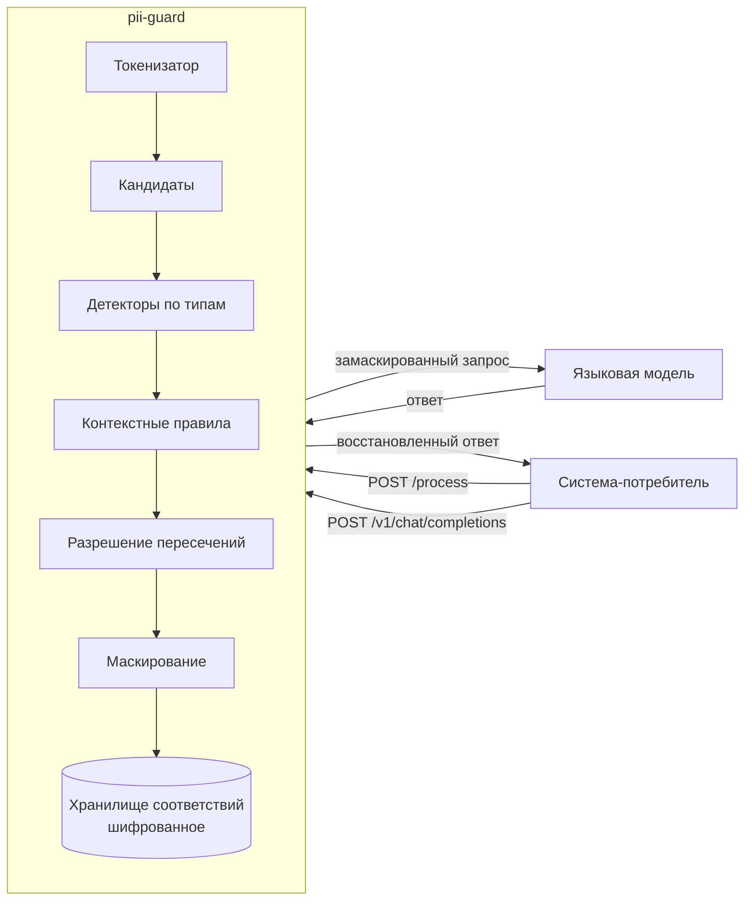

# pii-guard — модуль безопасности персональных данных

Сервис-прокси между системой-потребителем и языковой моделью: находит персональные данные в тексте, маскирует их перед отправкой в модель и возвращает исходные значения в ответе.

```
Система-потребитель → pii-guard (идентификация → маскирование) → LLM → pii-guard (демаскирование) → Потребитель
```

## Документация

**Точка входа одна: [docs/SYSTEM-DESIGN.md](docs/SYSTEM-DESIGN.md).** Это
верхнеуровневый документ на десять минут чтения: что за сервис, из чего
состоит, как течёт запрос, почему сделано именно так и какие числа получены.
Из него человек уходит вглубь по ссылкам. Остальные документы читаются по
надобности, а не подряд.

| Документ | О чём | Кому читать |
|---|---|---|
| [docs/SYSTEM-DESIGN.md](docs/SYSTEM-DESIGN.md) | **точка входа.** Окружение, состав развёртывания, внутреннее устройство, потоки данных, три главных сценария, принятые и отвергнутые решения, сводка показателей | всем, первым делом |
| [docs/QUICKSTART.md](docs/QUICKSTART.md) | адреса живого стенда, три команды `curl`, запуск у себя, нагрузочный прогон | жюри и всем, кто хочет потрогать сервис руками |
| [docs/ARCHITECTURE.md](docs/ARCHITECTURE.md) | устройство кода: конвейер разбора текста, пакеты, определение направления, хранилище соответствий, отказоустойчивость | тому, кто собирается править код |
| [docs/MASK-FORMAT.md](docs/MASK-FORMAT.md) | во что превращается найденный фрагмент: пресеты, правила границ, примеры по каждому типу | проверяющему качество маскирования |
| [docs/BALANCING.md](docs/BALANCING.md) | точка входа группы копий: уровень балансировки, готовность и живость, мягкий вывод копии из обслуживания, поведение под перегрузкой | тому, кто включает рост или разбирает отказ копии |
| [docs/SCALING.md](docs/SCALING.md) | расчёт ядер и машин под нагрузку, сигнал для автоматического роста, пороги и задержки, память под хранилище, следующие узкие места | тому, кто планирует нагрузку больше штатной |
| [docs/LOGGING.md](docs/LOGGING.md) | состав полей журнала, уровни, защита от утечки значений, журнал аудита, сбор, ротация и объём | дежурному и тому, кто расследует инцидент |
| [docs/OBSERVABILITY.md](docs/OBSERVABILITY.md) | справочник показателей, панель Grafana, запросы PromQL, признаки перегрузки | дежурному у панели |
| [docs/LOAD-TESTING.md](docs/LOAD-TESTING.md) | как повторить замеры: режимы прогонов, ключи генераторов, разбор результата | тому, кто перезамеряет |
| [BENCHMARKS.md](BENCHMARKS.md) | все замеры и условия, в которых они сняты | тому, кто хочет проверить число из любого другого документа |
| [docs/CORPUS-SOURCES.md](docs/CORPUS-SOURCES.md) | из чего собран набор для проверки качества и почему внешняя разметка честнее собственной | тому, кто сомневается в оценке качества |
| [docs/HANDOFF.md](docs/HANDOFF.md) | что получить отдельно, запуск за минуту, карта каталогов, как делить работу | второму участнику команды |

Рядом с кодом инфраструктуры лежат свои описания: `deploy/terraform/README.md`
про стенд как код, `deploy/logging/README.md` про установку сбора журнала,
`deploy/k6/README.md` про независимую проверку нагрузкой.

## Быстрый старт

```bash
# ключ шифрования хранилища и ключи систем-потребителей
cp .env.example .env && nano .env

# запуск
docker compose up -d --build     # либо: make run

# проверка контракта одной командой
make verify
```

Пример из постановки задачи:

```bash
curl -s -X POST http://localhost:8080/process \
  -H 'Content-Type: application/json' \
  -d '{"payload":"Клиент Иванов Иван Иванович, паспорт 4509 123456","payload_id":"demo-1"}'
# {"result":"Клиент ********************, паспорт ***********"}

curl -s -X POST http://localhost:8080/process \
  -H 'Content-Type: application/json' \
  -d '{"payload":"Клиент ********************, паспорт ***********","payload_id":"demo-1"}'
# {"result":"Клиент Иванов Иван Иванович, паспорт 4509 123456"}
```

Направление определяется содержимым запроса, а не порядковым номером: повторный запрос с тем же идентификатором и тем же исходным текстом вернёт ту же маску, а запрос с ранее выданной маской вернёт исходную строку. Эндпоинт идемпотентен и безопасен к повторам.

## Для жюри

Все сценарии собраны в один скрипт, каждый соответствует одному критерию оценки. Запуск целиком: `make jury-check`. По отдельности: `bash scripts/jury.sh <адрес> 1` и так далее.

| Критерий | Команда | Что увидите |
|---|---|---|
| 1. Качество идентификации и маскирования | `scripts/jury.sh <адрес> 1` | десять предложений со всеми обязательными типами из задания, включая латиницу |
| 2. Корректность демаскирования | `scripts/jury.sh <адрес> 2` | побайтовое восстановление, отказ системе без права демаскирования, отказ на чужую запись |
| 3. Точность и устойчивость к вариациям | `scripts/jury.sh <адрес> 3` | Пушкин и адрес отделения не тронуты, тёзка-клиент замаскирован, разные регистры и форматы дат |
| 4. Гибкая настройка | `scripts/jury.sh <адрес> 4` | выключение системы, отключение типа, запрет демаскирования, добавление нового типа через настройку без перезапуска |
| 5. Производительность | `scripts/jury.sh <адрес> 5` | задержка одного запроса из журнала, доли задержки из показателей, текст на сто тысяч токенов |
| 6. Безопасность, журнал, показатели | `scripts/jury.sh <адрес> 6` | журнал одного запроса с типами и без значений, показатели, ответы на неверный запрос |
| 7. Расширенные сценарии | `scripts/jury.sh <адрес> 7` | плейсхолдеры для модели, свой вид маски на систему, дополнительные документы, правило сочетаний |
| 8. Демонстрация | этот файл и [docs/SYSTEM-DESIGN.md](docs/SYSTEM-DESIGN.md) | схема цепочки, устройство решения и объяснение работы |

Журнал сервиса: `make logs` или `docker compose logs -f app`. Показатели: `http://<адрес>:8080/metrics`, наглядно — Grafana на порту 3000.

### Страница проверки: быстрее всего посмотреть здесь

`http://<адрес>:8080/ui` — одна страница, на которой видно всё решение целиком, без единой внешней ссылки: сервис работает в закрытом контуре, где интернета нет.

| Что на странице | Зачем |
|---|---|
| Кнопка «Прогнать через модель» | весь путь в четырёх состояниях текста: исходный, что ушло модели, что она ответила, что вернулось. Второе состояние и есть доказательство, что модель персональных данных не видела |
| Выбор системы-потребителя | у профилей разные маски, наборы типов и права на обратное преобразование; переключение показывает гибкость настройки нагляднее описания |
| Готовые примеры одним нажатием | полная анкета, текст в нижнем регистре, историческое лицо и адрес отделения, латиница. Придумывать текст не нужно |
| Таблица находок с причиной решения | по каждому фрагменту видно, какое правило сработало: якорь, форма, словарь, контрольная сумма |
| Таблица снятого с маскирования | видно, что решение умеет не только находить, но и осознанно отказываться |
| Матрица покрытия | какие типы каким системам маскируются и где дыры |
| Раздел «Правила» | там же дыры и закрываются: завести свой тип, убрать его, выбрать, что маскирует каждая система |

#### Управление правилами

Раздел «Правила» правит тот же файл настроек, из которого работает сервис: единственный источник правды остаётся один, а страница — лишь удобный способ его менять. Правка применяется сразу, не дожидаясь перечитывания по таймеру.

| Что можно | Как |
|---|---|
| Завести свой тип | имя, выражение, номер группы, контрольная сумма, якоря. Выражение проверяется до записи: неверное отвергается с объяснением |
| Убрать свой тип | кнопка в строке. Встроенные типы убрать нельзя — их выключают снятием галочки у системы |
| Выбрать типы системы | галочки по каждому типу либо «все типы» — при нём система маскирует и те типы, что добавят позже |
| Выключить систему целиком | признак «включена» |

Комментарии, пустые строки и отступы файла настроек правку переживают: файл меняется по дереву узлов, а не переписывается целиком. После круга «добавить тип — убрать тип» файл побайтово совпадает с исходным.

**Права.** Ключ системы-потребителя права на правку не даёт: иначе система могла бы выключить собственное маскирование. Писать вправе запрос с самой машины либо предъявивший заголовок `X-Admin-Token` со значением переменной `PII_ADMIN_TOKEN`, заданной при запуске. Без этой переменной правка снаружи закрыта совсем. Каждая попытка, удавшаяся и отклонённая, попадает в журнал аудита.

Правило сочетаний типов из задания («пин-код один не маскируем, пин-код с картой маскируем») выражено через связи между фрагментами одного человека. Включается признаком `context_rules_enabled` в настройках, **по умолчанию выключено**: построение связей стоит около пяти процентов запроса. Для показа его надо включить, иначе субъектов на странице будет ноль.

## Контракт

### `POST /process`

```json
{"payload": "<строка>", "payload_id": "<идентификатор>"}
→ 200 {"result": "<строка>"}
```

| Код | Когда |
|---|---|
| 200 | успешная обработка, в том числе при деградации: ответ несёт заголовок `X-PII-Degraded: 1` и частичную маску |
| 403 | система не опознана, либо ей запрещено демаскирование, либо запись принадлежит другой системе |
| 404 | прислан текст, похожий на маску, а запись по идентификатору не найдена (срок хранения истёк или идентификатор неизвестен); код ошибки `payload_not_found` |
| 409 | запись по идентификатору есть, но не расшифровывается (чужой ключ шифрования или испорченное значение); код ошибки `payload_corrupted` |
| 413 | тело больше допустимого размера |
| 422 | тело не разбирается или нет обязательного поля |
| 429 | ограничитель занят, в заголовке `Retry-After` указана одна секунда |
| 503 | внутренняя ошибка при строгом режиме обработки ошибок, либо сбой без частичного результата в любом режиме; в заголовке `Retry-After` указана одна секунда |

Код 500 не возвращается никогда: пять подряд невалидных ответов останавливают проверку, поэтому сбой детектора приводит либо к частичной маске с признаком деградации, либо к ответу с просьбой повторить. Открытый текст не возвращается ни при каких условиях.

**После срока хранения.** Если клиент прислал уже замаскированный текст с тем же `payload_id`, а запись истекла по `store.ttl`, сервис не маскирует звёздочки повторно: они стали бы «исходником», и оригинал был бы потерян. Поведение задаёт режим `on_unknown_id`. В режиме `404` сервис отвечает кодом 404 с кодом ошибки `payload_not_found` и описанием «срок хранения истёк или идентификатор неизвестен», без текста в ответе. В режиме `passthrough` сервис возвращает текст как есть с заголовком `X-PII-Unknown-Id: 1`, чтобы клиент видел, что восстановление не выполнено. Обычный текст с новым идентификатором маскируется и сохраняется, как раньше.

**Неоднозначный повтор.** Тот же `payload_id` с третьим, отличным от сохранённых текстом маскируется, а ответ несёт заголовок `X-PII-Ambiguous: 1`, чтобы клиент видел неоднозначность.

### `POST /v1/chat/completions`

Совместим с интерфейсом OpenAI. Маскирует содержимое сообщений, обращается к языковой модели и возвращает ответ с восстановленными значениями. Используется вид маскирования с плейсхолдерами, потому что звёздочки и инициалы модель в ответе не сохраняет.

Маскируются не только строковые `content` сообщений, но и текстовые части массива `content` (формат OpenAI для текста и картинок), а также текстовые поля `tools[].function.description` и `response_format`. Восстановление значений идёт только по текстовым полям ответа `choices[].message.content` и `choices[].delta.content`: служебные поля (`id`, `model` и прочие) не трогаются.

Потоковый режим (`stream: true`) не поддерживается: плейсхолдер может разорваться между фрагментами потока, и восстановить его по частям нельзя. Вместо молчаливой подмены на одиночный ответ прокси возвращает код 400 с кодом ошибки `stream_not_supported`.

Многоходовой диалог: при заголовке `X-Conversation-Id` соответствия плейсхолдеров сохраняются в хранилище под ключом диалога с тем же сроком хранения и подмешиваются при восстановлении. Так плейсхолдер из прошлого ответа ассистента, который клиент прислал в истории, восстанавливается и в новом ответе. Без заголовка поведение прежнее: соответствия живут в пределах одного запроса.

### Разбор и настройки

`POST /v1/inspect` — разбор текста с объяснением решения: что найдено, где, с какой уверенностью и по какому правилу. Здесь же видно, что снято с маскирования и почему. Это главная ручка для проверки правил: обычный контракт возвращает только результат, а по нему не видно, какое правило сработало.

`GET /v1/coverage` — матрица покрытия: какие типы каким системам-потребителям маскируются и каким видом маски. С одного взгляда видно тип из задания, который не маскируется ни одной системе.

`GET /v1/systems` — список настроенных систем-потребителей с их видом маски, набором типов и правом на обратное преобразование.

`GET /v1/rules` — действующие правила: встроенные типы, свои типы с их выражениями и якорями, набор типов у каждой системы. Признак `writable` в ответе говорит, вправе ли этот запрос что-то менять.

`POST /v1/rules` — правка правил. Пишет в файл настроек и применяет их сразу. Права строже остальных ручек: только с самой машины либо с заголовком `X-Admin-Token`, см. раздел про управление правилами выше.

```bash
# завести свой тип
curl -X POST http://<адрес>:8080/v1/rules -H 'Content-Type: application/json' \
  -d '{"op":"add_type","type":{"name":"BADGE","pattern":"(\\d{6})","group":1,
       "anchors":["пропуск"],"require_anchor":true}}'

# убрать его
curl -X POST http://<адрес>:8080/v1/rules -H 'Content-Type: application/json' \
  -d '{"op":"remove_type","name":"BADGE"}'

# оставить системе только часть типов
curl -X POST http://<адрес>:8080/v1/rules -H 'Content-Type: application/json' \
  -d '{"op":"set_system_types","system":"kilo","types":["FIO","PHONE","CARD"]}'

# выключить систему целиком
curl -X POST http://<адрес>:8080/v1/rules -H 'Content-Type: application/json' \
  -d '{"op":"set_system_enabled","system":"kilo","enabled":false}'
```

### Служебные

`GET /healthz` — живость. `GET /readyz` — готовность, при остановке отвечает кодом 503. `GET /metrics` — показатели в формате Prometheus.

## Настройка

Все правила живут в `configs/config.yaml` и применяются без перезапуска: отправьте сервису сигнал `SIGHUP` или просто сохраните файл, сервис заметит изменение за пять секунд. Раздел `systems` описывает потребителей: признак `enabled` включает и выключает доступ, список `types` задаёт маскируемые типы, признак `demask` разрешает обратное преобразование, поле `preset` и карта `per_type` выбирают вид маски для системы и для отдельных типов. Раздел `custom_types` добавляет новый тип персональных данных выражением и якорями, без правки кода. Настройки, не прошедшие проверку, отбрасываются, и сервис продолжает работать со старыми.

```yaml
systems:
  crm:
    enabled: true
    auth: {header: X-System-Key, key_sha256: "${CRM_KEY_SHA256}"}
    types: [FIO, PHONE, EMAIL, CARD]     # либо [all]
    demask: true
    preset: partial
    per_type: {FIO: initials}
    context_rules_enabled: true
    context_rules:
      - {mask: PIN, requires: [CARD]}     # пин-код маскируется только вместе с картой

custom_types:
  - name: SNILS
    pattern: '(\d{3}-\d{3}-\d{3}[ -]?\d{2})'
    group: 1
    validator: snils
    anchors: ["снилс", "страховой номер"]
```

Подключение нового потребителя: добавить блок в `systems`, положить хеш ключа в переменную окружения, сохранить файл. Перезапуск не нужен.

## Формат маскирования

Полное описание с примерами по каждому типу: [docs/MASK-FORMAT.md](docs/MASK-FORMAT.md).

Коротко: по умолчанию каждая руна внутри найденного фрагмента заменяется на звёздочку, число рун сохраняется, за пределами фрагмента не меняется ни один байт. Доступны также частичная маска, инициалы, плейсхолдеры и правдоподобная подстановка, выбор делается настройкой.

## Как устроено



Текст разбирается за один проход токенизатором, затем детекторы работают по кандидатам и небольшим окнам вокруг них, а не прогоняют выражения по всему тексту. Это даёт линейное время и позволяет обрабатывать тексты в сотни килобайт: длинный текст режется на куски по границам абзацев и обрабатывается параллельно.

Контрольные суммы номеров карт, ИНН и СНИЛС повышают уверенность, но не являются условием обнаружения: в проверочных текстах значения обычно вымышленные.

Регистр букв на обнаружение не влияет: токенизатор считает копию текста в нижнем регистре той же длины в байтах, и якоря, ключевые слова и словари имён ищутся по ней, а границы возвращаются в координатах исходного текста. Единственное исключение это незнакомая фамилия со строчной буквы: она опознаётся только при сильной опоре в соседних словах. Полный разбор того, что от регистра не зависит, а что зависит и почему, в [docs/SYSTEM-DESIGN.md](docs/SYSTEM-DESIGN.md).

Устройство кода, пакеты и определение направления обработки — в [docs/ARCHITECTURE.md](docs/ARCHITECTURE.md). Решение целиком, вместе с отвергнутыми вариантами, — в [docs/SYSTEM-DESIGN.md](docs/SYSTEM-DESIGN.md).

## Безопасность

- Исходные тексты хранятся только в зашифрованном виде, алгоритм AES-256-GCM, ключ берётся из переменной окружения и не попадает ни в образ, ни в репозиторий.
- Срок жизни записи ограничен, по умолчанию пятнадцать минут, число записей ограничено миллионом. Оба предела задаются настройкой `store`, расчёт памяти в [docs/SCALING.md](docs/SCALING.md).
- В журнал и в показатели попадают только типы найденных данных и счётчики. Значения не попадают никогда, это проверяется отдельным тестом, который прогоняет весь набор данных и ищет каждое эталонное значение в выводе.
- При сбое детектора или куска ответ несёт заголовок `X-PII-Degraded: 1`, а в журнал и показатели попадают только имена отказавших типов, без значений. Открытый текст не возвращается ни при каких условиях: при сбое без частичного результата сервис отвечает 503.
- Обращаться к сервису могут только перечисленные системы, опознание по хешу ключа в заголовке.
- Обратное преобразование доступно только той системе, которая создала запись, и только если оно ей разрешено настройкой.
- Соответствие «маска — значение» хранится отдельно от самого значения и защищено ключом: это отвечает требованию к обезличиванию методом введения идентификаторов.

Состав полей журнала, защита от утечки значений и журнал аудита — в [docs/LOGGING.md](docs/LOGGING.md).

## Надёжность

| Что отказало | Поведение |
|---|---|
| сбой одного детектора | тип пропускается, ответ отдаётся с частичной маской и признаком деградации |
| сбой куска длинного текста | кусок пропускается, ответ по остальным кускам с признаком деградации |
| сбой обработчика | щадящий режим отдаёт частичную маску с признаком деградации, строгий — ответ 503 с просьбой повторить, код 500 не возвращается |
| языковая модель недоступна | ответ 502, тело запроса в ошибку не попадает |
| ограничитель занят | ответ 429 с заголовком `Retry-After` |
| неверные настройки | отбрасываются, работает прежняя версия |
| остановка сервиса | готовность снимается первым действием, `/readyz` отвечает кодом 503, затем выдерживается пауза `drain_timeout` (по умолчанию семь секунд), и только после неё закрывается приём; принятые запросы дорабатываются в пределах таймаута записи ответа. Замер мягкой остановки под нагрузкой в [BENCHMARKS.md](BENCHMARKS.md), разбор пауз и порогов в [docs/BALANCING.md](docs/BALANCING.md) |

При сбое детектора или куска ответ несёт заголовок `X-PII-Degraded: 1`, а в
журнал и показатели попадают только имена отказавших типов, без значений.
Открытый текст не возвращается ни при каких условиях: если обработка завершилась
сбоем без частичного результата, обе ветви отвечают 503.

## Показатели

Задержка, число запросов в секунду и оценка числа токенов в секунду, число найденных фрагментов по типам, число снятых с маскирования по причинам, глубина очереди, число записей в хранилище, сбои детекторов, длительность обращения к модели. Оценка числа токенов считается по размеру текста и помечена в имени как оценочная: точный токенизатор модели на горячем пути дороже самой обработки.

Справочник всех показателей, панель Grafana и запросы для диагностики — в [docs/OBSERVABILITY.md](docs/OBSERVABILITY.md). Замеры — в [BENCHMARKS.md](BENCHMARKS.md).

## Реализовано сверх задания

- Обращение к языковой модели через плейсхолдеры с восстановлением значений в ответе.
- Свой вид маскирования для каждой системы и для каждого типа.
- Маскирование по сочетанию типов: пин-код сам по себе не маскируется, вместе с номером картой маскируется, правило включается одним признаком.
- Дополнительные документы, удостоверяющие личность: СНИЛС, загранпаспорт, вид на жительство, свидетельство о рождении, военный билет.
- Добавление новых типов настройкой без правки кода.
- Свой генератор размеченного набора данных и имитатор проверяющей системы с подсчётом качества.
- Связи между фрагментами одного человека: текст с двумя людьми разбирается на двух субъектов, и правило сочетаний типов выражается напрямую, а не обходными путями.
- Устойчивость к шуму: опечатки, буква «ё» вместо «е», ноль вместо буквы «о», лишние пробелы внутри номеров и подмена кириллицы одинаково выглядящей латиницей.
- Свойство маскирования проверяется фаззингом: для любого входа обратное преобразование возвращает исходный текст знак в знак. Так найдено и починено падение на невалидном UTF-8.
- Ворота качества одной командой: семнадцать проверок от формата до поиска персональных данных в журнале, с базовой линией качества и скорости.

## Ограничения и что дальше

- Падежи при обратной подстановке в ответ модели не согласуются: если модель написала «клиенту [FIO_1]», подставится именительный падеж. Решается видом маскирования с правдоподобной подстановкой, оценка полдня работы.
- Потоковый ответ модели не поддерживается: запрос с `stream: true` отклоняется кодом 400 с кодом ошибки `stream_not_supported`. Плейсхолдер может разорваться между фрагментами потока, и восстановить его по частям нельзя. Решается буфером удержания на границе, оценка полдня.
- Идентификация имён не зависит от регистра: имена, фамилии, отчества и инициалы опознаются и в тексте, где всё строчными. Заглавная буква осталась усилителем уверенности, а не условием. Осталась узкая граница: фамилия со строчной буквы, которой нет в словаре и у которой нет надёжного фамильного окончания, опознаётся только при сильной опоре в соседних словах — иначе фамилией стало бы обычное слово вроде «клиентов» или «магазин».
- Именованные сущности распознаются правилами и словарями, без нейросетевой модели. Модель добавила бы полноту на редких именах ценой десятков миллисекунд на килобайт, что не укладывается в требование по задержке. Точка расширения есть: достаточно зарегистрировать ещё один детектор.
- Хранилище соответствий по умолчанию живёт в памяти процесса. Общее хранилище поверх Redis реализовано и проверено на двух копиях: маску делает одна, обратное преобразование другая, результат совпадает знак в знак. Клиент протокола написан на стандартной библиотеке, новых зависимостей нет. При недоступности Redis сервис переходит на память и считает деградации, поведение переключается настройкой. Не проверено под нагрузкой: замер клиента дал около 129 тысяч операций в секунду при двух операциях на запрос, и это оценка потолка, а не измеренный предел. Расчёт роста и порядок включения — в [docs/SCALING.md](docs/SCALING.md) и [docs/BALANCING.md](docs/BALANCING.md).
- Ключ шифрования берётся из переменной окружения. Для промышленной эксплуатации нужен доступ к хранилищу секретов, интерфейс выделен.
