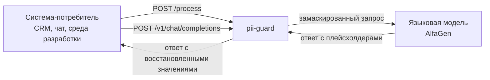
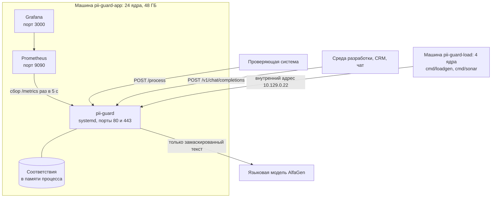
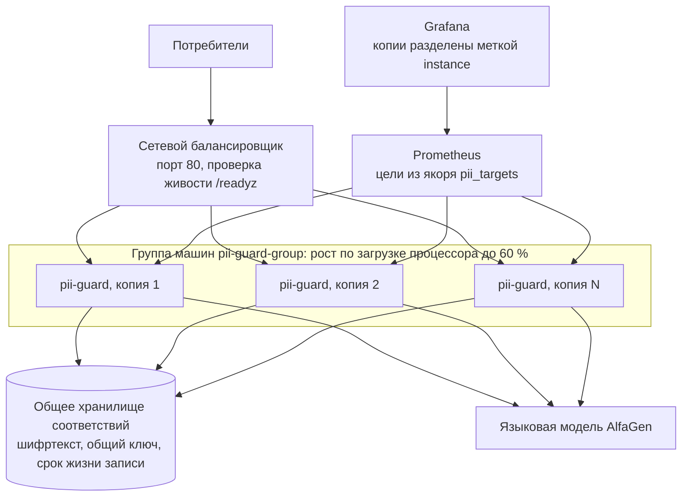
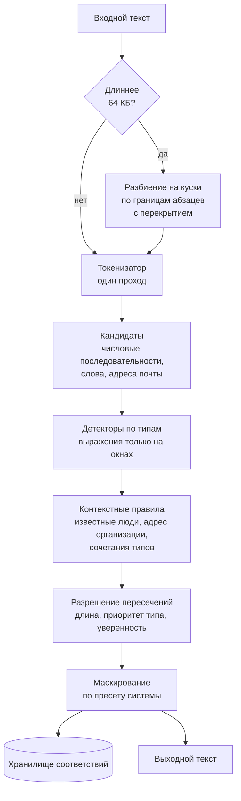
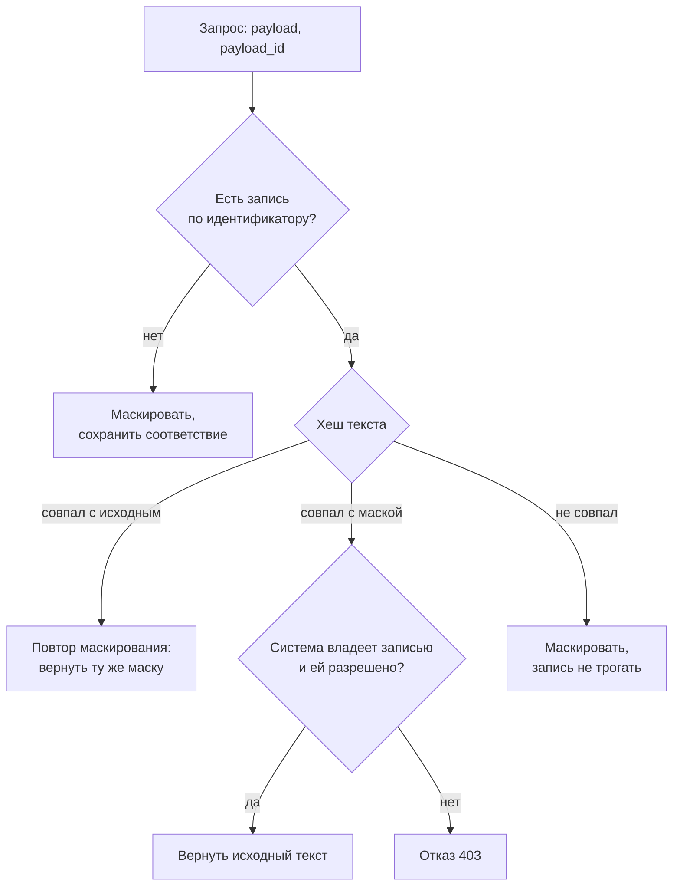

# Архитектура

## Место в цепочке



Сервис не хранит бизнес-логику потребителя и не меняет протокол: для контракта проверки это одна ручка, для обращения к модели это совместимый с OpenAI интерфейс. Подключение нового потребителя сводится к блоку в файле настроек.

## Развёртывание

### Сейчас: одна машина



Всё наблюдение живёт на той же машине, что и сервис: у стенда нет внешних
зависимостей, и жюри достаточно двух адресов, сервиса и панели.

### После включения роста: копии за балансировщиком



Вторая схема описана кодом в `deploy/terraform/scaling.tf` и выключена
переменной `enable_scaling`. Зачем и как её включать, в
[SCALING.md](SCALING.md).

### Состав стенда

| Компонент | Где живёт | Назначение | Нужен для роста |
|---|---|---|---|
| Сервис `pii-guard` | машина `pii-guard-app`, systemd, порты 80 и 443 | маскирование, обратное преобразование, прокси к языковой модели | копий становится N вместо одной |
| Хранилище соответствий | по умолчанию память процесса, при росте общее по протоколу RESP | связывает идентификатор запроса с исходным текстом, хранит его зашифрованным | да, без общего хранилища копии не видят чужие записи |
| Prometheus | та же машина, порт 9090 | собирает `/metrics` раз в пять секунд, хранит ряды | список копий задаётся якорем `pii_targets` в `deploy/prometheus.yml` |
| Grafana | та же машина, порт 3000 | панели для жюри и для наблюдения за прогоном | панели уже разделяют копии по метке `instance` |
| Генератор нагрузки | машина `pii-guard-load`, 4 ядра | `cmd/loadgen` ищет потолок, `cmd/sonar` повторяет правила проверяющей системы и считает качество | обращается к балансировщику вместо адреса машины |
| Языковая модель AlfaGen | внешний сервис | отвечает на запросы в режиме прокси, видит только плейсхолдеры | масштабируется отдельно, сервисом не управляется |
| Балансировщик | появляется вместе с группой машин | раскладывает запросы по копиям, проверяет живость по `/readyz` | да, это точка входа при N копиях |

## Конвейер обработки текста



Ключевое решение: текст разбирается один раз токенизатором, а регулярные выражения применяются только к небольшим окнам вокруг кандидатов. Прямой прогон семнадцати выражений по всему тексту на процессоре стенда занимает около одной целой двух десятых миллисекунды на килобайт, то есть почти полсекунды на текст в четыреста килобайт в один поток. Разбиение на куски с параллельной обработкой и работа по кандидатам снимают эту стоимость.

## Пакеты

| Пакет | Ответственность |
|---|---|
| `internal/pii` | токенизатор, кандидаты, детекторы по типам, контекстные правила, разрешение пересечений |
| `internal/mask` | виды маскирования и подстановка плейсхолдеров |
| `internal/store` | шифрованное хранилище соответствий с сроком жизни и сегментами |
| `internal/config` | разбор и проверка настроек, применение без перезапуска |
| `internal/engine` | связывает детекторы, правила системы и маскирование |
| `internal/api` | контракт проверки, режим прокси, служебные ручки |
| `internal/metrics` | показатели в формате Prometheus |
| `cmd/pii-guard` | запуск, сигналы, мягкая остановка |
| `cmd/gen` | генератор размеченного набора данных |
| `cmd/sonar` | имитатор проверяющей системы и подсчёт качества |

## Как добавить новый тип персональных данных

Способ без правки кода: описать тип в разделе `custom_types` файла настроек, указав выражение, якоря и при необходимости проверку контрольной суммы. Сохранить файл, сервис применит настройку за пять секунд.

Способ с кодом, если нужна нетривиальная логика: реализовать интерфейс с двумя методами и зарегистрировать конструктор. Ядро при этом не меняется.

```go
type Detector interface {
    Types() []Type
    Detect(d *Doc) []Span
}
```

## Определение направления обработки

Проверяющая система повторяет запросы при ошибках и таймаутах, поэтому порядковый номер запроса ненадёжен. Направление определяется содержимым.



Одновременные одинаковые запросы объединяются, поэтому повтор от проверяющей системы не приводит к двойной работе и не создаёт гонку за запись.

## Хранилище соответствий

Двести пятьдесят шесть независимых сегментов, каждый со своей блокировкой: запись не становится узким местом под нагрузкой. Исходный текст лежит зашифрованным алгоритмом AES-256-GCM, ключ читается из переменной окружения. Вместе с текстом хранятся хеши исходной строки и маски, имя системы-владельца, метаданные найденных фрагментов без значений и момент истечения.

Оценка памяти: при тысяче запросов в секунду и пяти минутах прогона накапливается около трёхсот тысяч записей, при среднем тексте в два килобайта это примерно семьсот мегабайт. На машине стенда с сорока восемью гигабайтами запас десятикратный.

### Что лежит в общем хранилище и зачем оно нужно для роста

Обратное преобразование возможно только там, где есть запись о маскировании.
Пока запись лежит в памяти процесса, её видит ровно одна копия сервиса, и
вторая копия на тот же идентификатор ответить не сможет. Поэтому общее
хранилище это не украшение схемы, а единственное условие горизонтального
роста.

| Что хранится | Вид | Зачем |
|---|---|---|
| Идентификатор запроса | ключ записи | по нему копия находит соответствие, кто бы его ни создал |
| Исходный текст | шифртекст AES-256-GCM | восстановление значений, ключ общий у копий и лежит в переменной окружения |
| Выданная маска | открытый текст | сравнение с пришедшим текстом, персональных данных в ней нет |
| Хеш исходника и хеш маски | по 32 байта | определение направления без расшифровки |
| Имя системы-владельца | строка | обратное преобразование разрешено только создателю записи |
| Границы найденных фрагментов и их типы | числа и названия типов | журнал и восстановление по смещениям, значений здесь нет |
| Момент истечения | отметка времени | запись живёт час и исчезает сама |

Ключевое свойство: общее хранилище видит шифртекст, а не персональные данные.
Расшифровать запись может только процесс сервиса, у которого есть ключ из
`PII_STORE_KEY`. Администратор хранилища, его резервная копия и его журнал
персональных данных не содержат. Из этого же следует требование к росту: ключ
у всех копий обязан быть одним и тем же, иначе копия не прочитает чужую
запись.

Переход на общее хранилище не меняет остальной код: обработчики работают через
интерфейс `store.Interface`, реализация выбирается один раз при запуске. Если
общее хранилище недоступно, сервис не падает, а уходит на память процесса и
отмечает это счётчиком `pii_degraded_total`.

## Потоки данных

Правило одно: значения персональных данных не покидают процесс сервиса.
Наружу уходит либо маска, либо шифртекст, либо число. Единственное исключение
это ответ на обратное преобразование, и он возвращается ровно той системе,
которая эту запись создала и которой обратное преобразование разрешено
настройкой.

| Куда | Что уходит | Чего там нет никогда |
|---|---|---|
| Языковая модель | текст с типизированными плейсхолдерами вместо значений, остальные поля запроса без изменений | ни одного настоящего значения: имени, номера документа, телефона, адреса |
| Журнал | событие, имя системы, идентификатор запроса, направление, размер в байтах, длительность, число найденных фрагментов по типам, признак щадящего режима | самого текста и значений фрагментов, в журнал не попадает даже маска |
| Показатели | счётчики и гистограммы с метками из закрытого набора: операция, система, код ответа, тип данных, причина пропуска, направление | идентификатора запроса и любых значений, метки не порождаются из пользовательского ввода |
| Хранилище соответствий | шифртекст исходника, маска, два хеша, имя системы, границы фрагментов, срок | открытого исходного текста |
| Ответ потребителю | маска либо восстановленный текст, в зависимости от направления | чужих записей: запрос к записи другой системы получает отказ 403 |

Из этого следует практическое удобство: журнал и показатели можно отдавать
кому угодно, включая жюри и внешнее наблюдение, не думая о режиме доступа к
персональным данным. Панель Grafana на порту 3000 открыта на просмотр именно
поэтому.

## Нагрузка и ограничители

Два ограничителя одновременной обработки: общий и отдельный для больших текстов. Оба работают как предохранители, а не как регуляторы: при исчерпании места запрос ждёт до полусекунды и только потом получает вежливый отказ с просьбой повторить. Отказ дешевле таймаута: проверяющая система умеет ждать и повторять, но не умеет ждать десять секунд без ответа.

Серверный таймаут записи ответа короче клиентского таймаута проверяющей системы, поэтому обрыв всегда остаётся решением сервиса.

## Отказоустойчивость

Перехват сбоев на трёх уровнях: внутри детектора, внутри обработчика и внутри горутины куска. Для профиля проверяющей системы включён щадящий режим: при внутренней ошибке возвращается исходный текст с признаком деградации, потому что пять подряд невалидных ответов останавливают весь прогон. Для остальных профилей режим строгий: ответ с кодом временной недоступности, без утечки тела запроса в сообщение об ошибке.
