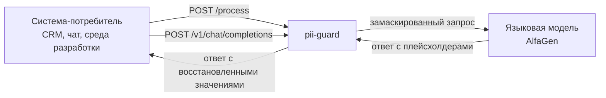
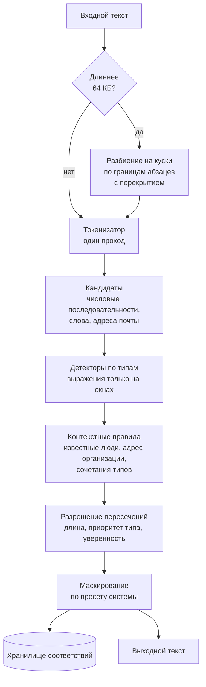
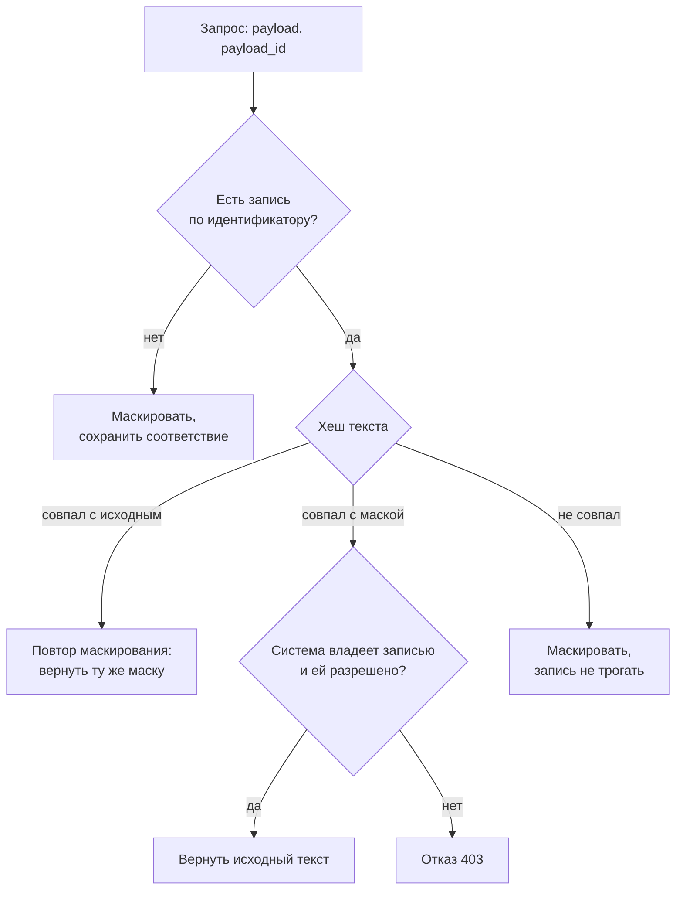

# Архитектура

## Место в цепочке



Сервис не хранит бизнес-логику потребителя и не меняет протокол: для контракта проверки это одна ручка, для обращения к модели это совместимый с OpenAI интерфейс. Подключение нового потребителя сводится к блоку в файле настроек.

## Конвейер обработки текста



Ключевое решение: текст разбирается один раз токенизатором, а регулярные выражения применяются только к небольшим окнам вокруг кандидатов. Прямой прогон семнадцати выражений по всему тексту на процессоре стенда занимает около одной целой двух десятых миллисекунды на килобайт, то есть почти полсекунды на текст в четыреста килобайт в один поток. Разбиение на куски с параллельной обработкой и работа по кандидатам снимают эту стоимость.

## Пакеты

| Пакет | Ответственность |
|---|---|
| `internal/pii` | токенизатор, кандидаты, детекторы по типам, контекстные правила, разрешение пересечений |
| `internal/mask` | виды маскирования и подстановка плейсхолдеров |
| `internal/store` | шифрованное хранилище соответствий с сроком жизни и сегментами |
| `internal/config` | разбор и проверка настроек, применение без перезапуска |
| `internal/engine` | связывает детекторы, правила системы и маскирование |
| `internal/api` | контракт проверки, режим прокси, служебные ручки |
| `internal/metrics` | показатели в формате Prometheus |
| `cmd/pii-guard` | запуск, сигналы, мягкая остановка |
| `cmd/gen` | генератор размеченного набора данных |
| `cmd/sonar` | имитатор проверяющей системы и подсчёт качества |

## Как добавить новый тип персональных данных

Способ без правки кода: описать тип в разделе `custom_types` файла настроек, указав выражение, якоря и при необходимости проверку контрольной суммы. Сохранить файл, сервис применит настройку за пять секунд.

Способ с кодом, если нужна нетривиальная логика: реализовать интерфейс с двумя методами и зарегистрировать конструктор. Ядро при этом не меняется.

```go
type Detector interface {
    Types() []Type
    Detect(d *Doc) []Span
}
```

## Определение направления обработки

Проверяющая система повторяет запросы при ошибках и таймаутах, поэтому порядковый номер запроса ненадёжен. Направление определяется содержимым.



Одновременные одинаковые запросы объединяются, поэтому повтор от проверяющей системы не приводит к двойной работе и не создаёт гонку за запись.

## Хранилище соответствий

Двести пятьдесят шесть независимых сегментов, каждый со своей блокировкой: запись не становится узким местом под нагрузкой. Исходный текст лежит зашифрованным алгоритмом AES-256-GCM, ключ читается из переменной окружения. Вместе с текстом хранятся хеши исходной строки и маски, имя системы-владельца, метаданные найденных фрагментов без значений и момент истечения.

Оценка памяти: при тысяче запросов в секунду и пяти минутах прогона накапливается около трёхсот тысяч записей, при среднем тексте в два килобайта это примерно семьсот мегабайт. На машине стенда с сорока восемью гигабайтами запас десятикратный.

## Нагрузка и ограничители

Два ограничителя одновременной обработки: общий и отдельный для больших текстов. Оба работают как предохранители, а не как регуляторы: при исчерпании места запрос ждёт до полусекунды и только потом получает вежливый отказ с просьбой повторить. Отказ дешевле таймаута: проверяющая система умеет ждать и повторять, но не умеет ждать десять секунд без ответа.

Серверный таймаут записи ответа короче клиентского таймаута проверяющей системы, поэтому обрыв всегда остаётся решением сервиса.

## Отказоустойчивость

Перехват сбоев на трёх уровнях: внутри детектора, внутри обработчика и внутри горутины куска. Для профиля проверяющей системы включён щадящий режим: при внутренней ошибке возвращается исходный текст с признаком деградации, потому что пять подряд невалидных ответов останавливают весь прогон. Для остальных профилей режим строгий: ответ с кодом временной недоступности, без утечки тела запроса в сообщение об ошибке.
