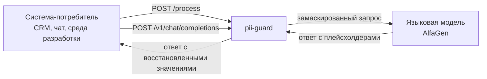
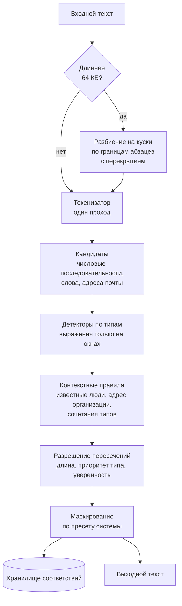
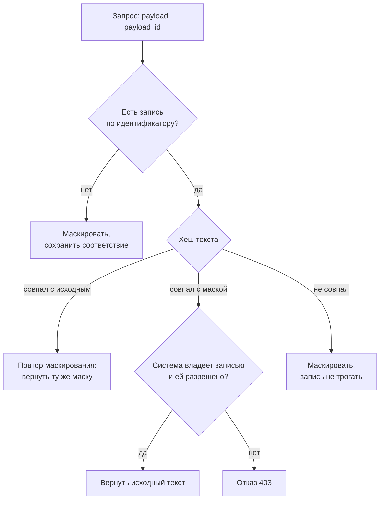

# Архитектура

Документ про устройство кода: как текст проходит через сервис, какие пакеты за
что отвечают, какие решения принимаются внутри процесса и почему именно такие.

Развёртывание, точка входа группы копий и рост под нагрузку здесь не
описываются, у них свои документы. Общий обзор решения, из которого видно
место этого документа среди остальных, в
[SYSTEM-DESIGN.md](SYSTEM-DESIGN.md).

| Вопрос | Где ответ |
|---|---|
| Из чего состоит стенд, кто с кем разговаривает, какие числа получены | [SYSTEM-DESIGN.md](SYSTEM-DESIGN.md) |
| Точка входа группы копий, проверки готовности и живости, вывод копии из обслуживания | [BALANCING.md](BALANCING.md) |
| Сколько нужно ядер и машин, по какому сигналу добавлять копии, память под хранилище | [SCALING.md](SCALING.md) |
| Состав полей журнала, защита от утечки значений, сбор и ротация | [LOGGING.md](LOGGING.md) |
| Показатели, панель, запросы для диагностики | [OBSERVABILITY.md](OBSERVABILITY.md) |
| Во что превращается найденный фрагмент | [MASK-FORMAT.md](MASK-FORMAT.md) |
| Все замеры и условия, в которых они сняты | [../BENCHMARKS.md](../BENCHMARKS.md) |

## Место в цепочке



Сервис не хранит бизнес-логику потребителя и не меняет протокол: для контракта
проверки это одна ручка, для обращения к модели это совместимый с OpenAI
интерфейс. Подключение нового потребителя сводится к блоку в файле настроек.

Ключевое свойство кода: конвейер разбора текста один и общий для всех точек
входа. Различаются только адаптеры, то есть разбор тела запроса, выбор вида
маскирования и форма ответа. Новая точка входа не приносит новой логики
обнаружения.

## Конвейер обработки текста



Ключевое решение: текст разбирается один раз токенизатором, а регулярные
выражения применяются только к небольшим окнам вокруг кандидатов. Прямой
прогон всех выражений по всему тексту на процессоре стенда занимает около одной
целой двух десятых миллисекунды на килобайт, то есть почти полсекунды на текст
в четыреста килобайт в один поток. Разбиение на куски с параллельной
обработкой и работа по кандидатам снимают эту стоимость.

Пороги разбиения заданы в `internal/engine/engine.go` константами и в
настройках не повторяются.

| Константа | Значение | Смысл |
|---|---|---|
| `chunkThreshold` | 64 КБ | начиная с этого размера текст режется на куски |
| `chunkTarget` | 32 КБ | целевой размер куска |
| `chunkOverlap` | 512 байт | перекрытие соседних кусков, чтобы фрагмент на границе не потерялся |

## Пакеты

| Пакет | Ответственность |
|---|---|
| `internal/pii` | токенизатор, кандидаты, детекторы по типам, контекстные правила, разрешение пересечений, словари |
| `internal/mask` | виды маскирования и подстановка плейсхолдеров |
| `internal/store` | шифрованное хранилище соответствий: память процесса, общее поверх протокола RESP, кодирование записи |
| `internal/config` | разбор и проверка настроек, применение без перезапуска |
| `internal/engine` | связывает детекторы, правила системы и маскирование, режет длинные тексты на куски |
| `internal/engine/subjects.go` | связи между фрагментами одного человека: через них выражается правило сочетаний типов из задания |
| `internal/api` | контракт проверки, режим прокси к модели, ручка разбора, страница проверки, служебные ручки |
| `internal/metrics` | показатели в формате Prometheus, [OBSERVABILITY.md](OBSERVABILITY.md) |
| `internal/logging` | создание журнала, единый стандарт полей, второй рубеж защиты от утечки значений, глушение повторов, журнал аудита, [LOGGING.md](LOGGING.md) |
| `cmd/pii-guard` | запуск, сигналы, мягкая остановка |
| `cmd/gen` | генератор размеченного набора данных |
| `cmd/corpus` | сборка набора из внешних источников, [CORPUS-SOURCES.md](CORPUS-SOURCES.md) |
| `cmd/score` | быстрый замер качества по набору без сети |
| `cmd/sonar` | имитатор проверяющей системы и подсчёт качества |
| `cmd/loadgen` | чистый генератор нагрузки для поиска потолка, [LOAD-TESTING.md](LOAD-TESTING.md) |

Зависимость между пакетами односторонняя: `api` знает про `engine`, `engine`
знает про `pii`, `mask` и `store`, обратных ссылок нет. `metrics` и `logging`
подключаются сверху и не участвуют в решениях об обнаружении.

## Как добавить новый тип персональных данных

Способ без правки кода: описать тип в разделе `custom_types` файла настроек,
указав выражение, якоря и при необходимости проверку контрольной суммы.
Сохранить файл, сервис применит настройку за пять секунд.

Способ с кодом, если нужна нетривиальная логика: реализовать интерфейс с двумя
методами и зарегистрировать конструктор. Ядро при этом не меняется.

```go
type Detector interface {
    Types() []Type
    Detect(d *Doc) []Span
}
```

Имена типов совпадают в трёх местах сразу: в константах `internal/pii/types.go`,
в разделе `systems` файла настроек и в метке `type` показателей. Поэтому
переименование типа это правка не только кода.

## Определение направления обработки

Проверяющая система повторяет запросы при ошибках и таймаутах, поэтому
порядковый номер запроса ненадёжен. Направление определяется содержимым.



Одновременные одинаковые запросы объединяются, поэтому повтор от проверяющей
системы не приводит к двойной работе и не создаёт гонку за запись.

## Хранилище соответствий

Двести пятьдесят шесть независимых сегментов, каждый со своей блокировкой:
запись не становится узким местом под нагрузкой. Исходный текст лежит
зашифрованным алгоритмом AES-256-GCM, ключ читается из переменной окружения.

| Что хранится | Вид | Зачем |
|---|---|---|
| Идентификатор запроса | ключ записи | по нему находится соответствие |
| Исходный текст | шифртекст AES-256-GCM | восстановление значений |
| Выданная маска | открытый текст | сравнение с пришедшим текстом, персональных данных в ней нет |
| Хеш исходника и хеш маски | по 32 байта | определение направления без расшифровки |
| Имя системы-владельца | строка | обратное преобразование разрешено только создателю записи |
| Границы найденных фрагментов и их типы | числа и названия типов | восстановление по смещениям, значений здесь нет |
| Момент истечения | отметка времени | запись исчезает сама |

Ключевое свойство: хранилище видит шифртекст, а не персональные данные.
Расшифровать запись может только процесс сервиса, у которого есть ключ из
`PII_STORE_KEY`.

### Расход памяти

| Величина | Значение | Вид |
|---|---|---|
| Одна запись | около 3 КБ | замер |
| Миллион записей в памяти процесса | около 3 ГБ | замер |
| Штатный прогон: 1 000 запросов в секунду за пять минут | 299 994 записи, около 0.9 ГБ | расчёт по замеру выше |
| Память машины стенда | 48 ГБ | из описания стенда |

Расход памяти растёт от частоты запросов и срока жизни записи, а не от объёма
текста. Два предела задаются настройкой `store`: срок жизни `store.ttl` равен
пятнадцати минутам, предел числа записей `store.max_records` равен миллиону.
При исчерпании предела хранилище вытесняет самые старые записи, поэтому
настоящий срок жизни равен меньшему из двух. Таблица расхода под разные
частоты в [SCALING.md](SCALING.md).

### Переход на общее хранилище

Обратное преобразование возможно только там, где есть запись о маскировании.
Пока запись лежит в памяти процесса, её видит ровно одна копия сервиса, и
вторая копия на тот же идентификатор ответить не сможет. Поэтому общее
хранилище это единственное условие горизонтального роста, а не украшение схемы.

В коде это ничего не меняет: обработчики работают через интерфейс
`store.Interface`, реализация выбирается один раз при запуске. Если общее
хранилище недоступно, сервис не падает, а уходит на память процесса и отмечает
это счётчиком `pii_degraded_total`. Клиент протокола RESP написан на
стандартной библиотеке, новых зависимостей он не принёс.

Из общего ключа следует требование к росту: ключ у всех копий обязан быть
одним и тем же, иначе копия не прочитает чужую запись. Порядок включения и
расчёт нагрузки на хранилище в [SCALING.md](SCALING.md).

## Потоки данных наружу

Правило одно: значения персональных данных не покидают процесс сервиса. Наружу
уходит либо маска, либо шифртекст, либо число. Единственное исключение это
ответ на обратное преобразование, и он возвращается ровно той системе, которая
эту запись создала и которой обратное преобразование разрешено настройкой.

В коде правило держится тремя местами: метки показателей берутся из закрытого
набора и не порождаются из пользовательского ввода (`internal/metrics`), в
журнал передаются только типы и счётчики, а перед записью поля ещё раз
проверяются вторым рубежом (`internal/logging`), в хранилище исходный текст
кладётся только зашифрованным (`internal/store/codec.go`). Правило проверяется
отдельным тестом: он прогоняет весь набор данных и ищет каждое эталонное
значение во всём выводе.

Разбор по каждому потоку, с указанием что именно уходит и чего там нет
никогда, в [SYSTEM-DESIGN.md](SYSTEM-DESIGN.md).

## Ограничители одновременной обработки

Два ограничителя: общий и отдельный для больших текстов. Оба работают как
предохранители, а не как регуляторы: при исчерпании места запрос ждёт до
полусекунды и только потом получает вежливый отказ с просьбой повторить. Отказ
дешевле таймаута, потому что проверяющая система умеет ждать и повторять, но
не умеет ждать десять секунд без ответа.

| Параметр настроек | Значение | Смысл |
|---|---|---|
| `limits.inflight` | 96 | общий предел одновременной обработки |
| `limits.heavy_inflight` | 6 | отдельный предел для больших текстов |
| `limits.heavy_threshold_bytes` | 64 КБ | с какого размера текст считается большим |
| `limits.max_wait` | 500 мс | ожидание места, дальше ответ 429 |
| `server.write_timeout` | 9 с | серверный таймаут записи ответа |
| `server.shutdown_timeout` | 15 с | предел ожидания завершения при остановке |

Серверный таймаут записи ответа короче клиентского таймаута проверяющей
системы в десять секунд, поэтому обрыв всегда остаётся решением сервиса.
Поведение под перегрузкой целиком, вместе с признаками и порядком разбора, в
[BALANCING.md](BALANCING.md) и [OBSERVABILITY.md](OBSERVABILITY.md).

## Отказоустойчивость

Предохранителей два, и стоят они в тех местах, где чужой код может уронить
процесс: вокруг вызова детектора в `internal/pii/registry.go` и вокруг
обработчика запроса в `internal/api/server.go`. Для профиля проверяющей системы
включён щадящий режим: при внутренней ошибке возвращается исходный текст с
признаком деградации, потому что пять подряд невалидных ответов останавливают
весь прогон. Для остальных профилей режим строгий: ответ с кодом временной
недоступности, без утечки тела запроса в сообщение об ошибке.

| Что отказало | Где перехватывается | Поведение |
|---|---|---|
| Сбой одного детектора | `internal/pii/registry.go`, `detectOne` | тип пропускается, счётчик `pii_detector_panics_total`, ответ с частичной маской |
| Сбой обработчика | `internal/api/server.go` | щадящий режим отдаёт исходный текст с признаком деградации, строгий отдаёт 503 |
| Общее хранилище недоступно | `internal/store` | уход на память процесса, счётчик `pii_degraded_total` |
| Настройки не прошли проверку | `internal/config` | отбрасываются, работает прежняя версия |

Честная граница: при разбиении длинного текста куски обрабатываются
горутинами в `internal/engine`, и собственного предохранителя у этих горутин
нет. Вызов детектора внутри них защищён, а сбой в остальном коде горутины
перехватить некому, потому что предохранитель обработчика лежит в другой
горутине. На сегодня эта ветка не срабатывала ни в одном прогоне, но полагаться
на это не стоит.
