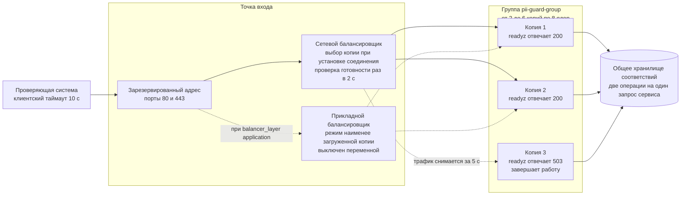
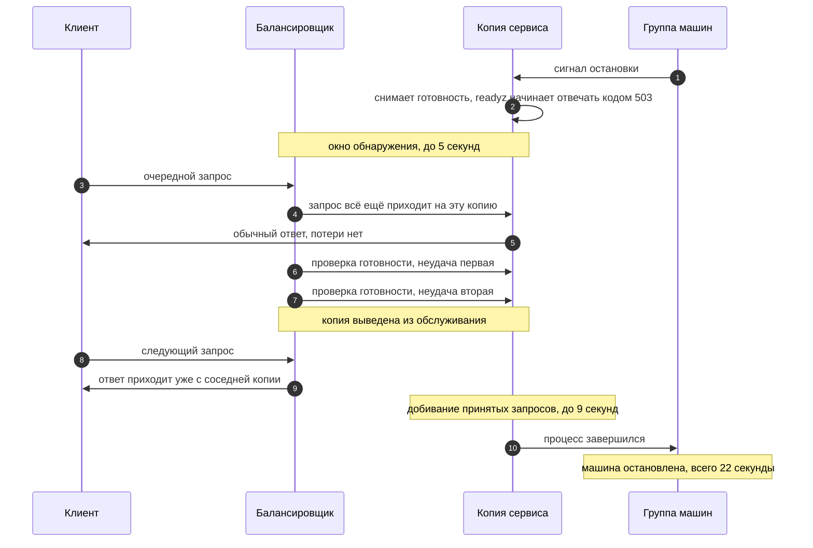

# Балансировка нагрузки

Точка входа группы копий сервиса. Что выбрано, почему именно так, сколько это
стоит по времени и где лежат ловушки. Все замеры взяты из
[BENCHMARKS.md](../BENCHMARKS.md), расчётные величины помечены словом оценка.

Код: [`deploy/terraform/balancer.tf`](../deploy/terraform/balancer.tf) и
[`deploy/terraform/scaling.tf`](../deploy/terraform/scaling.tf). Соседние
темы: [SCALING.md](SCALING.md) про рост числа копий,
[OBSERVABILITY.md](OBSERVABILITY.md) про показатели.

## Коротко

| Вопрос | Решение | Почему |
|---|---|---|
| Уровень балансировки | сетевой, на уровне соединений | тела до четырёх мегабайт и доля 99 равна 0.97 мс, разбор HTTP на входе дороже самой обработки |
| Прикладной уровень | описан, выключен | нужен, когда появится перекос загрузки между копиями либо отдельный таймаут на путь прокси |
| Что проверяет балансировщик | готовность `/readyz` | копия сама просит увести с себя трафик, когда завершает работу |
| Что проверяет группа машин | живость `/healthz` | пересоздавать копию надо только когда процесс умер, а не когда он корректно выводится |
| Привязка клиента к копии | не нужна | соответствия лежат в общем хранилище, а привязка при одном клиенте свела бы группу к одной копии |
| Способ выбора копии | наименее загруженная, на прикладном уровне | стоимость запроса разнится в полторы тысячи раз, равное число запросов не означает равную работу |
| Точка входа | один зарезервированный адрес на порты 80 и 443 | контракт проверки не должен распадаться на два адреса |

## Выбор уровня балансировки

Сетевой балансировщик выбирает копию один раз, когда клиент устанавливает
соединение, и дальше только передаёт пакеты. Прикладной разбирает HTTP и
выбирает копию на каждый запрос, то есть видит путь, заголовки и тело.

Наши условия, из-за которых выбор неочевиден:

| Условие | Значение | Что из этого следует |
|---|---|---|
| Размер тела запроса | до 4 мегабайт | прикладной балансировщик тело буферизует, сетевой не трогает |
| Средний текст набора проверки | 247 байт | обычный запрос крошечный, дорогих запросов мало, но они очень дорогие |
| Доля 50 задержки на рабочей частоте | 0.36 мс | собственное время прикладного балансировщика сопоставимо с временем обработки |
| Доля 99 задержки на рабочей частоте | 0.97 мс | любая добавка на входе видна в отчёте |
| Разброс времени обработки | от долей миллисекунды до сотен миллисекунд | равномерная раскладка по числу запросов не даёт равномерной загрузки |
| Контракт по TLS | порт 443, самоподписанный сертификат | сетевой пропускает TLS насквозь, прикладному нужен сертификат в Certificate Manager |

Что даёт каждый уровень в нашем случае:

| Свойство | Сетевой, уровень соединений | Прикладной, уровень запросов |
|---|---|---|
| Добавка к задержке | пакетная передача, собственной обработки запроса нет | разбор HTTP и буферизация тела, замера у нас нет, оценка единицы миллисекунд |
| Тело в 4 мегабайта | проходит насквозь | проходит через память балансировщика |
| Выбор копии | один раз на соединение, по пятёрке адресов и портов | на каждый запрос, доступен режим наименее загруженной |
| Разные таймауты для разных путей | невозможны, путь не разбирается | маршрут `/v1/chat/completions` получает свой предел |
| Отказ копии в середине запроса | клиент видит обрыв соединения | балансировщик отвечает кодом 502 или 504 |
| Порт 443 | проброс соединения, сертификат сервиса не меняется | требуется сертификат в Certificate Manager, TLS завершается на балансировщике |
| Клиентский адрес в журнале сервиса | сохраняется | подменяется адресом балансировщика, исходный уезжает в заголовок |

Выбран сетевой. Главный довод в цифрах: на рабочей частоте вся обработка
запроса укладывается в 0.97 мс по доле 99, и прикладной балансировщик добавил
бы к этому свою обработку того же порядка. Второй довод в том, что запас по
пропускной способности сейчас двадцатикратный, то есть перекос загрузки между
копиями не превращается в отказ, а именно перекос и есть то, ради чего берут
прикладной уровень.

Когда переходить на прикладной, признаки в порядке важности:

| Признак | Порог | Что именно ломается на сетевом уровне |
|---|---|---|
| Перекос загрузки процессора между копиями | больше 15 процентных пунктов устойчиво | соединение уже прибито к копии, перераспределить запросы внутри него нельзя |
| Длинный путь прокси к языковой модели вместе с коротким путём маскирования | появление заметной доли запросов к модели | один предел на всё, короткий путь придётся мерить по длинному |
| Требование отвечать кодом вместо обрыва | появление в контракте | сетевой балансировщик кодов не формирует |
| Разделение путей по группам копий | появление отдельного профиля нагрузки | маршрутизации по пути нет |

Переключение сделано одной переменной `balancer_layer`, значения `network` и
`application`. Обе схемы описаны в `balancer.tf`, создаётся ровно одна.

## Путь запроса

Общее хранилище на схеме не случайно стоит под всеми копиями: именно оно
делает копии взаимозаменяемыми и снимает вопрос о привязке клиента.

## Проверки: готовность и живость

Это две разные проверки с разной ценой ошибки, и они намеренно разведены.

| Что | Готовность `/readyz` | Живость `/healthz` |
|---|---|---|
| Отвечает на вопрос | слать ли на копию трафик прямо сейчас | жив ли процесс вообще |
| Кто смотрит | балансировщик | группа машин |
| Что делает при отказе | уводит трафик на соседние копии | пересоздаёт машину |
| Цена ошибочного срабатывания | доли секунды перекоса нагрузки | около двух минут на сборку и запуск новой копии |
| Когда отвечает отрицательно | сервис получил сигнал остановки и снял готовность | процесс не отвечает |

Если бы балансировщик смотрел на живость, снятие готовности перед остановкой
он бы не заметил и продолжал слать запросы в закрывающийся процесс. Если бы
группа машин смотрела на готовность, каждое мягкое завершение она принимала бы
за поломку и пересоздавала машину. Поэтому проверки разные, и задаются они
разными переменными.

| Параметр | Готовность | Живость | Почему так |
|---|---|---|---|
| Период проверки | 2 с | 10 с | трафик надо уводить быстро, пересоздавать машину незачем |
| Предел ожидания ответа | 1 с | 3 с | обработчик не ходит ни в хранилище, ни в детекторы, доля 99 всего запроса 0.97 мс |
| Порог отрицательного решения | 2 неудачи | 6 неудач | вывод из обслуживания дёшев и обратим, пересоздание дорого |
| Порог положительного решения | 2 удачи | 2 удачи | одна случайная удача не должна возвращать копию в строй |
| Время решения в худшем случае | 5 с | 63 с | период умножить на порог плюс предел ожидания |

Числа задаются переменными `balancer_check_*` в `balancer.tf` и
`scaling_live_*` в `scaling.tf`, по месту они не повторяются.

## Мягкий вывод копии из обслуживания

Полная цепочка по шагам и по времени:

| Шаг | Время | Откуда число |
|---|---|---|
| Сигнал остановки доходит до процесса | мгновенно | systemd либо группа машин |
| Сервис снимает готовность | мгновенно | переключение флага в памяти, `SetReady` |
| Балансировщик замечает снятие готовности | до 5 с | период 2 с умножить на порог 2 плюс предел ожидания 1 с |
| Запас на разброс проверок | 2 с | переменная `balancer_drain_margin` |
| Сервис держит приём открытым | 7 с | сумма двух строк выше, `local.lb_drain_seconds` |
| Добивание принятых запросов | до 9 с | таймаут записи ответа в сервисе |
| Предел ожидания завершения | 15 с | `server.shutdown_timeout` |
| Полная остановка | 22 с | 7 плюс 15 |

Сопоставление с внутренними пределами сервиса:

| Величина | Значение | Отношение к выводу из обслуживания |
|---|---|---|
| Ожидание места в ограничителе | 0.5 с | запрос либо начал обрабатываться, либо получил отказ с просьбой повторить задолго до конца окна |
| Таймаут записи ответа | 9 с | ни один принятый запрос не переживёт добивание |
| Предел завершения | 15 с | с запасом перекрывает таймаут записи, обрыва по этому пределу быть не может |
| `TimeoutStopSec` у systemd | по умолчанию 90 с | перекрывает 22 с, но задать явное значение 30 с честнее, чем полагаться на умолчание |

Рассчитанные значения не спрятаны в тексте: модуль выдаёт их выводами
`balancer_drain_plan` и `scaling_stop_seconds`, и они пересчитываются сами при
изменении настроек проверки.

> **Закрыто в коде сервиса.** В `cmd/pii-guard/main.go` после `SetReady(false)`
> вызывается `drain`, и только затем `Shutdown`: пауза задаётся настройкой
> `server.drain_timeout`, сейчас она равна семи секундам при окне обнаружения
> в пять. Замер мягкой остановки под нагрузкой даёт разрыв 6.9 секунды между
> снятием готовности и закрытием приёма, отказов при этом ноль.

## Привязка клиента к копии

Привязка не нужна, и включать её нельзя. Три независимых довода.

| Довод | Разбор |
|---|---|
| Привязка не решает нашу задачу | связать надо не клиента с копией, а идентификатор запроса с копией, которая сделала маску, потому что маскирование и обратное преобразование это два отдельных запроса |
| Привязать по идентификатору технически невозможно | идентификатор лежит в теле запроса, а балансировщик умеет привязывать только по адресу источника, по заголовку или по куке, тело он для этого не разбирает ни на каком уровне |
| Привязка по адресу убивает балансировку | проверяющая система приходит с одного адреса, и вся нагрузка осела бы на одной копии из шести |

Настоящее решение уже есть: общее хранилище соответствий. Запись кладёт любая
копия, читает любая копия, ключ шифрования у всех один. Именно поэтому копии
взаимозаменяемы и привязка не нужна.

### Ловушка: балансировщик включён, общее хранилище выключено

Это самая неприятная из возможных ошибок настройки, потому что она не выглядит
как ошибка.

| Шаг | Что происходит |
|---|---|
| Маскирование | запрос попадает на копию 1, она кладёт соответствие в память своего процесса и отдаёт маску |
| Обратное преобразование | запрос с тем же идентификатором попадает на копию 2 |
| Копия 2 ищет запись | записи нет, потому что память у процессов разная |
| Копия 2 принимает решение | присланный текст считается новым и маскируется ещё раз |
| Что видит клиент | код 200 и формально правильный ответ, в котором исходного текста нет |

Ни ошибки, ни отказа, ни всплеска на панели. Поэтому защита стоит в коде
инфраструктуры, а не в инструкции: предусловия в `scaling.tf` и `balancer.tf`
не дают применить конфигурацию с `enable_scaling = true` при
`enable_shared_store = false` и объясняют причину текстом ошибки.

У ловушки есть и второе дно, уже во время работы. При недоступности общего
хранилища сервис переходит на память процесса и считает деградации в
`pii_degraded_total`. На одной машине это правильное поведение, оно спасает
прогон. В группе копий это ровно та же тихая ошибка, что и выше. Предложение,
которое стоит внести в код сервиса: при включённом общем хранилище деградация
должна снимать готовность, чтобы балансировщик увёл трафик с копии, потерявшей
хранилище. Файл принадлежит другой теме, здесь записано требование.

## Распределение запросов по копиям

Стоимость запроса у нас определяется не числом запросов, а объёмом текста.
Замер стоит 1.2 мс на килобайт на ядро, отсюда расчёт:

| Размер текста | Стоимость одного прохода на ядре | Откуда |
|---|---|---|
| 250 байт | 0.3 мс | расчёт по замеру 1.2 мс на килобайт |
| 2 килобайта | 2.4 мс | расчёт по замеру |
| 8 килобайт | 9.6 мс | расчёт по замеру |
| 400 килобайт, максимум набора проверки | 480 мс | расчёт по замеру |
| 4 мегабайта, предел размера тела | 4.9 с | расчёт по замеру |

Разброс стоимости между самым дешёвым и самым дорогим запросом набора равен
полутора тысячам раз. Отсюда сравнение способов выбора копии:

| Способ | Что уравнивает | Что происходит у нас |
|---|---|---|
| Круговой перебор | число запросов на копию | копия, которой достались три текста по 400 килобайт, получит следующий запрос наравне с простаивающей соседкой |
| Случайный выбор | число запросов в среднем | то же самое, только с большей дисперсией |
| Наименее загруженная копия | число активных запросов на копию | копия, занятая тяжёлым текстом, перестаёт получать новые запросы, пока не освободится |
| Хеш по пятёрке адресов и портов, сетевой уровень | соединения, а не запросы | внутри одного соединения перераспределения нет вовсе |

Поэтому на прикладном уровне выбран режим наименее загруженной копии,
переменная `balancer_mode`, значение `LEAST_REQUEST`. У этого режима есть и
второй эффект, важный именно для нас: внутри сервиса есть отдельный
ограничитель на 6 одновременных текстов больше 64 килобайт. Копия, упёршаяся в
этот ограничитель, начинает отвечать медленнее, число активных запросов на ней
растёт, и режим наименее загруженной уводит с неё трафик сам. Круговой перебор
продолжил бы слать ей запросы до отказов с просьбой повторить.

На сетевом уровне выбора режима нет, распределение идёт хешем по пятёрке
адресов и портов. Это терпимо, пока клиент открывает много соединений: адреса
и порты источника разные, соединения раскладываются равномерно. Это ломается,
когда клиент держит несколько долгих соединений и шлёт в них текст разного
объёма. Порог перехода на прикладной уровень описан выше.

## Отказ одной машины

Считаем по контрактной нагрузке 1000 запросов в секунду и двум копиям, то есть
500 запросов в секунду на копию. Числа потерь это оценка, полученная
умножением частоты на время обнаружения, а не отдельный замер.

| Сценарий | Что видит клиент | Сколько запросов затронуто, оценка | Как видно в показателях |
|---|---|---|---|
| Мягкий вывод, готовность снята заранее | ничего, все запросы обслужены | 0 | ряд копии в панели плавно уходит в ноль, отказов нет |
| Процесс упал, машина жива | отказ в соединении сразу, ошибка быстрая | до 2500 за 5 секунд окна обнаружения, это 0.8 процента пятиминутного прогона | `up` по цели становится нулём, суммарная частота проседает вдвое |
| Машина выключилась целиком | таймаут соединения, клиент ждёт до своих 10 секунд | те же до 2500, но каждый ждёт долго | `up` по цели становится нулём, у клиента растёт доля 99 |
| Копия жива, но потеряла общее хранилище | ответы приходят, часть из них молча неверна | все запросы копии до вмешательства | растёт `pii_degraded_total`, отказов не видно |

Три вывода из этой таблицы.

Первый. Разница между первой и второй строкой это и есть цена паузы перед
закрытием приёма. Семь секунд ожидания превращают две с половиной тысячи
потерянных запросов в ноль.

Второй. Проверяющая система останавливает прогон после пяти подряд неверных
ответов. При жёстком отказе копии подряд идущие обрывы набираются за доли
секунды, поэтому мягкий вывод это не вежливость, а требование к прогону.

Третий. Показатели сервиса по определению не видят запросов, которые до
сервиса не доехали. Потери видны либо у клиента, либо по провалу суммарной
частоты на панели. Собственных показателей балансировщика мы не собираем, это
известный пробел наблюдения.

## Согласование таймаутов

Правило: чем глубже звено, тем короче его предел. Тогда сдаётся первым тот, кто
дальше всех от клиента, а каждое звено выше успевает превратить его отказ в
осмысленный ответ. Нарушение порядка даёт обрыв соединения вместо кода ответа,
а обрыв клиент не отличает от нашей поломки.

Путь маскирования, контракт проверки:

| Глубина | Звено | Предел | Где задан |
|---|---|---|---|
| 1 | Проверяющая система | 10 с | контракт проверки |
| 2 | Балансировщик, только прикладной уровень | 9.5 с | `balancer_route_timeout` |
| 3 | Сервис, запись ответа | 9 с | `server.write_timeout` |
| 4 | Ожидание места в ограничителе | 0.5 с | `limits.max_wait` |
| 5 | Одна операция в общем хранилище | 0.3 с | настройки клиента хранилища |

На сетевом уровне ступени номер 2 нет: балансировщик не разбирает запрос и
своего предела на запрос не имеет. Цепочка становится короче на одно звено, и
роль верхней границы целиком берёт на себя таймаут записи ответа в сервисе.

Путь прокси к языковой модели устроен иначе, и здесь порядок нарушен:

| Глубина | Звено | Предел | Замечание |
|---|---|---|---|
| 1 | Среда разработки | задаётся не нами | неизвестен |
| 2 | Балансировщик, прикладной уровень | 60 с | `balancer_proxy_route_timeout`, отдельный маршрут |
| 3 | Сервис, запись ответа | 9 с | общий для всех путей |
| 4 | Обращение к языковой модели | 60 с | `systems.kilo.upstream.timeout` |

Ступень 4 длиннее ступени 3 в шесть с лишним раз. Это значит, что ответ модели
дольше девяти секунд сервис записать не успеет: соединение закроется по
таймауту записи, а клиент увидит обрыв, хотя модель ещё считает. Пока прокси
не нагружают, это не проявляется. Решение лежит в коде сервиса и принадлежит
другой теме: либо снимать предел записи на маршруте прокси через
`http.ResponseController`, либо развести пути по разным слушателям с разными
пределами. Отдельный маршрут на прикладном балансировщике уже описан и ждёт
этой правки.

## Что изменено в коде инфраструктуры

| Изменение | Файл | Зачем |
|---|---|---|
| Балансировка вынесена в отдельный файл | `balancer.tf` | уровень балансировки меняется одной переменной и не задевает описание машин |
| Описан прикладной балансировщик целиком | `balancer.tf` | группа бэкендов, маршрутизатор, виртуальный узел и сам балансировщик, включается `balancer_layer` |
| Добавлен зарезервированный адрес | `balancer.tf` | порты 80 и 443 садятся на один адрес, точка входа переживает пересоздание балансировщика |
| Добавлен слушатель порта 443 | `balancer.tf` | без него включение масштабирования молча рвало половину контракта проверки |
| Параметры проверок вынесены в переменные | `balancer.tf`, `scaling.tf` | период, предел ожидания и пороги задаются в одном месте и участвуют в расчёте времени вывода |
| Проверка группы машин переведена на живость | `scaling.tf` | раньше группа пересоздавала бы копию за корректное снятие готовности |
| Добавлены пределы раскатки | `scaling.tf` | `startup_duration`, `max_checking_health_duration`, `max_opening_traffic_duration`, стратегия `proactive` |
| Посчитано и выведено время вывода из обслуживания | `balancer.tf`, `scaling.tf` | выводы `balancer_drain_plan` и `scaling_stop_seconds` вместо чисел на глаз |
| Усилены предусловия | `scaling.tf`, `balancer.tf` | ловушка с выключенным общим хранилищем теперь объясняется текстом ошибки |

## Как включить

Порядок тот же, что в [SCALING.md](SCALING.md), балансировка добавляет к нему
один шаг выбора уровня.

| Шаг | Что сделать | Как проверить |
|---|---|---|
| 1 | `enable_shared_store = true` | `pii_degraded_total` остаётся нулём |
| 2 | `enable_monitor_vm = true` | панель поднялась на отдельной машине |
| 3 | `enable_scaling = true`, задать `scaling_service_account_id` | план создаёт группу, адрес и балансировщик, ничего не удаляет |
| 4 | при необходимости `balancer_layer = "application"` | план заменяет сетевой балансировщик прикладным, группа машин не пересоздаётся |
| 5 | посмотреть вывод `balancer_drain_plan` | числа совпадают с таблицей мягкого вывода |
| 6 | проверить обратное преобразование через разные копии | исходный текст совпадает побайтово |

## Что осталось нерешённым

| Вопрос | Состояние |
|---|---|
| Пауза между снятием готовности и закрытием приёма | требуется правка `cmd/pii-guard/main.go`, число 7 секунд посчитано и выведено модулем |
| Явный `TimeoutStopSec` у systemd | требуется правка `deploy/terraform/cloud-init/pii-guard.service`, нужное значение 30 секунд |
| Деградация хранилища не снимает готовность | требуется правка кода сервиса, в группе копий деградация означает тихо неверные ответы |
| Таймаут записи короче таймаута обращения к модели | требуется правка кода сервиса, на пути прокси порядок пределов нарушен |
| Показатели самого балансировщика | не собираются, отказ копии виден только по провалу суммарной частоты |
| Собственная задержка прикладного балансировщика | не замерена, в таблице стоит оценка, мерить надо на стенде перед переключением уровня |
| Проверка плана в облаке | `tofu validate` и `tofu fmt` проходят, `tofu plan` требует доступа к облаку, которого у сборки нет |
