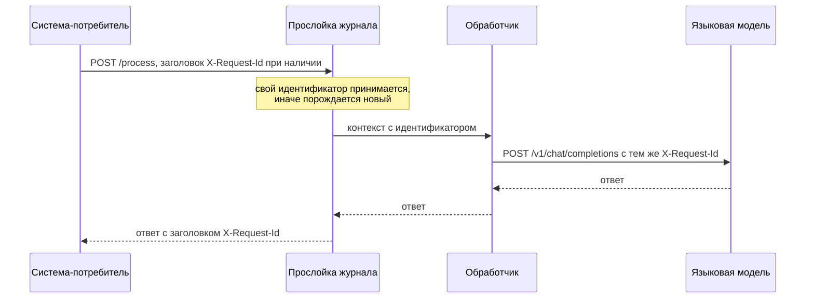
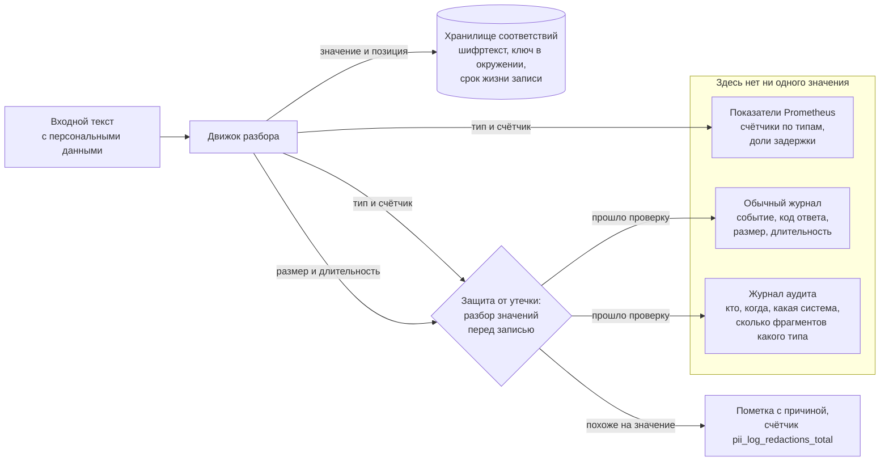
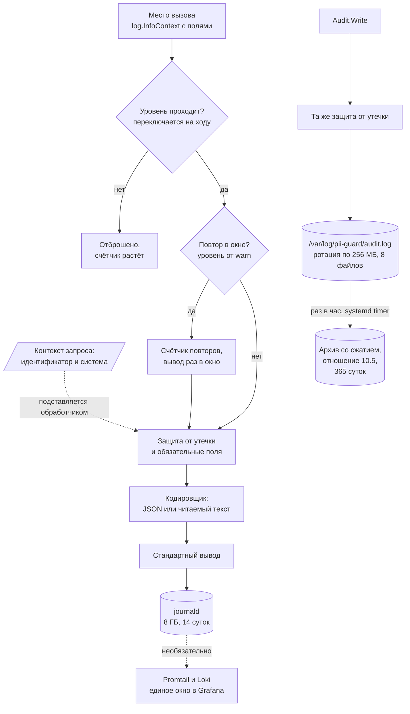

# Журналирование

Документ описывает, как сервис ведёт журнал: какие поля обязательны, как
выбирается уровень, как устроена защита от утечки персональных данных, чем
журнал аудита отличается от обычного, куда всё это собирается и сколько места
занимает.

Главное требование, из которого выведено остальное: **значения персональных
данных не попадают в журнал никогда**. Оно закрыто двумя независимыми
рубежами, и второй из них работает даже тогда, когда ошибся человек.

## Что изменилось

| Было | Стало |
| --- | --- |
| `slog.New` прямо в `main`, уровень зашит в код | пакет `internal/logging`, уровень и формат из настроек |
| у каждой записи свой набор полей | обязательные поля добавляются обработчиком, а не местом вызова |
| идентификатор запроса читался из заголовка в двух местах | сквозной идентификатор в контексте, ответ клиенту с заголовком |
| утечка предотвращалась только дисциплиной вызова | второй рубеж: разбор значений перед записью |
| шторм ошибок писался целиком | глушение повторов со счётчиком, прореживание обычных записей |
| журнала аудита не было | отдельный поток аудита со своим сроком хранения |
| журнал никуда не собирался и не ротировался | journald с пределами, аудит в файл с ротацией и архивом |
| подробность менялась перезапуском | ручка управления уровнем с автоматическим возвратом |
| обязательные поля дописывались вслепую, переданное место вызова получало два ключа с одним именем | дописывается только то, чего в записи нет |
| идентификатор от клиента проверялся только по форме | политика идентификатора: непохожий на идентификатор выходит отпечатком |
| журнал не был подключён к сервису | подключён: прослойка на всех маршрутах, аудит на всех обращениях к данным, показатели в общем реестре |

## Стандарт полей

Обязательные поля есть в каждой записи. Их подставляет обработчик журнала,
поэтому новое место вызова не может их забыть.

| Поле | Откуда берётся | Пример |
| --- | --- | --- |
| `time` | slog | `2026-09-22T19:31:05.123Z` |
| `level` | slog | `info` |
| `event` | место вызова, иначе `unspecified` | `process` |
| `request_id` | контекст запроса | `4f3c2b1a...` |
| `system` | контекст запроса, ставится после опознания ключа | `crm` |
| `duration_ms` | место вызова, иначе ноль | `0.36` |
| `service`, `instance`, `version` | настройки при запуске | `pii-guard`, `pii-guard-1` |

Часто встречающиеся поля: `component`, `op`, `status`, `method`, `path`,
`payload_id`, `bytes`, `error`, `pii_types`, `suppressed`.

Обязательное поле дописывается только тогда, когда его нет в записи. Место
вызова вправе передать `request_id` или `system` само — например, когда имя
системы известно раньше, чем оно попало в контекст, — и второго ключа с тем
же именем в JSON не появится. Это правило держит обработчик, а не дисциплина
мест вызова: раньше оно держалось обходом на стороне вызова, и каждое новое
место вызова могло его нарушить.

Два правила, из которых всё остальное следует само:

1. **Сообщение это константа.** Всё переменное идёт в поля. Иначе не работают
   ни поиск по журналу, ни глушение повторов: его ключ это уровень и текст
   сообщения.
2. **Событие обязательно.** `event` это машинный код записи, по нему строятся
   выборки и правила оповещения. Набор событий закрыт и перечислен
   в `internal/logging/logging.go`.

## Уровни

Правило в одном предложении: **уровень определяется не важностью данных, а
тем, нужен ли человек**.

| Уровень | Нужен ли человек | Что писать | Примеры |
| --- | --- | --- | --- |
| `error` | нужен сейчас, само не пройдёт | сервис не сделал обещанного | настройки не приняты при запуске, сбой обработчика, сбой детектора |
| `warn` | нужен, если повторится | сервис справился, но хуже обещанного, или ресурс на исходе | деградация общего хранилища, отказ по ограничителю, отклонены новые настройки, сертификат не подготовлен |
| `info` | не нужен | значимое изменение состояния и факт обслуживания | запуск и остановка, применены настройки, запрос обслужен |
| `debug` | только если сам попросил | подробности горячего пути | какое правило сработало, сколько заняли этапы разбора |

Отладочный уровень выключен по умолчанию и включается без перезапуска:

```bash
curl -XPOST 'localhost:8080/admin/loglevel?level=debug&ttl=5m'
```

По истечении срока уровень возвращается сам. Это защита от забытого
отладочного уровня: на потолке нагрузки он даёт поток, который съедает
дисковый бюджет за минуты.

Цена отладочной записи при выключенном уровне измерена и составляет 8.6
наносекунды без выделения памяти, поэтому вызов на горячем пути допустим.

## Идентификатор запроса



Правила:

- присланный клиентом идентификатор принимается, если он не длиннее 96 байт и
  состоит из букв, цифр и знаков `-_.:`; иначе порождается свой из
  шестнадцати случайных байтов;
- проверка формы обязательна: чужая строка произвольного вида это и мусор в
  журнале, и способ протащить в него значение персональных данных;
- идентификатор возвращается клиенту в заголовке ответа и входит в тело
  ошибки, чтобы клиент мог сослаться на конкретный запрос;
- он же уходит к языковой модели, поэтому обращение к ней видно в её журнале
  под тем же номером;
- в коде его не передают руками: он лежит в контексте, обработчик журнала
  достаёт его сам.

### Политика идентификатора

Проверка формы отвечает на вопрос «не сломает ли чужая строка разметку
журнала», но не отвечает на вопрос «идентификатор ли это вообще». Строка
`4276380012345678` проверку формы проходит: в ней только цифры и она короче
предела. Это номер карты.

Так же устроено поле `payload_id`: его присылает клиент в теле запроса, и
раньше оно было выведено из разбора значений целиком. Идентификатор из одних
цифр проходил проверку формы по определению и попадал в журнал аудита
дословно, на уровне info.

Поэтому поверх проверки формы действует **политика идентификатора**. Она общая
для `request_id` и `payload_id` и применяется в самом пакете журнала, а не в
местах вызова: новое место вызова получает её даром.

Законным считается значение не длиннее 96 байт, состоящее из букв, цифр и
знаков `-_.:`, в котором есть хотя бы одна буква либо меньше шести цифр.
Остальное заменяется отпечатком: приставка `hash:` и первые восемь байтов
хеша SHA-256.

| Что прислал клиент | Что в журнале | Почему |
| --- | --- | --- |
| `4f3c2b1a9d8e7c6b5a4f3c2b1a9d8e7c` | дословно | пример из задания, буквы есть |
| `payload-42`, `01HZX-9K`, `trace:abc.def` | дословно | буквы есть |
| `12345` | дословно | цифр меньше шести |
| `4276380012345678` | `hash:87fe0eae4a312993` | одни цифры: карта, ИНН, СНИЛС, паспорт |
| `+7 (916) 123-45-67` | отпечаток | знаки вне набора идентификатора |
| `ivanov@mail.ru` | отпечаток | то же |
| строка длиннее 96 байт | отпечаток | предел длины |

Шестнадцатеричный идентификатор из задания под правило «только цифры» не
попадает: строка из тридцати двух знаков без единой буквы получается примерно
в одном случае из трёх миллионов.

Почему отпечаток, а не вычистка и не обрезка:

| Вариант | Цена |
| --- | --- |
| вычистить целиком | записи одного запроса перестают сходиться, журнал теряет связность, запись аудита перестаёт отвечать на вопрос «какое это было обращение» |
| оставить первые знаки | первые шесть знаков карты это банк и платёжная система, первые знаки телефона это код оператора и региона: в журнале остаётся кусок тех самых данных |
| оставить отпечаток | одинаковые значения дают одинаковый отпечаток, записи по-прежнему сходятся, разные запросы по-прежнему различимы |

Цена выбранного варианта: найти запрос по присланному клиентом числовому
идентификатору напрямую нельзя, сперва надо посчитать от него отпечаток.

```bash
printf '%s' 4276380012345678 | shasum -a 256 | cut -c1-16
# 87fe0eae4a312993 — это и есть хвост значения hash: в журнале
```

Дословных идентификаторов это не касается: у них в журнале лежит то же, что
прислал клиент.

## Защита от утечки

Рубежей два.

**Первый рубеж это дисциплина вызова.** В журнал передают типы, счётчики,
размеры и длительности, но не значения. Это проверяется тестом.

**Второй рубеж это разбор значений перед записью.** Обработчик смотрит на
значения полей и на текст сообщения и не пропускает то, что похоже на
персональные данные. Он страхует от ошибки человека: склеенного с текстом
значения, текста ошибки разбора с куском входа, нового места вызова, где
автор не подумал.

Разбор идёт за один проход по рунам, без регулярных выражений и без выделения
памяти.

| Правило | Признак | Что ловит |
| --- | --- | --- |
| цепочка цифр | шесть цифр подряд и больше | паспорт, индекс, ИНН, номер карты |
| группа цифр | шесть цифр и больше через пробел, дефис, точку, скобки, плюс | телефон, СНИЛС, код подразделения, дата рождения |
| адрес почты | собачка после буквы и точка после неё | электронная почта |
| собственное имя | два кириллических слова с прописной буквы длиной от трёх знаков | ФИО, адрес, место рождения, орган выдачи |
| имя держателя карты | два латинских слова из прописных букв подряд при отсутствии строчных | `CARDHOLDER` |
| слишком длинное значение | длиннее 512 байт | кусок входного текста, попавший в поле по ошибке |

Из проверки выведены сетевые адреса вида `10.129.0.22`: четыре части не
длиннее трёх цифр, разделённые только точками. Без этого исключения любое
упоминание адреса копии сервиса в тексте ошибки пропадало бы из журнала.

Из проверки выведены поля, значения которых сервис формирует сам из закрытых
наборов: `event`, `system`, `op`, `status`, `method`, `path`, `component`,
`type`, `reason`, `code`, `addr`, `version` и несколько других. Это же и
главная экономия на горячем пути.

Полей `request_id` и `payload_id` в этом списке нет: их значение приходит от
клиента. Они идут не через разбор значений, а через политику идентификатора,
описанную выше. Разбор значений им не подходит: он вычистил бы поле целиком,
а по идентификатору сходятся записи одного запроса.

Сработавшее правило заменяет значение пометкой с причиной и длиной:

```json
{"level":"warn","event":"process","value":"[удалено: person_name, длина 39]"}
```

Срабатывание видно в показателе `pii_log_redactions_total`. **Ненулевое
значение этого показателя означает ошибку в коде**, а не нормальную работу:
до второго рубежа дело доходить не должно.

Замена идентификатора отпечатком считается отдельным показателем,
`pii_log_id_replaced_total`, и в счётчик вычищенных значений не попадает.
Причина в том, кого показатель обвиняет: вычищенное значение это наша ошибка,
а непригодный идентификатор присылает клиент, и смешивать их значило бы
поднимать тревогу на чужое поведение.

### Цена проверки

Измерено на ноутбуке разработчика, Apple M3 Pro, пять прогонов, приведено
лучшее значение.

| Измерение | До политики идентификатора | После |
| --- | --- | --- |
| запись целиком с защитой | 1330 нс, 424 байта, 9 выделений памяти | 1380 нс, 424 байта, 9 выделений памяти |
| та же запись без защиты | 1176 нс, 424 байта, 9 выделений памяти | 1174 нс, 424 байта, 9 выделений памяти |
| цена защиты на записи | 154 нс | 206 нс |
| разбор одного значения | 69.2 нс, без выделения памяти | 69.0 нс, без выделения памяти |
| отладочная запись при выключенном уровне | 8.6 нс, без выделения памяти | 8.6 нс, без выделения памяти |

Политика идентификатора стоит 52 наносекунды на записи: проход по двум
значениям, `payload_id` и `request_id` из контекста, без выделения памяти.
Отпечаток считается только для непригодного идентификатора, то есть в
штатной работе не считается вовсе. Пробовалась замена цепочки сравнений
таблицей разрядов на 256 значений: она оказалась медленнее, 1515 против 1380
наносекунд, и не взята.

Стенд втрое медленнее ноутбука, это следует из измерения скорости разбора
текста: 1.2 против 0.41 миллисекунды на килобайт. Отсюда **оценка** для
стенда: запись обходится примерно в 4 микросекунды, защита примерно в 0.5
микросекунды. На потолке в 23 200 запросов в секунду одна запись на запрос
занимает около 9 процентов одного ядра из двадцати четырёх, защита около 1
процента одного ядра. Это оценка пересчётом, отдельного измерения на стенде
не проводилось.

## Глушение повторов и прореживание

Это разные механизмы для разных бед.

| Механизм | Против чего | Что делает | Где настраивается |
| --- | --- | --- | --- |
| глушение повторов | шторм одинаковых ошибок | одинаковая запись выходит раз в окно, остальные считаются | `logging.repeat_window` и `logging.repeat_level`, по умолчанию 10 секунд и `warn` |
| прореживание | поток записей об успешных запросах | в журнал идёт каждый N-й успешный запрос | `logging.sample_n` в файле настроек либо `PII_LOG_SAMPLE`, по умолчанию 1:50 |

Глушение повторов нужно потому, что при отказе общего хранилища сервис пишет
предупреждение на каждый запрос. На потолке это 23 200 строк в секунду,
около восьми мегабайт в секунду: диск кончится раньше, чем человек откроет
журнал, а причина отказа утонет в повторах. Заглушённые записи не пропадают
бесследно, раз в окно выходит запись со счётчиком:

```json
{"level":"warn","event":"log_suppressed","msg":"общее хранилище недоступно, работаем через память","suppressed":9412,"window_s":10}
```

Прореживание не трогает интересное: отказы, ошибки и запросы медленнее
порога пишутся всегда. Теряется только однообразное.

Служебные ручки `/metrics`, `/healthz`, `/readyz` не пишутся вовсе: сбор
показателей идёт раз в пять секунд, проверки живости от балансировщика чаще,
и вместе они дают больше записей, чем полезная работа.

## Журнал аудита

### Чем отличается от обычного

| Свойство | Обычный журнал | Журнал аудита |
| --- | --- | --- |
| на какой вопрос отвечает | что происходило внутри сервиса | кто, когда и какой системой обращался к персональным данным |
| состав записи | свой у каждого места вызова | фиксирован |
| зависит ли от уровня | да | нет, выходит всегда |
| глушится ли | да | нет, пропуск это пробел в отчётности |
| прореживается ли | да | нет |
| срок хранения | недели | годы |
| кто читает | дежурный инженер | служба контроля |
| куда пишется | стандартный вывод, journald | отдельный файл, архив со сжатием |

### Почему банку он нужен отдельно

Обычный журнал существует ради разбора отказов. Его сокращают, прореживают,
удаляют через две недели, читают все дежурные, и это правильно: он про
работу сервиса.

Журнал аудита существует ради ответа на вопрос проверяющего: кто и когда
получил доступ к персональным данным клиента. Из этого следуют другие
свойства. Его нельзя прореживать, потому что отсутствующая запись означает
недоказуемость. Его нельзя удалять через две недели, потому что вопрос
задают через год. Его нельзя смешивать с обычным, потому что тогда весь
объём обычного журнала пришлось бы хранить годами и открывать всем, кому
нужен аудит.

Отдельный поток разделяет три вещи сразу: срок хранения, права на чтение и
объём.

### Состав записи

```json
{"time":"2026-09-22T19:31:05.123Z","level":"info","msg":"обращение к персональным данным",
 "stream":"audit","event":"audit","op":"mask","result":"ok","bytes":247,
 "duration_ms":0.36,"system":"crm","actor":"key:9f86d081884c7d65",
 "payload_id":"payload-42","pii_types":{"PHONE":2,"DOB":1},"pii_total":3,
 "request_id":"4f3c2b1a...","service":"pii-guard","instance":"pii-guard-1"}
```

Значений в записи нет ни одного. Видно, что систему `crm` обслужили, нашли
два телефона и одну дату рождения, и сколько это заняло. Не видно ни одного
телефона.

Поле `actor` это отпечаток ключа доступа: первые восемь байтов хеша. По нему
видно, что ключ один и тот же, но сам ключ по нему не восстановить. Поле
`payload_id` приходит от клиента и проходит политику идентификатора: значение,
похожее на номер карты или телефон, выходит в запись отпечатком с приставкой
`hash:`. Политика применяется в самом пакете, поэтому она действует и при
выключенной защите от утечки: запись аудита обязана быть безопасной при любых
настройках.

## Что куда попадает



Значение существует ровно в двух местах: в исходном тексте, который прислал
потребитель, и в хранилище соответствий, где оно лежит зашифрованным и
удаляется по сроку жизни записи. Ни один из трёх выходных потоков значения
не получает: в показатели идут только счётчики по типам, в журнал аудита
только типы и их число, в обычный журнал только размеры и длительности.
Защита от утечки стоит на входе в оба журнала.

## Путь записи



## Сбор и хранение

### Варианты

| Вариант | Что добавляет | Плюсы | Минусы | Решение |
| --- | --- | --- | --- | --- |
| ничего, вывод в консоль | ничего | нулевая цена | журнал исчезает при перезапуске, читать нечем | отвергнут |
| journald | ничего, уже есть в systemd | хранение, ротация, сжатие, поиск и пределы из коробки, знаком дежурному | нет единого окна с показателями, поиск построчный | **выбран** |
| файл плюс ротация своими силами | немного кода | полный контроль | повторяет journald, но хуже | выбран только для аудита |
| Promtail и Loki | два контейнера, около 400 МБ памяти | единое окно с Grafana, поиск по меткам | лишние движущиеся части, хранилище, настройка меток | необязательный слой |
| Elasticsearch и Kibana | три и более контейнера, несколько ГБ памяти | мощный поиск | несоразмерно задаче, съест ресурсы у самого сервиса | отвергнут |
| отправка в SIEM банка | зависит от банка | требование отчётности закрыто целиком | за пределами стенда | оставлено как следующий шаг для аудита |

### Что выбрано и почему

**Обычный журнал: стандартный вывод, journald.** Сервис уже запускается
через systemd и уже пишет JSON в стандартный вывод, поэтому сбор включается
одним файлом с пределами и ничего не стоит. Поиск по journald построчный, но
записи это JSON, и `journalctl -o cat | jq` закрывает все нужные выборки.
Оповещения строить по журналу не нужно: для этого есть Prometheus, который
уже собирает показатели раз в пять секунд, а срабатывания защиты от утечки и
глушения повторов вынесены в отдельные показатели.

**Журнал аудита: отдельный файл с ротацией, затем архив со сжатием.** В
journald он лежать не может, потому что там у него был бы срок хранения
обычного журнала и права обычного журнала. Ротация сделана внутри сервиса,
потому что внешних зависимостей нет, а сжатие вынесено в почасовую задачу
systemd: сжатие это десятки секунд работы целого ядра, и внутри процесса,
обслуживающего запросы, оно пришлось бы на случайный момент.

**Loki оставлен необязательным слоем.** Он даёт единое окно в той же
Grafana, но стоит двух контейнеров и памяти. Включается одной командой, если
единое окно понадобится.

Ловушка, на которой легко потерять журнал: **у journald есть собственный
ограничитель частоты**, по умолчанию не больше 10 000 сообщений за 30 секунд
на службу, и всё сверх того отбрасывается молча. Наш сервис на нагрузке
выдаёт больше. Ограничитель выключен в `deploy/logging/journald.conf` и в
дополнении к службе: прореживание и глушение повторов сервис делает сам и
осознанно, а второй ограничитель только прячет записи.

Вторая ловушка: journald сжимает только объекты крупнее 512 байт. Наши записи
меньше, поэтому расчёт объёма ниже ведётся **без учёта сжатия**.

### Настройки

Всё лежит в `deploy/logging/`, установка одной командой:

```bash
sudo /opt/pii-guard/deploy/logging/install.sh
```

| Файл | Куда ставится |
| --- | --- |
| `journald.conf` | `/etc/systemd/journald.conf.d/pii-guard.conf` |
| `pii-guard-logging.conf` | `/etc/systemd/system/pii-guard.service.d/logging.conf` |
| `audit-archive.sh`, `.service`, `.timer` | архивация журнала аудита раз в час |
| `loki/` | необязательный слой единого окна |

## Объём журнала

Размеры записей измерены на реальном выводе, настройки эксплуатационные, с
именем копии и версией сборки. Запись аудита стала короче на 15 байт: из неё
ушёл второй ключ `system`, который дописывался поверх переданного местом
вызова. Проверка размера встроена в тест
`TestRecordSize`: если записи разрастутся, тест упадёт и напомнит пересчитать
этот раздел.

| Запись | Размер |
| --- | --- |
| о запросе, `event=http_request` | 333 байта |
| об обработке, `event=process` | 353 байта |
| аудита | 430 байт |

Отношение сжатия журнала аудита измерено на десяти тысячах записей: **10.5
раза**, gzip с быстрым уровнем.

### Без прореживания

| Поток запросов | Обычный журнал | Аудит | Аудит в архиве |
| --- | --- | --- | --- |
| 50 в секунду | 0.02 МБ/с, 1.4 ГБ/сут | 0.02 МБ/с, 1.9 ГБ/сут | 0.18 ГБ/сут |
| 1 000 в секунду, штатный прогон | 0.33 МБ/с, 28.8 ГБ/сут | 0.43 МБ/с, 37.2 ГБ/сут | 3.5 ГБ/сут |
| 23 200 в секунду, потолок | 7.73 МБ/с, 667 ГБ/сут | 9.98 МБ/с, 862 ГБ/сут | 82 ГБ/сут |

Число, которое расставляет всё по местам: на потолке сервис обрабатывает
5.8 мегабайта текста в секунду, а журнала без прореживания порождает 17.7
мегабайта в секунду. **Журнал был бы втрое больше полезной нагрузки.** Дисковый
бюджет в 8 гигабайт при этом кончается за 17 минут.

### С прореживанием

Цель: около 20 записей в секунду, при ней бюджета в 8 гигабайт хватает на
две недели.

| Поток запросов | Коэффициент | Записей в секунду | ГБ в сутки | 8 ГБ хватит на |
| --- | --- | --- | --- | --- |
| 50 | 1:1 | 50 | 1.44 | 5.6 суток |
| 50 | 1:3 | 17 | 0.48 | 16.7 суток |
| 1 000 | 1:1 | 1 000 | 28.77 | 6.7 часа |
| 1 000 | 1:20 | 50 | 1.44 | 5.6 суток |
| 1 000 | 1:50 | 20 | 0.58 | 13.9 суток |
| 23 200 | 1:1 | 23 200 | 667.49 | 17 минут |
| 23 200 | 1:500 | 46 | 1.33 | 6.0 суток |
| 23 200 | 1:1000 | 23 | 0.67 | 12.0 суток |

**Когда включать прореживание.** Коэффициент выбирается по потоку: он равен
потоку запросов, делённому на двадцать. До двадцати запросов в секунду
прореживание не нужно. На штатном прогоне в тысячу запросов это 1:50, на
потолке 1:1000. Отказы, ошибки и запросы медленнее порога пишутся всегда,
поэтому прореживание не мешает разбору происшествий: оно убирает только
однообразные успешные записи, число которых и так видно в показателях.

### Хранение аудита

Журнал аудита не прореживается, поэтому его объём задан потоком запросов
жёстко. На машине он занимает не больше, чем позволяет ротация: восемь
файлов по 256 мегабайт плюс текущий, около двух гигабайт. Всё остальное
уходит в архив.

| Поток запросов | Аудит в архиве за сутки | За год |
| --- | --- | --- |
| 50 в секунду | 0.18 ГБ | 65 ГБ |
| 1 000 в секунду | 3.5 ГБ | 1.3 ТБ |

Год аудита при тысяче запросов в секунду на диск машины не помещается: диск
60 гигабайт. Значит архив обязан уезжать с машины. Куда именно, решается за
пределами стенда: объектное хранилище или хранилище отчётности банка. На
стенде архив лежит локально с сроком хранения 365 суток, задаваемым
переменной в `deploy/logging/audit-archive.sh`.

Отдельно стоит сказать про потолок: 9.98 мегабайта записей аудита в секунду
это режим нагрузочного испытания, а не эксплуатации. Если такой поток
понадобится держать постоянно, запись аудита придётся уносить с машины
потоком, а не файлом, и это уже другая задача.

## Как этим пользоваться

```bash
# всё по одному запросу, включая обращение к языковой модели
journalctl -u pii-guard -o cat | jq -c 'select(.request_id == "ИДЕНТИФИКАТОР")'

# отказы за последний час
journalctl -u pii-guard --since -1h -o cat | jq -c 'select(.status >= 400)'

# что глушил журнал
journalctl -u pii-guard -o cat | jq -c 'select(.event == "log_suppressed")'

# аудит по системе за сутки
sudo jq -c 'select(.system == "crm")' /var/log/pii-guard/audit.log

# сработала ли защита от утечки хоть раз
curl -s localhost:8080/metrics | grep pii_log_redactions_total
```

## Показатели журнала

| Показатель | Что означает | Когда тревожиться |
| --- | --- | --- |
| `pii_log_records_total` | число записей, дошедших до вывода | резкий рост означает шторм |
| `pii_log_redactions_total` | сколько значений вычистила защита | **любое ненулевое значение это ошибка в коде** |
| `pii_log_id_replaced_total` | сколько идентификаторов заменено отпечатком | само по себе не ошибка: так присылает клиент; постоянный рост это повод сказать потребителю, что он кладёт в `payload_id` не то |
| `pii_log_suppressed_total` | сколько повторов заглушено | рост означает шторм одинаковых ошибок |
| `pii_log_sampled_total` | сколько записей убрало прореживание | справочно, для проверки расчёта объёма |

## Подключение к точкам входа

Пакет подключён. Ниже перечислено, что и где сделано: раздел описывает
проделанную работу, а не план.

### 1. Запуск, `cmd/pii-guard/main.go`

Прямое создание `slog.New` заменено на журнал пакета. Журналов при запуске
два, и это сделано осознанно:

| Журнал | Когда живёт | Откуда настройки | Зачем |
| --- | --- | --- | --- |
| журнал запуска | до чтения файла настроек | только окружение, `logging.FromEnv` | отказ чтения файла надо куда-то записать, а файла ещё нет |
| окончательный | всё остальное время | файл плюс окружение, `logConfig` | полный набор, включая журнал аудита |

Журнал аудита в журнале запуска выключен: файл аудита открывается ровно один
раз, и открывает его окончательный журнал.

Слияние настроек делает `logConfig`. Порядок: значения по умолчанию, поверх
них файл, поверх них окружение. Окружение важнее файла — привычное правило
для секретов и уровней: файл лежит в образе и описывает установку целиком,
окружение правится на конкретной машине. Что именно задано в окружении,
определяется сравнением с умолчанием: `FromEnv` возвращает готовый набор
поверх умолчаний, поэтому отличие поля означает, что переменная задана. Второй
разбор переменных по именам не заводится намеренно — это было бы второе место,
где о новой переменной забудут.

Приёмник журнала остался буферизованным: `Config.Output` получает тот же
`logWriter`, что был до подключения. Без буфера вывод журнала стоил сорок
процентов процессора сервиса, с буфером 0.94 процента, и терять это на
подключении пакета было бы нелепо.

Закрытие журнала явное у каждого выхода из `main`: `os.Exit` пропускает
отложенные вызовы, а без закрытия последние записи аудита и последние счётчики
заглушенных повторов до вывода не дойдут.

Показатели журнала зарегистрированы в общем реестре:

```go
if rerr := m.Register(logging.NewCollector(lg)); rerr != nil { ... }
```

Реестр показателей закрыт, поэтому в `internal/metrics/metrics.go` добавлен
установщик `Register` на три строки.

### 2. Обработчики, `internal/api/server.go`

Прослойка ставится вокруг всех маршрутов сразу, в `Routes`:

```go
h := s.withRecover(mux)
return logging.Middleware(s.lg, s.lg.MiddlewareOptions())(h)
```

Перехват сбоя стоит внутри прослойки, чтобы подменённый на 503 ответ попал в
журнал с настоящим кодом. Маршруты собираются один раз и отдаются обоим
слушателям, обычному и защищённому: второй вызов `Routes` дал бы вторую
прослойку со своим счётчиком прореживания, и коэффициент на деле оказался бы
вдвое мягче заданного.

Журнал подключается установщиком `SetLogging`, а не параметром `New`: так
сервер остаётся пригодным для тестов, которые поднимают его с одним `slog`.
При пустом журнале маршруты собираются без прослойки.

Идентификатор запроса больше не читается из заголовка руками, `requestID`
берёт его из контекста. Запасной путь через заголовок оставлен для вызовов
обработчика напрямую, без прослойки, и чужая строка в нём проходит ту же
проверку пригодности `SafeID`.

`logProcess` передаёт имя системы всегда и прогоняет `payload_id` через
`logging.LogID`. Обход, при котором имя системы передавалось только в
отсутствие контекста, снят: обработчик журнала сам не дописывает то, что уже
есть в записи.

Запись `logProcess` переведена на стандарт полей и опущена до отладочного
уровня: факт обслуживания запроса пишет прослойка, состав найденного уходит в
журнал аудита и в показатели, а подробности разбора нужны только тогда, когда
за ними пришли. Иначе на каждый запрос выходило бы по две почти одинаковые
записи.

Ручка смены уровня висит на `/admin/loglevel` и закрыта функцией `allowAdmin`:

| Кто | Проходит | Почему |
| --- | --- | --- |
| запрос с петлевого адреса | да | дежурный инженер через туннель на машину, ровно как встроенный профилировщик |
| запрос с ключом включённой системы | да | то же сравнение хешей, что и на рабочих ручках, отдельный пароль администратора не заводится: лишний секрет это лишнее место для утечки |
| анонимная система без ключа | нет | без ключа приходит проверяющая система, менять ей подробность журнала нельзя |
| всё остальное | нет | 403 |

### 3. Опознанная система, `internal/api/process.go`

`logging.SetSystem` вызывается в конце `resolveSystem`. Точка одна на три
входа: `/process`, `/v1/inspect` и `/v1/chat/completions` зовут
`resolveSystem`, и поле `system` появляется во всех записях запроса, включая
те, что пишет прослойка уже после возврата из обработчика.

### 4. Журнал аудита, `internal/api/process.go`

Запись аудита пишет `auditProcess`. Пишется она в четырёх случаях:

| Случай | `op` | `result` |
| --- | --- | --- |
| маскирование и повтор маскирования | `mask`, `mask_retry`, `ambiguous` | `ok` |
| обратное преобразование | `demask` | `ok` |
| отказ в обратном преобразовании | `demask` | `forbidden` |
| частичная маска при сбое детектора или куска в режиме `on_error: open` | `mask` | `degraded` |

Последние два добавлены сверх очевидного. Отказанная попытка развернуть маску
для службы контроля интереснее удавшейся: видно, кто просил чужое. А частичная
маска при сбое означает, что часть типов не обработана, и для отчётности это
событие важнее удачной работы: по нему видно, что качество маскирования на этом
ответе ниже обычного.

Имя системы `auditProcess` передаёт всегда. Обход, при котором имя не
передавалось, если оно есть в контексте, снят вместе с причиной: раньше
переданное имя выходило в JSON вторым ключом `system`.

Кроме `/process` запись аудита пишут прокси к языковой модели (`op: proxy`) и
ручка разбора текста (`op: inspect`). Обе отдают персональные данные наружу:
первая отправляет их модели, вторая возвращает вызывающему.

Значений в записи нет: только типы, их число, размер текста и отпечаток ключа
доступа. Проверено на живом выводе:

```json
{"msg":"обращение к персональным данным","stream":"audit","event":"audit",
 "op":"demask","result":"ok","bytes":73,"duration_ms":0.002,
 "actor":"anonymous","payload_id":"rt1",
 "pii_types":{"FIO":1,"PASSPORT":1,"PHONE":1},"pii_total":3,
 "request_id":"83bb4f1d...","system":"alfasonar"}
```

### 5. Прокси к языковой модели, `internal/api/proxy.go`

`logging.Propagate` вызывается в `callUpstream` сразу после создания
исходящего запроса: обращение к модели видно в её журнале под тем же номером,
что и запрос клиента у нас.

### 6. Настройки журнала в файле

Раздел `logging` в `configs/config.yaml` повторяет состав `logging.Config`.
Значения сливаются с окружением, окружение важнее. Проверка уровня, формата и
коэффициента прореживания встроена в `config.Validate`, поэтому набор с
неизвестным уровнем отвергается целиком при перечитывании файла, а не
наполовину принимается.

### Чего подключение стоило по скорости

Замер сквозного прогона на тексте 250 байт, `cmd/loadgen`, три пары прогонов
подряд на одной машине, без ограничения частоты, 200 отправителей, 20 секунд.

| Прогон | До, запросов в секунду | После, запросов в секунду |
| --- | --- | --- |
| 1 | 47 156 | 46 597 |
| 2 | 47 609 | 46 238 |
| 3 | 49 970 | 46 929 |
| Среднее | 48 245 | 46 588 |

Потеря 3.4 процента, доля 99 в среднем 19.65 мс против 20.33 мс. Отказов
и ошибок нет ни в одном прогоне.

Числа в разы ниже стендовых 23 200 и потолочных замеров из `docs/SCALING.md`
по двум причинам: прогон идёт на ноутбуке разработчика, а отправитель нагрузки
живёт на той же машине, что и сервис, и делит с ним процессор. Сравнивать
между собой их можно, с абсолютными числами стенда — нет.

Промежуточный замер стоит отдельного упоминания. При коэффициенте прореживания
1:1 потеря составляла 7.5 процента, и причина оказалась не в самом пакете, а в
числе записей: до подключения на запрос выходила одна запись, после — две,
запись прослойки и запись аудита. Диагностика выключением по одному:

| Что выключено | Запросов в секунду |
| --- | --- |
| ничего | 38 831 |
| защита от утечки | 43 860 |
| журнал аудита | 49 590 |

Журнал аудита не прореживается и прореживаться не должен, поэтому убрана
вторая запись: коэффициент прореживания обычного журнала поставлен в 1:50 по
расчёту из раздела об объёме. Полнота следа от этого не страдает — каждое
обращение к персональным данным целиком лежит в аудите.

## Что осталось сделать

1. **Прореживание не знает частоты.** Коэффициент постоянный, поэтому одно и
   то же число не может одновременно означать «на тысяче запросов пишем всё»
   и «на потолке прореживаем». Выбрано значение для штатного потока, 1:50; на
   потолке его поднимают до 1:1000 настройкой либо переменной. Правильное
   решение — прореживание по наблюдаемой частоте, оно живёт в
   `internal/logging/middleware.go`.
2. **Привести оставшиеся места вызова к стандарту.** Точки входа, запуск и
   `internal/metrics` переведены. Остались `internal/store`, `internal/engine`
   и `internal/pii`: там нужны `event`, перенос переменного из сообщения в
   поля и суффикс `Context`.
3. **Подписать журнал аудита.** Сейчас файл защищён только правами доступа.
   Для отчётности банка нужна цепочка хешей или внешняя подпись, чтобы задним
   числом запись нельзя было подменить.
4. **Увезти архив аудита с машины.** На стенде он лежит локально, в
   эксплуатации должен уходить в объектное хранилище или в хранилище
   отчётности.
5. **Связать журнал и трассировку.** Идентификатор запроса уже сквозной, но
   трассировки как таковой нет. Если она появится, поле `trace_id` встанет
   рядом с `request_id` без правок мест вызова.
