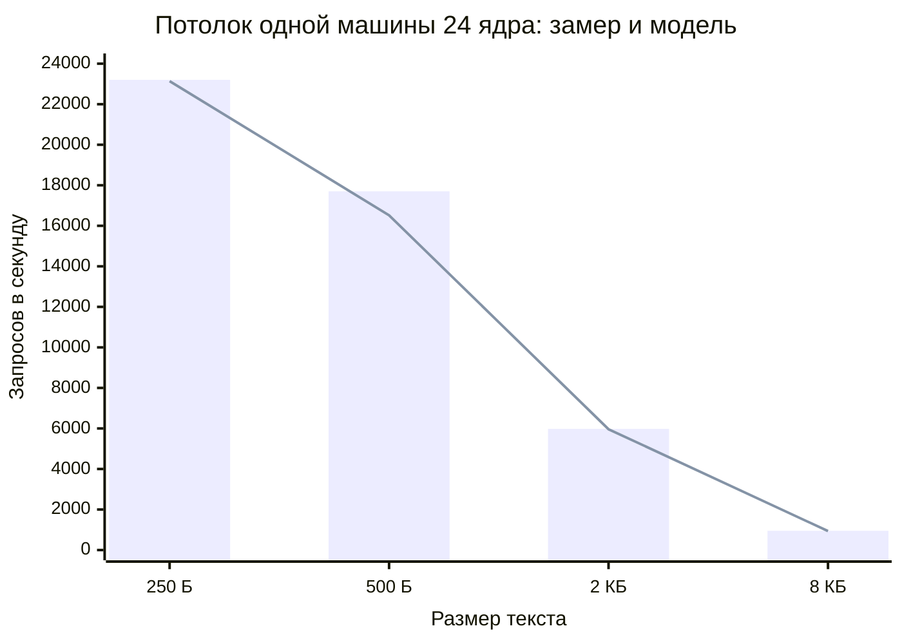
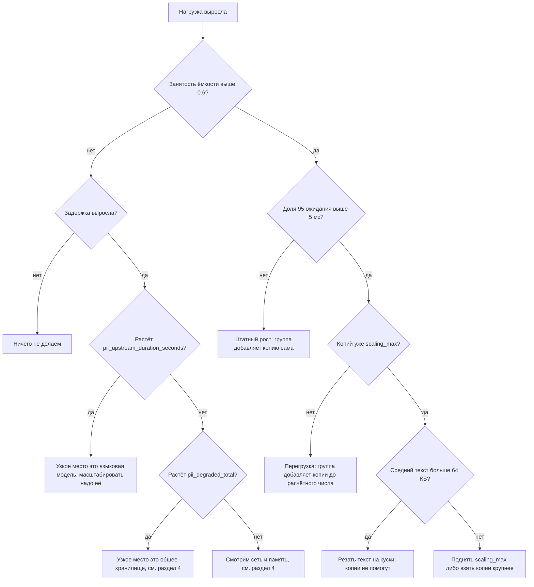

# Масштабирование

Документ отвечает на четыре вопроса: сколько ядер и машин нужно под заданную
нагрузку, по какому сигналу добавлять копии, когда и с какой задержкой это
происходит, и во что сервис упрётся после того, как первое узкое место снято.

Все числа берутся из [BENCHMARKS.md](../BENCHMARKS.md). Там, где замера нет,
стоит пометка «оценка» и показано, из чего она получена.

Соседние документы: точка входа и проверки готовности в
[BALANCING.md](BALANCING.md), показатели и панели в
[OBSERVABILITY.md](OBSERVABILITY.md), устройство сервиса в
[ARCHITECTURE.md](ARCHITECTURE.md).

## Коротко

| Вопрос | Ответ |
|---|---|
| Требование проверки | 1 000 запросов в секунду |
| Замеренный потолок одной машины на текстах 250 байт | 23 200 запросов в секунду |
| Сколько машин нужно под требование | одна, запас двадцатитрёхкратный |
| По какому сигналу растём | занятость модельной ёмкости разбора, `pii_capacity_used_ratio`, цель 0.6 |
| Аварийный сигнал | доля 95 ожидания в очереди, `pii_queue_wait_p95_seconds`, цель 5 мс |
| От всплеска нагрузки до первого обслуженного запроса новой копией | 5 минут при сборке из исходников, 3 минуты с готовым бинарником, оценка |
| Что упрётся следующим | общее хранилище на 64 500 запросах в секунду |
| Чего масштабирование не лечит | один текст в 400 килобайт, он упирается в одно ядро |

## 1. Модель ёмкости

### Формула

Стоимость одного запроса в процессорном времени одного ядра:

```
C(S) = (0.57 мс + 1.56 мс на килобайт * S) * K(S)
K(S) = 1    при S не больше 2 КБ
K(S) = 1.8  при S больше 2 КБ
```

Отсюда всё остальное:

```
Ядер под нагрузкой      N = ЧастотаЗапросов * C(S) / 1000
Ядер под разбор у машины M = ВсегоЯдер * 0.92
Потолок одной машины     R = M * 1000 / C(S)
Машин                    K = округление вверх( N / (M * ЦельЗанятости) )
```

Где `S` это средний размер текста в килобайтах, `0.92` это замеренная доля ядер,
которую сервис занимает на потолке, то есть 22 ядра из 24, а `ЦельЗанятости`
это рабочая точка автоматического масштабирования, по умолчанию 0.6.

Откуда коэффициенты. Постоянная часть 0.57 мс это разбор JSON, работа сетевого
стека и запись в хранилище: она не зависит от длины текста. Часть 1.56 мс на
килобайт это проход детекторов вместе с маскированием: чистый разбор текста
замерен отдельно и стоит 1.2 мс на килобайт, остальное это построение маски и
шифрование записи. Обе величины подобраны по двум замеренным точкам потолка:
23 200 запросов в секунду при 250 байтах и 5 980 при двух килобайтах, обе при
22 занятых ядрах из 24.

### Проверка формулы на замерах

| Размер текста | Замеренный потолок | Потолок по формуле | Расхождение |
|---|---|---|---|
| 250 байт | 23 200 | 23 137 | 0.3 % |
| 500 байт | 17 700 | 16 520 | 6.7 % в запас |
| 2 КБ | 5 980 | 5 962 | 0.3 % |
| 8 КБ | 950 | 937 | 1.4 % в запас |

Две точки из четырёх формула воспроизводит точно, потому что по ним и
подобраны коэффициенты. Две другие это проверка: на 500 байтах формула
занижает потолок на 7 процентов, на 8 килобайтах на 1 процент. Занижение
безопасно, планирование получается с запасом.

Множитель 1.8 для длинных текстов взят из замера на 8 килобайтах: линейная
модель обещала 1 686 запросов в секунду, замер дал 950. Почему длинные тексты
дороже линейной оценки, мы не выясняли: правдоподобные объяснения это давление
на сборщик мусора и промахи кеша процессора, но отдельного замера под эту
гипотезу нет.

### Сколько ядер и машин нужно

Машина стенда это 24 ядра, копия в группе по умолчанию 8 ядер. Цель занятости
0.6, то есть 40 процентов ёмкости держатся под всплеск на время появления новой
копии.

| Запросов в секунду | Средний текст | Текста в секунду | Ядер под нагрузкой | Машин по 24 ядра | Копий по 8 ядер |
|---|---|---|---|---|---|
| 1 000 | 250 Б | 0.25 МБ | 1.0 | 1 | 1 |
| 1 000 | 2 КБ | 2.05 МБ | 3.7 | 1 | 1 |
| 1 000 | 8 КБ | 8.19 МБ | 23.5 | 2 | 6 |
| 5 000 | 250 Б | 1.25 МБ | 4.8 | 1 | 2 |
| 5 000 | 2 КБ | 10.24 МБ | 18.4 | 2 | 5 |
| 5 000 | 8 КБ | 40.96 МБ | 117.5 | 9 | 27 |
| 10 000 | 250 Б | 2.50 МБ | 9.5 | 1 | 3 |
| 10 000 | 2 КБ | 20.48 МБ | 36.9 | 3 | 9 |
| 10 000 | 8 КБ | 81.92 МБ | 234.9 | 18 | 54 |
| 20 000 | 250 Б | 5.00 МБ | 19.0 | 2 | 5 |
| 20 000 | 2 КБ | 40.96 МБ | 73.8 | 6 | 17 |
| 50 000 | 250 Б | 12.50 МБ | 47.5 | 4 | 11 |
| 50 000 | 2 КБ | 102.40 МБ | 184.5 | 14 | 42 |

Таблицу не нужно держать в голове: тот же расчёт делает код инфраструктуры.
Переменные `plan_rps` и `plan_text_bytes` в `deploy/terraform/autoscale.tf`
задают плановую нагрузку, вывод `autoscale_capacity_plan` показывает стоимость
запроса, потребность в ядрах, начальный размер группы и потолок.

### Предел в запросах в зависимости от размера текста

Главное следствие модели: пропускная способность определяется объёмом текста, а
не числом запросов. Постоянная часть стоимости 0.57 мс заметна только на
коротких текстах, дальше всё решает часть на килобайт.

| Размер текста | Потолок машины 24 ядра | Потолок копии 8 ядер | Текста в секунду |
|---|---|---|---|
| 250 Б | 23 137 | 7 740 | 5.8 МБ |
| 500 Б | 16 520 | 5 527 | 8.3 МБ |
| 2 КБ | 5 962 | 1 995 | 12.2 МБ |
| 8 КБ | 937 | 313 | 7.7 МБ |
| 64 КБ | 122 | 41 | 8.0 МБ |
| 400 КБ | 20 | 7 | 8.0 МБ |



Столбики это замер, линия это формула.

## 2. Сигнал для автоматического роста

### Чем плоха загрузка процессора

Сейчас группа в `scaling.tf` растёт по загрузке процессора с целью 60
процентов. Для первого включения это правильный выбор: облако снимает этот
показатель само, ничего доставлять не нужно. Но для нашей нагрузки у него
четыре беды.

| Беда | В чём проявляется |
|---|---|
| Считает чужую работу | сборка сервиса при выкладке, наблюдение, обслуживание машины дают рост загрузки без единого запроса, и группа добавляет копию на пустом месте |
| Упирается в потолок | при перегрузке в два раза и в десять раз показатель одинаково равен ста процентам, поэтому по нему нельзя понять, сколько копий добавить |
| Не переводится в копии | 60 процентов загрузки не говорят, близко ли мы к пределу: на текстах по 250 байт это 14 тысяч запросов в секунду, на восьми килобайтах 560 |
| Теряет треть машины | сервис линеен до 92 процентов загрузки и до этой точки держит долю 99 в пределах ориентира, а порог 60 процентов объявляет перегрузкой то, что ей не является |

Последнее стоит пояснить отдельно. Порог в 60 процентов обычно ставят, чтобы
оставить время на прогрев новой копии. Но время на прогрев это отдельная
настройка `warmup_duration`, а не запас по порогу, и смешивать их означает
платить за машины, которые ничего не делают.

### Какие сигналы рассматривали

| Сигнал | Что умеет | Почему не он |
|---|---|---|
| Загрузка процессора | есть из коробки | четыре беды выше |
| `pii_inflight`, число запросов в обработке | прямо отражает занятость | упирается в размер ограничителя, 96, и перестаёт расти; показывает настройку ограничителя, а не ёмкость машины |
| `pii_queue_wait_seconds`, ожидание в очереди | растёт и после насыщения | это гистограмма, а правило группы принимает одно число, а не набор наблюдений; к тому же сигнал запаздывающий, очередь появляется уже после того, как стало плохо |
| Доля 95 общей задержки | понятна бизнесу | смешивает разбор текста и ожидание модели в режиме прокси, поэтому растёт там, где копии не помогут |
| Отношение достигнутой частоты к пределу | прямо переводится в копии | предел зависит от размера текста, и считать его надо той же формулой, что ниже; это и есть выбранный сигнал, только выраженный в долях ёмкости |

### Что выбрано

Основной сигнал это **занятость модельной ёмкости копии**, показатель
`pii_capacity_used_ratio`. Сервис считает по каждому обработанному запросу его
модельную стоимость `C(S)` из раздела 1, складывает её за скользящее окно в 15
секунд и делит на то, что за эти 15 секунд могли бы дать доступные процессу
ядра. Единица означает, что разбор занял всю ёмкость копии.

Чем он лучше загрузки процессора:

| Свойство | Загрузка процессора | Занятость ёмкости |
|---|---|---|
| Считает только разбор текста | нет | да |
| Учитывает размер текста | косвенно | прямо, через формулу |
| Переводится в число копий | нет | да, нужное число копий равно текущему, умноженному на отношение сигнала к цели |
| Не реагирует на выкладку и обслуживание | нет | да |
| Работает без доставки показателей в облако | да | нет, нужен сбор показателей |

Аварийный сигнал это **доля 95 ожидания места в ограничителе**, показатель
`pii_queue_wait_p95_seconds`. Он нужен ровно там, где основной перестаёт
работать: занятость ёмкости, как и загрузка процессора, не может превысить
единицу, а ожидание в очереди растёт дальше и отличает перегрузку в два раза от
перегрузки в десять. Правила в группе считаются независимо, облако берёт
наибольшую из рекомендаций, поэтому правила дополняют друг друга, а не спорят.

### Что добавлено в код

В `internal/metrics/metrics.go` добавлены два показателя. Оба считаются по тем
наблюдениям, которые обработчик уже отдаёт, поэтому новых вызовов на горячем
пути не появилось: добавилось одно сложение под коротким замком на запрос.

| Показатель | Тип | Окно | Смысл |
|---|---|---|---|
| `pii_capacity_used_ratio` | мгновенное значение | 15 с | доля модельной ёмкости копии, занятая разбором |
| `pii_queue_wait_p95_seconds` | мгновенное значение | 60 с | доля 95 ожидания места в ограничителе |

Окно разложено на слоты по секунде: протухает слот целиком, поэтому памяти
нужно столько же, сколько секунд в окне, независимо от частоты запросов. Для
доли 95 хранятся не сами наблюдения, а счётчики по тем же границам, что у
гистограммы `pii_queue_wait_seconds`: шестьдесят строк по десять чисел вместо
полутора миллионов наблюдений в минуту на предельной нагрузке.

Число ядер берётся из `GOMAXPROCS`, а не из числа ядер машины. Начиная с Go
1.25 среда выполнения сама учитывает ограничение процессора в контейнере, и
планировать надо по тем ядрам, которыми процесс реально располагает.

### Как показатель попадает в облако

Правило роста группы читает показатели из Yandex Monitoring, а сервис отдаёт их
в формате Prometheus по ручке `/metrics`. Между ними нужен переносчик. Два
пути, оба на стенде не разворачивались, поэтому это описание, а не отчёт о
проделанном.

Путь первый, агент на каждой копии. Yandex Unified Agent умеет забирать
показатели в формате Prometheus и складывать их в Monitoring под своим
пространством имён. Настройка примерно такая:

```yaml
routes:
  - input:
      plugin: metrics_pull
      config:
        url: http://localhost:8080/metrics
        format:
          prometheus: {}
        namespace: custom
        project: pii-guard
    channel:
      channel_ref:
        name: cloud_monitoring
```

Путь второй, отправка с машины наблюдения. Prometheus на машине наблюдения уже
собирает все копии, и его можно научить пересылать нужные показатели в
Monitoring через запись по HTTP. Путь хуже первого: машина наблюдения
становится звеном, без которого группа перестаёт расти.

Пока доставка не настроена, правило по показателю сервиса работать не будет:
группа не увидит метрику и останется в минимальном размере. Поэтому в
`autoscale.tf` стоит предусловие: либо `autoscale_metrics_delivered = true`,
либо `autoscale_signal = "cpu"`, то есть честный откат на загрузку процессора.


## 3. Пороги, задержки и защита от раскачки

### Настройки

| Настройка | Значение | Почему столько |
|---|---|---|
| Цель занятости ёмкости | 0.6 | оставшиеся 40 процентов держат рост нагрузки, пока поднимается новая копия |
| Цель доли 95 ожидания | 5 мс | на штатной нагрузке ожидание неразличимо, вся задержка доля 99 равна 0.97 мс; расчётное ожидание на потолке около 8 мс |
| Окно усреднения сигнала | 60 с | меньше облако не принимает |
| Прогрев копии | 180 с | копия ставит Go и собирает сервис около двух минут, до этого её показатели ничего не значат |
| Окно устойчивости | 300 с | в течение пяти минут группа не уменьшается |
| Минимум копий | 2 | одна копия это отсутствие устойчивости к отказу |
| Начальный размер | по плановой нагрузке | разгон с двух копий до шести занял бы три решения подряд, это четверть часа |

Откуда 8 мс расчётного ожидания. На предельной ступени сервис держит 23 200
запросов в секунду при ограничителе в 96 одновременных запросов, значит внутри
ограничителя запрос живёт 96 / 23 200, то есть 4.1 мс. Наблюдаемая доля 50
задержки на той же ступени равна 12 мс. Разница около 8 мс это ожидание места и
сеть. Это расчёт по двум замеренным числам, а не отдельный замер.

### Когда группа уменьшается

Отдельного порога уменьшения нет, и это правильно. Облако считает нужное число
копий как текущее число, умноженное на отношение сигнала к цели, а решение об
уменьшении принимает по максимуму сигнала за окно устойчивости. Отсюда
естественный гистерезис: чтобы уйти с N копий на N минус одну, сигнал должен
опуститься ниже цели, умноженной на отношение N минус один к N.

| Копий сейчас | Порог роста | Порог уменьшения | Зазор |
|---|---|---|---|
| 2 | 0.60 | 0.30 | двукратный |
| 3 | 0.60 | 0.40 | в полтора раза |
| 4 | 0.60 | 0.45 | треть |
| 6 | 0.60 | 0.50 | пятая часть |
| 10 | 0.60 | 0.54 | одиннадцатая часть |

Зазор сужается с ростом группы, и это тоже правильно: в большой группе одна
копия это малая доля ёмкости, и ошибка стоит дёшево. Дополнительно от раскачки
защищают окно усреднения в 60 секунд, максимум за окно устойчивости в 300
секунд и прогрев в 180 секунд, в течение которого новая копия не учитывается в
среднем по группе.

### Сколько времени занимает появление копии

| Шаг | Время | Откуда число |
|---|---|---|
| Накопление окна показателя | 15 с | настройка в `internal/metrics` |
| Сбор показателя агентом | до 15 с | оценка по периоду сбора Prometheus на стенде |
| Усреднение в группе | 60 с | `measurement_duration` |
| Решение и вызов API группы | до 15 с | оценка, замера нет |
| Создание машины и загрузка системы | 30 до 45 с | оценка, замера нет |
| Установка Go и сборка сервиса | около 120 с | зафиксировано в описании группы |
| Проверки живости до перевода трафика | 20 с | две проверки с периодом 10 с |
| Балансировщик начинает слать запросы | до 10 с | оценка |
| **Итого от всплеска нагрузки** | **5 минут** | сумма |
| Из них после решения группы | 3.2 минуты | последние четыре шага |
| То же с готовым бинарником вместо сборки | **3 минуты** | минус шаг сборки |

Вывод очевиден и его стоит сделать раньше, чем понадобится: выкладка готового
бинарника через `app_binary_url` сокращает время появления копии почти вдвое.
Сборка из исходников удобна на стенде и дорога в работе.

### Что происходит с нагрузкой всё это время

Ничего страшного, пока рост нагрузки укладывается в свободные 40 процентов
ёмкости. Допустимая скорость роста считается так:

```
ДопустимыйРост = (1 - ЦельЗанятости) * ЁмкостьГруппы / ВремяПоявленияКопии
```

| Копий по 8 ядер | Потолок группы на текстах 250 Б | Рабочая точка | Свободно | Допустимый рост при 5 мин | при 3 мин |
|---|---|---|---|---|---|
| 2 | 15 481 | 9 288 | 6 192 | 21 запрос в секунду за секунду | 34 |
| 4 | 30 961 | 18 577 | 12 385 | 41 | 69 |
| 6 | 46 442 | 27 865 | 18 577 | 62 | 103 |

Читается так: группа из четырёх копий переживает без очереди рост на 41 запрос в
секунду за каждую секунду, то есть удвоение нагрузки примерно за семь с
половиной минут. Более резкий рост запас не покрывает.

Если нагрузка растёт быстрее, запас кончается раньше, чем появляется копия.
Тогда включается то, что уже написано: ограничитель на 96 одновременных
запросов держит очередь, ждёт до 500 миллисекунд и отвечает просьбой повторить
с заголовком ожидания. Отказ с просьбой повторить лучше, чем таймаут: клиент
проверяющей системы его понимает и повторяет запрос. Но это именно
предохранитель, а не регулятор.

Три способа пережить быстрый рост, в порядке дешевизны: поднять минимальный
размер группы под известный дневной профиль, выкладывать готовый бинарник
вместо сборки, взять копии крупнее, потому что запас в 40 процентов от
восьмиядерной копии это меньше запросов, чем 40 процентов от двадцатичетырёх
ядерной.

### Дерево решений



## 4. Что станет узким местом после снятия первого

Порядок, в котором упирается сервис, если снимать ограничения одно за другим.
Числа в таблице это потолок всей установки, а не одной копии, если не сказано
иное.

| Порядок | Узкое место | Когда упрётся | Замер или расчёт |
|---|---|---|---|
| 1 | Процессор копии | 23 137 запросов в секунду на 24 ядра при текстах 250 Б | замер 23 200 |
| 2 | Ограничитель одновременных запросов | 96 делить на время внутри обработки | расчёт, уже связывает на потолке |
| 3 | Общее хранилище | 64 500 запросов в секунду | замер клиента 129 000 операций в секунду, две операции на запрос |
| 4 | Память под соответствия | зависит от срока жизни записи, см. раздел 6 | расчёт по 3 КБ на запись |
| 5 | Сеть | около 150 Мбит в секунду на копию на потолке | расчёт, замера нет |
| 6 | Языковая модель в режиме прокси | 96 делить на задержку модели | расчёт |

Разбор по порядку.

**Процессор копии.** Первое и единственное узкое место, которое мы видели на
стенде: на предельной ступени процессор занят на 92 процента, генератор при
этом занят на 45 процентов из своих четырёх ядер, значит предел принадлежит
сервису. Лечится добавлением копий линейно.

**Ограничитель одновременных запросов.** Общий семафор на 96 мест и отдельный
на 6 мест для текстов больше 64 килобайт. На замеренном потолке ограничитель
уже связывает: при 23 200 запросах в секунду внутри обработки одновременно
находятся 96 запросов, а не больше. Это осознанная настройка, а не упущение:
предохранитель обязан срабатывать раньше, чем машина уйдёт в неуправляемое
состояние. Но при росте числа ядер копии его придётся поднимать вместе с
ядрами, иначе копия на 48 ядрах будет держать ту же очередь, что и на 24.
Ориентир: четыре места на ядро, как сейчас, то есть 96 мест на 24 ядра.

**Общее хранилище.** На каждый запрос приходятся две операции: запись
соответствия при маскировании и чтение при обратном преобразовании. Замер
клиента дал около 129 тысяч операций в секунду при 32 одновременных
отправителях, значит потолок по хранилищу это 64 500 запросов в секунду на всю
установку. Дальше нужно разделение по сегментам ключа: идентификатор запроса
уже даёт готовый ключ разделения, и сегменты растут линейно. Отдельно стоит
помнить, что при недоступности хранилища сервис переходит на память процесса и
считает деградации: ответы остаются валидными, но обратное преобразование
через другую копию перестаёт работать, поэтому `pii_degraded_total` это повод
для тревоги, а не для записи в журнал.

**Память.** Разобрана в разделе 6, потому что это не потолок по частоте, а
потолок по произведению частоты на срок жизни записи.

**Сеть.** Замера сети нет. Расчёт: на каждый запрос по сети проходит текст
дважды, в запросе и в ответе, плюс примерно 60 процентов сверху на JSON,
заголовки и служебный трафик. На потолке текстов по 250 байт это 18.6 мегабайта
в секунду, около 150 мегабит. На потолке текстов по 2 килобайта это 39
мегабайт, около 314 мегабит. Полоса машины в облаке по документации провайдера
измеряется гигабитами, поэтому сеть упрётся на порядок позже процессора, но
проверять это надо замером на интерфейсе, а не на бумаге.

**Языковая модель в режиме прокси.** Здесь предел задаёт не сервис. Показатель
`pii_upstream_duration_seconds` на стенде измеряется секундами против долей
миллисекунды у маскирования, и при ограничителе в 96 одновременных запросов
режим прокси упирается в простое соотношение.

| Задержка модели | Предел копии в режиме прокси |
|---|---|
| 0.5 с | 192 запроса в секунду |
| 1 с | 96 |
| 2 с | 48 |
| 5 с | 19 |

Это расчёт по закону Литтла, а не замер: точную задержку модели на стенде мы не
фиксировали. Вывод из него важнее чисел: в режиме прокси копии сервиса нужны не
под процессор, а под удержание соединений, и масштабировать надо модель.
Разумная доработка, которой сейчас нет: отдельный ограничитель для режима
прокси, чтобы медленная модель не съедала места у быстрого маскирования.

## 5. Вертикальный рост против горизонтального

Разбор текста распараллеливается внутри процесса хорошо: на потолке сервис
занимает 22 ядра из 24, то есть эффективность 92 процента, общих блокировок на
горячем пути нет, хранилище разделено на 256 сегментов со своими замками.
Поэтому вертикальный рост работает почти линейно и по модели неотличим от
горизонтального.

| Установка | Ядер всего | Потолок на текстах 250 Б | Что ещё нужно |
|---|---|---|---|
| Одна машина 24 ядра | 24 | 23 137 | ничего |
| Три копии по 8 ядер | 24 | 23 220 | общее хранилище, балансировщик, проверки готовности |
| Одна машина 48 ядер | 48 | 46 275, оценка по линейности | ограничитель поднять до 192 мест |
| Шесть копий по 8 ядер | 48 | 46 440 | то же, что и для трёх |

По числам выбор безразличен, поэтому решают не числа, а свойства.

| Что учитываем | Вертикальный | Горизонтальный |
|---|---|---|
| Общее хранилище | не нужно, память процесса работает | обязательно, иначе обратное преобразование приходит не на ту копию |
| Отказ машины | теряется весь сервис | теряется доля ёмкости, при шести копиях шестая часть |
| Задержка | нет лишнего звена | плюс балансировщик, доли миллисекунды |
| Выкладка новой версии | перерыв в обслуживании | по одной копии без перерыва |
| Предел | ядра одной машины, по каталогу провайдера до 96 на `standard-v3`, оценка | ограничен хранилищем и сетью |
| Сложность | одна машина и systemd | группа, балансировщик, проверки, доставка показателей |

Правило, которым пользуемся: пока нужное число ядер влезает в одну машину и нет
требования пережить её отказ, растём вертикально. Как только появляется любое
из двух, переходим на группу. Требование проверки в тысячу запросов в секунду
закрывается одной машиной с запасом в двадцать три раза, поэтому на стенде
группа выключена.

Чего мы не замеряли: линейность выше 24 ядер и накладные расходы установки из
нескольких копий. Обе величины в таблице выше помечены как оценка по
линейности, и перед переходом на крупные машины их надо замерить, а не
доверять экстраполяции.

## 6. Память под хранилище соответствий

Запись занимает 2.7 килобайта: зашифрованный исходный текст, маска, хеши и
служебные поля. Замер: 984 058 записей заняли 2.725 гигабайта памяти процесса.
В расчётах ниже берётся округление вверх до 3 килобайт на запись, чтобы план
не получился оптимистичнее замера. Расход считается так:

```
Записей = ЧастотаЗапросов * СрокЖизниЗаписи
Память  = Записей * 3 КБ
```

Рабочая настройка сейчас это срок жизни 15 минут при пределе в миллион
записей, строка с ней помечена. Строки на 60 минут оставлены как цена
увеличения срока, а не как действующее значение.

| Запросов в секунду | Срок жизни записи | Записей | Память | Хватает ли предела в 1 млн записей |
|---|---|---|---|---|
| 1 000 | 15 мин, рабочая настройка | 0.90 млн | 2.7 ГБ | да |
| 1 000 | 60 мин | 3.60 млн | 10.8 ГБ | нет, нужен предел 3.6 млн |
| 5 000 | 15 мин | 4.50 млн | 13.5 ГБ | нет, нужен предел 4.5 млн |
| 5 000 | 60 мин | 18.00 млн | 54.0 ГБ | нет, нужен предел 18 млн |
| 10 000 | 15 мин | 9.00 млн | 27.0 ГБ | нет, нужен предел 9 млн |
| 10 000 | 60 мин | 36.00 млн | 108.0 ГБ | нет, нужен предел 36 млн |
| 23 200 | 60 мин | 83.52 млн | 250.6 ГБ | нет, нужен предел 83.5 млн |

### Почему срок жизни записи равен 15 минутам

У хранилища два независимых предела: срок жизни записи и предельное число
записей. Работает тот, который срабатывает первым. При достижении предела по
числу записей вытесняются самые старые, и тогда настоящий срок жизни равен не
заявленному, а пределу записей, делённому на частоту запросов.

| Запросов в секунду | Настоящий срок жизни при пределе в 1 млн записей |
|---|---|
| 1 000 | 16.7 мин |
| 5 000 | 3.3 мин |
| 10 000 | 1.7 мин |

Отсюда правило: предел числа записей должен быть не меньше произведения
плановой частоты на срок жизни записи. Если правило нарушено, заявленный срок
жизни это украшение. Проверяющей системе это безразлично, она обращается за
обратным преобразованием сразу, а в живой работе это тихая потеря
соответствий, которую никто не заметит до первой жалобы.

Согласовать два числа можно с двух сторон, поэтому вариантов было два.

| Вариант | Нужный предел записей | Память при 1 000 запросов в секунду | Чем платим |
|---|---|---|---|
| Поднять предел записей под срок жизни 60 мин | 3.6 млн | 10.8 ГБ | вчетверо больше памяти, и предел придётся перебирать заново при каждом росте частоты |
| Сократить срок жизни до 15 мин | 1 млн, уже стоит | 2.7 ГБ | окно на обратное преобразование короче в четыре раза |

Выбран второй вариант: в `configs/config.yaml` стоит `ttl: 15m` при
`max_records: 1000000`. При тысяче запросов в секунду это 0.9 миллиона записей
против предела в миллион, то есть первым срабатывает срок жизни, и заявленные
15 минут выдерживаются на самом деле. Пятнадцати минут хватает с запасом:
между маскированием и обратным преобразованием у проверяющей системы проходят
миллисекунды, у прикладного сценария с языковой моделью секунды.

Правило остаётся в силе при любой правке настроек. Подняли плановую частоту
или срок жизни, пересчитайте предел записей по таблице выше, иначе вернётся та
же тихая потеря соответствий.

### Когда памяти процесса перестаёт хватать

Копия в группе по умолчанию имеет 16 гигабайт. Под хранилище разумно отдавать
не больше трёх четвертей, то есть 12 гигабайт, это 4 миллиона записей. При
тысяче запросов в секунду на копию этого хватает на 66 минут жизни записи, при
пяти тысячах на 13 минут.

Но память это не главная причина переходить на общее хранилище. Главная причина
в том, что при нескольких копиях память процесса просто неверна: запрос на
маскирование попадает на одну копию, обратное преобразование на другую, и вторая
копия не найдёт записи. Поэтому переход на общее хранилище происходит не по
объёму памяти, а в момент появления второй копии. Это закреплено предусловием в
описании группы: включить масштабирование без общего хранилища модуль не даёт.

### Предел самого общего хранилища

| Что ограничивает | Значение | Откуда |
|---|---|---|
| Частота операций | 64 500 запросов в секунду | замер 129 000 операций, две на запрос |
| Память одного узла | по размеру выбранного класса | настройка `redis_maxmemory_mb` |
| Объём данных | 3 КБ на запись, столько же, сколько в памяти процесса | замер |

При 10 тысячах запросов в секунду и часе жизни записи общему хранилищу нужно
108 гигабайт, что уже требует разделения по сегментам. Разделение делается по
идентификатору запроса, потому что он же служит ключом, и дополнительной
согласованности между сегментами не требуется: каждая запись живёт ровно в
одном.

## 7. Пределы, которые нельзя перешагнуть масштабированием

| Предел | Число | Почему копии не помогают |
|---|---|---|
| Один текст в 400 КБ | 494 мс на одном ядре, замер | один запрос обслуживает одна копия; добавление копий не ускоряет один текст |
| Тексты больше 64 КБ | 6 одновременных на копию | отдельный ограничитель, при 400 КБ это 12 запросов в секунду на копию, расчёт |
| Тело запроса 4 МБ | 4.9 с на одном ядре, расчёт по 1.2 мс на килобайт | таймаут записи ответа равен 9 с, запас меньше двукратного |
| Обратное преобразование | требует общего хранилища | при памяти процесса ответ будет формально валидным и неправильным по сути |
| Задержка сети между зонами | доли миллисекунды, оценка | группа держится в одной зоне намеренно |

Первый предел важнее остальных. Текст в 400 килобайт стоит 494 миллисекунды на
одном ядре, то есть съедает весь ориентир жюри в полсекунды и не оставляет
ничего на сеть и хранилище. Единственное лечение это нарезка текста на куски по
границам абзацев и параллельная обработка кусков внутри одного запроса: 494
миллисекунды на 22 ядрах превращаются в 22 миллисекунды плюс сборка результата.
Нарезка в сервисе есть, и без неё никакое число машин не спасёт: масштабирование
увеличивает число одновременных запросов, а не скорость одного.

Второй предел это следствие первого. Пока тяжёлые запросы ограничены шестью
одновременно на копию, предел по текстам в 400 килобайт равен 12 запросам в
секунду на копию. Если такие тексты станут основной нагрузкой, поднимать надо не
число копий, а ограничитель тяжёлых запросов вместе с числом ядер.

## 8. Как включить рост

Порядок шагов, каждый проверяемый.

| Шаг | Что сделать | Как проверить |
|---|---|---|
| 1 | Включить общее хранилище: `enable_shared_store = true`, адрес в `store.redis.addr`, одинаковый `PII_STORE_KEY` у всех копий | `pii_store_records` отражает общее число записей, `pii_degraded_total` равен нулю |
| 2 | Вынести наблюдение на отдельную машину: `enable_monitor_vm = true` | панель жива при пересоздании копий |
| 3 | Настроить доставку показателей в Yandex Monitoring, поставить `autoscale_metrics_delivered = true` | показатель `pii_capacity_used_ratio` виден в Monitoring |
| 4 | Задать плановую нагрузку `plan_rps` и `plan_text_bytes`, посмотреть вывод `autoscale_capacity_plan` | начальный размер группы совпадает с расчётом из раздела 1 |
| 5 | Включить группу: `enable_autoscale_signal = true`, задать `scaling_service_account_id` | группа поднимается, проверки живости проходят |
| 6 | Проверить обратное преобразование через разные копии | маска, полученная от одной копии, разворачивается на другой побайтово точно |

Шестой шаг это настоящая приёмка роста, и пропускать его нельзя. Годится
`scripts/verify.sh` с адресом балансировщика, запущенный несколько раз подряд:
запросы разойдутся по копиям, и любая ошибка в общем хранилище проявится сразу.

Если доставка показателей не настроена, шаги 3 и 4 пропускаются, а
`autoscale_signal` ставится в `cpu`. Это тот же вариант, что описан в
`scaling.tf`, и он работает без единой дополнительной настройки, просто хуже по
причинам из раздела 2.

## 9. Чего в замерах нет

Список честный, чтобы им можно было пользоваться как планом следующих замеров.

| Чего нет | Почему важно |
|---|---|
| Поведение общего хранилища под настоящей нагрузкой | потолок 64 500 запросов в секунду посчитан из замера клиента, а не снят на сервисе |
| Линейность выше 24 ядер | все выводы про вертикальный рост за этой границей это экстраполяция |
| Накладные расходы установки из нескольких копий | балансировщик, сеть, общее хранилище добавляют задержку, величина неизвестна |
| Полоса сети под нагрузкой | оценка в 150 мегабит посчитана, а не измерена |
| Задержка языковой модели | известно только, что измеряется секундами |
| Время появления копии от решения до первого запроса | сумма оценок по шагам, целиком не измерялась |
| Причина, по которой длинные тексты дороже линейной модели | множитель 1.8 замерен, объяснение не проверено |
