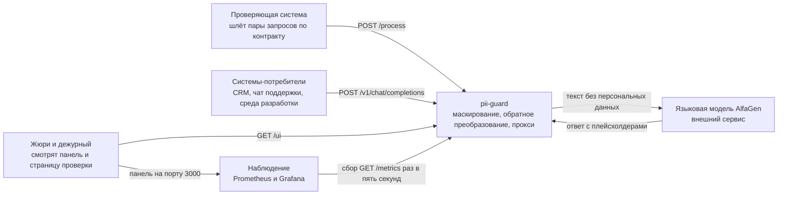
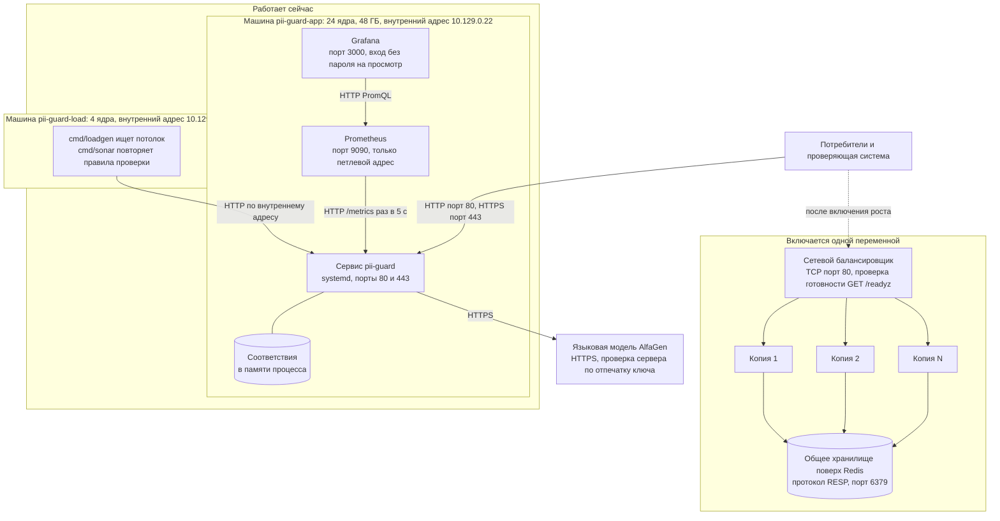
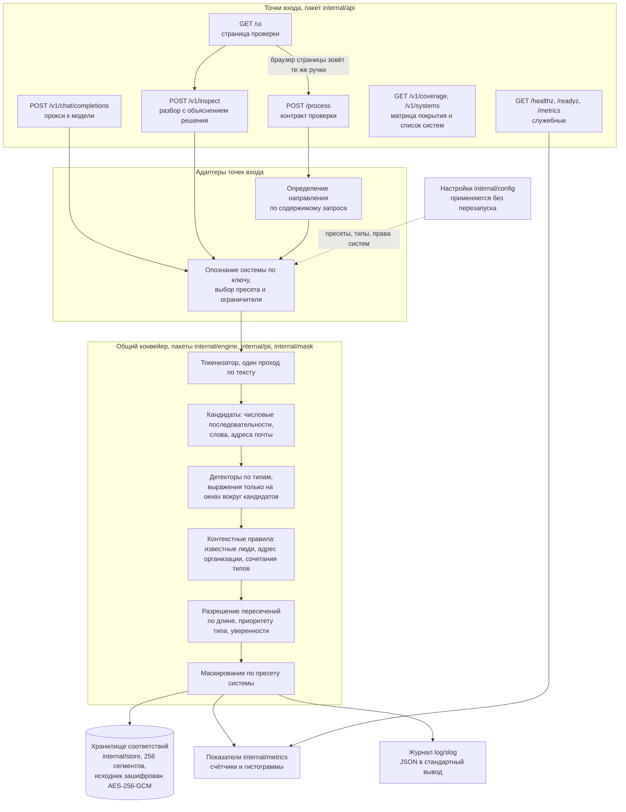
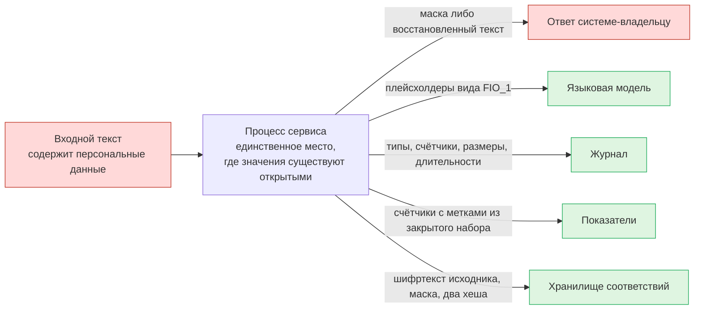
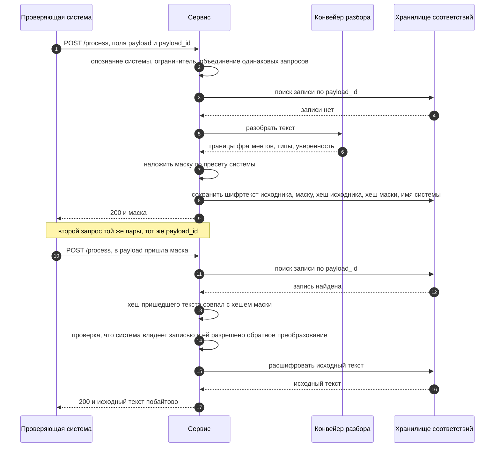
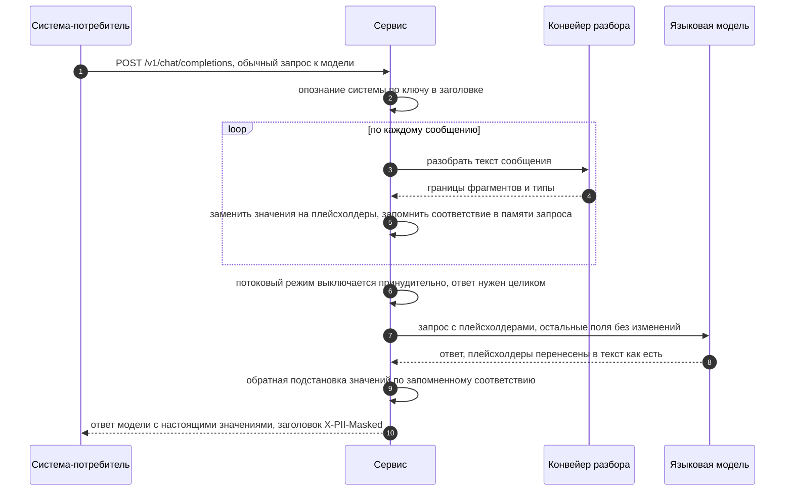
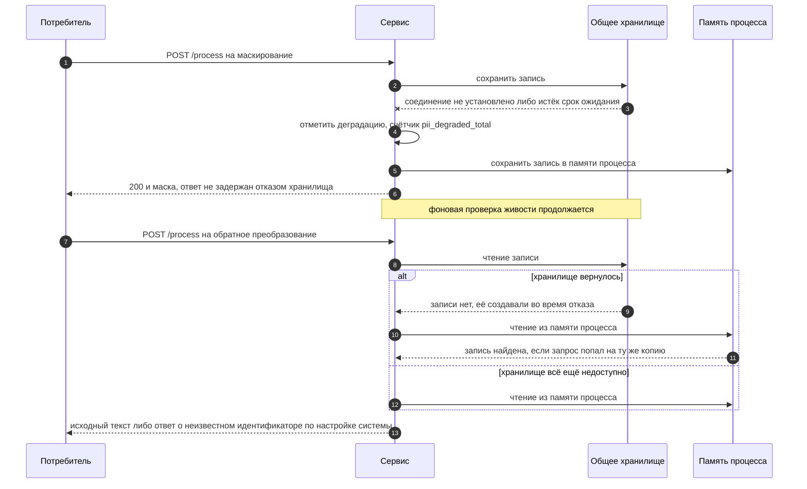

# Системная схема решения

**Это точка входа в документацию решения.** Документ верхнеуровневый: он
отвечает на вопросы «что это», «из чего состоит», «как течёт запрос» и «почему
сделано именно так». Подробности живут в отдельных документах, ссылки стоят в
каждом разделе. Чтение занимает около десяти минут, дальше уходите вглубь по
ссылкам. Читать остальные документы подряд не нужно и не задумано.

## Куда идти за подробностями

| Документ | О чём | Кому читать |
|---|---|---|
| [QUICKSTART.md](QUICKSTART.md) | адреса живого стенда, три команды `curl`, запуск у себя | тому, кто хочет потрогать сервис прямо сейчас |
| [ARCHITECTURE.md](ARCHITECTURE.md) | устройство кода: конвейер, пакеты, определение направления, хранилище, отказоустойчивость | тому, кто собирается править код |
| [MASK-FORMAT.md](MASK-FORMAT.md) | форма маски, пресеты, правила границ фрагмента | проверяющему качество маскирования |
| [BALANCING.md](BALANCING.md) | точка входа группы копий, проверки готовности и живости, мягкий вывод копии из обслуживания, поведение под перегрузкой | тому, кто включает рост или разбирает отказ копии |
| [SCALING.md](SCALING.md) | расчёт числа ядер и машин, сигнал для автоматического роста, память под хранилище, следующие узкие места | тому, кто планирует нагрузку больше штатной |
| [LOGGING.md](LOGGING.md) | состав полей журнала, уровни, защита от утечки значений, сбор, ротация, объём | дежурному и тому, кто расследует инцидент |
| [OBSERVABILITY.md](OBSERVABILITY.md) | показатели, панель, запросы для диагностики, признаки перегрузки | дежурному у панели |
| [../BENCHMARKS.md](../BENCHMARKS.md) | все замеры и условия, в которых они сняты | тому, кто хочет проверить любое число ниже |
| [LOAD-TESTING.md](LOAD-TESTING.md) | как повторить замеры, режимы прогонов, разбор результата | тому, кто перезамеряет |
| [CORPUS-SOURCES.md](CORPUS-SOURCES.md) | из чего собран набор для проверки качества | тому, кто сомневается в оценке качества |
| [../README.md](../README.md) | контракт, настройка, сценарии для жюри, оглавление всех документов | жюри |
| [HANDOFF.md](HANDOFF.md) | что получить отдельно, карта каталогов, деление работы | второму участнику команды |

---

## 1. Задача и ограничения

Сервис стоит между системами банка и языковой моделью и не выпускает наружу
персональные данные: он находит их в тексте, заменяет масками или
плейсхолдерами и умеет вернуть исходный текст тому, кто его прислал. Для
проверяющей системы это одна ручка `POST /process`, которая по содержимому
запроса сама понимает, маскировать текст или восстанавливать. Для прикладных
систем это совместимый с OpenAI прокси `POST /v1/chat/completions`, который
подменяет значения перед отправкой модели и возвращает их на место в ответе.

Ограничения, в которых задача решается.

| Ограничение | Формулировка | Как подтверждается |
|---|---|---|
| Задержка | ориентир доли 99 составляет 500 мс на запрос | замерено, [BENCHMARKS.md](../BENCHMARKS.md) |
| Частота запросов | штатная нагрузка 1 000 запросов в секунду в течение пяти минут | замерено, прогон по правилам проверяющей системы |
| Персональные данные не выходят наружу | ни в языковую модель, ни в журнал, ни в показатели, ни в общее хранилище не попадает ни одного значения | проверяется тестом, который ищет каждое эталонное значение во всём выводе |
| Закрытый контур | машина стенда не ходит в интернет за данными и моделями во время работы: словари, правила и наборы лежат рядом с сервисом | зависимостей у сервиса четыре, новых не добавляем, клиент протокола общего хранилища написан на стандартной библиотеке |
| Ответ короче клиентского таймаута | серверный таймаут записи ответа выставлен короче таймаута проверяющей системы, чтобы обрыв всегда был решением сервиса | значения в таблице показателей ниже |

Из закрытого контура следует главное архитектурное решение: обнаружение
персональных данных работает на правилах и словарях, а не на нейросетевой
модели. Обоснование в разделе о принятых решениях.

---

## 2. Окружение: кто с кем разговаривает

Крупный уровень, без внутренностей сервиса.

Что здесь важно.

| Участник | Что от него приходит | Что он получает | Видит ли персональные данные |
|---|---|---|---|
| Проверяющая система | текст и идентификатор запроса | маску либо восстановленный исходный текст | да, это её собственные данные, и только её |
| Система-потребитель | обычный запрос к языковой модели | ответ модели с восстановленными значениями | да, свои собственные |
| Языковая модель | ничего | текст с плейсхолдерами вместо значений | нет, ни одного значения |
| Наблюдение | ничего | счётчики и гистограммы с метками из закрытого набора | нет |
| Жюри и дежурный | ничего | панель, страница проверки, журнал | только то, что сами ввели на странице проверки |

---

## 3. Состав развёртывания

Сейчас работает левая часть схемы. Правая описана кодом в
`deploy/terraform/scaling.tf` и выключена переменной `enable_scaling`, почему
именно так, в [SCALING.md](SCALING.md).

| Часть | Где живёт | Протокол и порт | Зачем |
|---|---|---|---|
| Сервис `pii-guard` | машина `pii-guard-app`, запуск через systemd | HTTP 80, HTTPS 443, в разработке 8080 и 8443 | вся обработка текста |
| Хранилище соответствий | память процесса по умолчанию, общее поверх Redis при росте | RESP, порт 6379 | связывает идентификатор запроса с исходным текстом |
| Prometheus | та же машина | HTTP 9090, наружу закрыт | собирает `/metrics` раз в пять секунд |
| Grafana | та же машина | HTTP 3000, открыт наружу | панель для жюри |
| Генератор нагрузки | машина `pii-guard-load` | HTTP по внутреннему адресу | замеры качества и пропускной способности |
| Балансировщик | появляется вместе с группой машин | TCP 80, проверка готовности `/readyz` | точка входа при нескольких копиях; живость `/healthz` смотрит не он, а группа машин, разбор в [BALANCING.md](BALANCING.md) |
| Языковая модель | внешний сервис | HTTPS | отвечает на запросы в режиме прокси |

---

## 4. Внутреннее устройство сервиса

Ключевое свойство: конвейер разбора текста один и общий для всех точек входа.
Различаются только адаптеры, то есть разбор тела запроса, выбор вида
маскирования и форма ответа. Новая точка входа не приносит новой логики
обнаружения.

Разбиение больших текстов стоит перед токенизатором: текст длиннее порога
режется по границам абзацев и обрабатывается параллельно, потому что один
проход по тексту в четыреста килобайт в один поток укладывается в ориентир
без запаса. Числа в [BENCHMARKS.md](../BENCHMARKS.md), подробности конвейера в
[ARCHITECTURE.md](ARCHITECTURE.md).

Ограничители одновременной обработки стоят на входе в конвейер: общий и
отдельный для больших текстов. Это предохранители, а не регуляторы,
подробности в [BALANCING.md](BALANCING.md).

### Регистр букв

Задание требует прямо: идентификация не зависит от регистра. Основной приём
один. Токенизатор считает копию текста в нижнем регистре, у которой длина в
байтах совпадает с исходной, и все якоря, ключевые слова и словари ищутся по
этой копии, а границы найденного возвращаются в координатах исходного текста.
Поэтому «ПАСПОРТ», «Паспорт» и «паспорт» для детекторов это одно и то же.

| Что опознаётся | Зависит ли от регистра | Почему так |
|---|---|---|
| Якоря и ключевые слова всех детекторов | нет | поиск идёт по копии текста в нижнем регистре |
| Имена, фамилии и отчества из словаря | нет | слово нормализуется к нижнему регистру перед обращением к словарю |
| Отчества на «ович», «евич», «овна», «евна» | нет | окончание опознаётся само по себе, заглавная буква не нужна |
| Номера, даты, почта, карта, ИНН, СНИЛС | нет | решение принимается по цифрам, разделителям и контрольной сумме |
| Одиночное имя из словаря | нет | имя опознаётся по словарю, заглавная буква не нужна |
| Фамилия с именем, с отчеством, с инициалами | нет | соседство компонентов опознаётся по словарю и окончаниям |
| Инициалы с точкой | нет | одиночная буква с точкой это инициал независимо от регистра |
| Незнакомое слово, похожее на фамилию только окончанием | да | с заглавной буквы принимается сразу, со строчной только при сильной опоре рядом и с пониженной уверенностью |
| Отчества на «ична» и «ич» | да | те же окончания есть у обычных слов вроде «практична», поэтому нужна заглавная буква |
| Имя держателя карты без якоря | да | латиница прописными это и есть признак; при якоре «cardholder» или «держатель карты» регистр не требуется |
| Латинское имя как ФИО | нет | латинская запись сравнивается с латинским словарём (английские имена и транслитерация русских), пара из двух слов или слово с якорем опознаются в любом регистре |

Заглавная буква осталась усилителем уверенности, а не условием: имя из словаря,
фамилия с именем, отчеством или инициалами опознаются и в тексте, где всё
строчными. Единственное место, где регистр ещё решает, — незнакомое слово,
похожее на фамилию только окончанием: со строчной буквы оно принимается только
при сильной опоре в соседних словах, иначе фамилией становится любое слово
вроде «клиентов» или «слева». Это узкая граница, числа качества в
[BENCHMARKS.md](../BENCHMARKS.md) сняты после доводки.

---

### Что добавилось после ночного прогона улучшений

| Точка входа | Что отдаёт | Зачем |
|---|---|---|
| `GET /v1/coverage` | матрица «тип персональных данных против системы-потребителя» | с одного взгляда виден тип из задания, который не маскируется ни одной системе. Иначе такую дыру замечают только чтением настроек |
| `GET /v1/systems` | список систем с их видом маски, набором типов и правом на обратное преобразование | показывает гибкость настройки, не требуя читать файл |

**Связи между фрагментами одного человека.** Поверх найденных фрагментов
строится граф: узлы это фрагменты, рёбра это основание считать их
относящимися к одному человеку. Оснований три, у каждого своя уверенность:
соседство в предложении, общий якорь анкеты, повтор значения. Компоненты
связности и есть субъекты.

Это не украшение, а то, без чего не выражается требование задания:
«маскирование только при наличии нескольких однозначно идентифицированных
типов, пин-код один не маскируем, пин-код с картой маскируем». Правило говорит
о СВЯЗИ между фрагментами, а не о фрагменте, и до появления графа выражалось
обходными путями.

Ребро при этом остаётся основанием для правила, а не правилом: связь сама по
себе маскирование не расширяет. Реализация в `internal/engine/subjects.go`,
подробности в [SUBJECTS.md](SUBJECTS.md).

Построение стоит около пяти процентов запроса, поэтому идёт только при
включённом правиле сочетаний (`context_rules_enabled`), которое по умолчанию
выключено.

## 5. Потоки данных

Правило одно: значения персональных данных не покидают процесс сервиса. Наружу
уходит либо маска, либо шифртекст, либо число. Единственное исключение это
ответ на обратное преобразование, и он возвращается ровно той системе, которая
эту запись создала и которой обратное преобразование разрешено настройкой.

Красным отмечены места, где открытые значения есть, зелёным где их нет ни в
каком виде.

| Поток | Что именно уходит | Персональные данные | В каком виде | Подробности |
|---|---|---|---|---|
| Ответ системе-владельцу | маска при маскировании, исходный текст при обратном преобразовании | да, при обратном преобразовании | открытым текстом, только создателю записи, только при разрешении в настройках | [ARCHITECTURE.md](ARCHITECTURE.md) |
| Языковая модель | тело запроса без изменений, в сообщениях типизированные плейсхолдеры вместо значений | нет | значений нет вообще, есть тип и порядковый номер | [MASK-FORMAT.md](MASK-FORMAT.md) |
| Журнал | событие, имя системы, идентификатор запроса, направление, размер в байтах, длительность, число фрагментов по типам, признак щадящего режима | нет | ни текста, ни значений, ни маски | [LOGGING.md](LOGGING.md) |
| Показатели | счётчики и гистограммы с метками операция, система, код ответа, тип данных, причина пропуска, направление | нет | метки берутся из закрытого набора и не порождаются из пользовательского ввода | [OBSERVABILITY.md](OBSERVABILITY.md) |
| Хранилище соответствий | шифртекст исходника, выданная маска, хеш исходника, хеш маски, имя системы, границы и типы фрагментов, момент истечения | да, но недоступные | AES-256-GCM, ключ живёт в переменной окружения процесса сервиса | [ARCHITECTURE.md](ARCHITECTURE.md) |
| Страница проверки и `/v1/inspect` | найденные значения, маски, причины решения | да | открытым текстом тому, кто этот же текст и прислал, ручка выключается настройкой | [../README.md](../README.md) |

Практическое следствие: журнал и показатели можно отдавать кому угодно, включая
жюри и внешнее наблюдение, не думая о режиме доступа к персональным данным.
Панель Grafana открыта на просмотр именно поэтому. Администратор общего
хранилища, его резервная копия и его журнал персональных данных тоже не
содержат: без ключа из переменной окружения запись не расшифровывается.

---

## 6. Три главных сценария

### 6.1. Маскирование и обратное преобразование по контракту проверки

Направление определяется содержимым запроса, а не порядковым номером:
проверяющая система повторяет запросы при ошибках и таймаутах, поэтому
счётчику доверять нельзя. Сравниваются два хеша, исходника и маски.

Три ветки, которые сюда не поместились, разобраны в
[ARCHITECTURE.md](ARCHITECTURE.md): повтор маскирования того же текста,
неизвестный идентификатор и случай, когда текст не совпал ни с исходником, ни
с маской.

### 6.2. Обращение к языковой модели через прокси

Соответствие «плейсхолдер, значение» здесь живёт только в памяти обработчика и
исчезает вместе с запросом: хранилище в этом сценарии не участвует. Одинаковые
значения в пределах запроса получают один плейсхолдер, поэтому модель видит,
что речь об одном и том же человеке.

### 6.3. Недоступность общего хранилища

Общее хранилище появляется только при нескольких копиях сервиса. Отказ
хранилища не роняет сервис: реализация уходит на память процесса, считает
деградации и продолжает отвечать.

Честная граница этого сценария: записи, созданные во время отказа, видит
только та копия, которая их создала. Пока копия одна, разницы нет вовсе. При
нескольких копиях обратное преобразование по такой записи сработает не с
первой попытки балансировщика. Это осознанный размен: отвечать с деградацией
лучше, чем отказывать, потому что пять подряд невалидных ответов
останавливают весь прогон проверяющей системы.

---

## 7. Принятые решения и отвергнутые варианты

| Решение | Почему так | Что рассматривали взамен | Чем пожертвовали |
|---|---|---|---|
| Правила и словари вместо нейросетевой модели | нейросетевое распознавание сущностей стоит десятки миллисекунд на килобайт против измеренных 1.2 мс у правил, и требует весов внутри закрытого контура | модель распознавания именованных сущностей, гибридная схема «правила плюс модель на остатке» | полнотой на редких и искажённых именах: она добирается словарями и контекстными правилами, а не обобщением |
| Хранилище соответствий вместо обратимого шифрования внутри текста | шифртекст внутри текста меняет длину и форму фрагмента, ломает разметку и сам становится утечкой: его можно унести и расшифровать позже | формат с сохранением формы, шифрование значения с подстановкой в текст | связностью без состояния: обратное преобразование возможно только там, где есть запись, поэтому нескольким копиям нужно общее хранилище |
| Одна машина сейчас, рост выключен переменной | замеренный потолок превышает требование в двадцать три раза, а балансировщик и общее хранилище это две дополнительные точки отказа и два новых источника задержки | сразу группа машин за балансировщиком, копии с общим хранилищем | мгновенной готовностью к росту: включение стоит трёх проверяемых шагов, они описаны в [SCALING.md](SCALING.md) |
| Плейсхолдеры для модели вместо звёздочек | звёздочки и инициалы модель в ответе не сохраняет, она пересказывает текст своими словами, и восстанавливать значение становится не из чего | маска звёздочками, инициалы, удаление фрагмента | тем, что плейсхолдер сообщает модели тип данных и число разных значений: смысла запроса это не раскрывает, но факт наличия персональных данных виден |
| Свой клиент протокола RESP вместо готовой библиотеки | закрытый контур и запрет новых зависимостей: нужен ровно один сценарий из нескольких команд, и он пишется на стандартной библиотеке | популярный клиент Redis, обёртка над готовым пулом соединений | зрелостью чужого кода: наш клиент покрывает только используемые команды, зато его целиком видно в ревью и он не тянет транзитивных зависимостей |
| Маска сохраняет число знаков | позиции соседних фрагментов не сдвигаются, разметка исходного текста остаётся валидной для маски, а подсчёт качества у проверяющей системы идёт посимвольно | маска фиксированной длины, полное удаление фрагмента, замена на ярлык типа | тем, что по маске видна длина значения в знаках: это единственное, что она сообщает, значение и алфавит по ней не восстанавливаются |
| Направление по содержимому, а не по счётчику запросов | проверяющая система повторяет запросы при ошибках и таймаутах, поэтому порядковый номер ненадёжен | считать первый запрос маскированием, второй обратным преобразованием | двумя хешами на запись и разбором неоднозначных случаев |
| Щадящий режим для профиля проверки | пять подряд невалидных ответов останавливают весь прогон, поэтому внутренняя ошибка отдаёт исходный текст с признаком деградации | строгий режим для всех профилей | тем, что в щадящем режиме ответ может оказаться незамаскированным: он помечается заголовком и счётчиком, а для остальных профилей режим строгий |

---

## 8. Границы: чего решение не делает

- Падежи при обратной подстановке в ответ модели не согласуются. Если модель
  написала «клиенту FIO_1», подставится именительный падеж.
- Потоковый ответ модели не поддерживается: сервис принудительно запрашивает
  ответ целиком, иначе плейсхолдер разорвётся между фрагментами потока.
- Обнаружение работает на правилах и словарях. Имя, которого нет в словаре и
  вокруг которого нет ни якоря, ни узнаваемой формы, может быть пропущено.
- Независимость от регистра выполнена не до конца. Незнакомая фамилия,
  написанная со строчной буквы, опознаётся только при сильной опоре в соседних
  словах; без опоры она пропускается, потому что иначе фамилией становится
  обычное слово. Разбор в разделе о внутреннем устройстве.
- Поведение общего хранилища под нагрузкой на стенде не измерено. Есть только
  замер клиента, число в таблице показателей ниже помечено как оценка.
- Предел режима прокси не измерен: его задаёт не сервис, а языковая модель.
- Ключ шифрования берётся из переменной окружения. Хранилища секретов в
  решении нет, интерфейс для него выделен.
- Сквозного идентификатора, который сервис порождал бы сам, в решении нет:
  он берётся из заголовка запроса, подробности в [LOGGING.md](LOGGING.md).
  Распределённой трассировки между копиями нет.
- Записи, созданные во время отказа общего хранилища, живут в памяти той
  копии, которая их создала, и не переживают её перезапуск.

---

## 9. Показатели качества и производительности

Все значения ниже взяты из [BENCHMARKS.md](../BENCHMARKS.md), там же условия
замера и команды для повторения. Строки с пометкой «оценка» получены расчётом,
а не измерены.

### Качество

| Показатель | Значение | Где замерено |
|---|---|---|
| Среднее изменение фрагмента на независимом наборе | 0.983 | 63 249 текстов с чужой разметкой, `wolframko/russian-pii-66k` |
| Доля затронутых фрагментов там же | 98.4 % | тот же набор |
| Изменённых знаков вне фрагментов там же | 0.93 % | тот же набор |
| Среднее изменение на собственном наборе | 0.9962 | прогон по правилам проверяющей системы |
| Обратное преобразование, точное совпадение | 100 % | тот же прогон |
| Ложные срабатывания в отрицательных категориях | 0 из 14 категорий | собственный набор |

### Производительность на штатной нагрузке

| Показатель | Значение |
|---|---|
| Целевая частота | 1 000 запросов в секунду |
| Достигнутая частота | 999.98 запросов в секунду |
| Длительность прогона | 5 минут |
| Запросов всего | 299 994 |
| Ответов с кодом 200 | 299 994 |
| Задержка, доля 50 | 0.36 мс |
| Задержка, доля 95 | 0.65 мс |
| Задержка, доля 99 | 0.97 мс |
| Отказов и просьб повторить | 0 |

### Потолок пропускной способности

Предел принадлежит сервису: на последней ступени его процессор занят на
92 процента, то есть 22 ядра из 24, а процессор машины-генератора занят на
45 процентов из четырёх ядер.

| Размер текста | Предел, запросов в секунду | Задержка 50 | Задержка 99 |
|---|---|---|---|
| 250 байт | 23 200 | 12 мс | 276 мс |
| 500 байт | 17 700 | 15 мс | 259 мс |
| 2 КБ | 5 980 | 59 мс | 190 мс |
| 8 КБ | 950 | 373 мс | 1045 мс |

Правило, которое из этого следует: пропускная способность определяется объёмом
текста, а не числом запросов, и составляет порядка шести-двенадцати мегабайт
текста в секунду на 24 ядрах. Расчёт числа машин под произвольную нагрузку в
[SCALING.md](SCALING.md).

### Стоимость обработки и ресурсы

| Показатель | Значение | Вид |
|---|---|---|
| Разбор текста на процессоре стенда | 1.2 мс на килобайт на одно ядро | замер |
| Разбор текста на ноутбуке разработчика | 0.41 мс на килобайт на одно ядро | замер, стенд втрое медленнее |
| Запись в хранилище соответствий | около 3 КБ | замер |
| Миллион записей в памяти процесса | около 3 ГБ | замер |
| Средний текст в наборе для проверки | 247 байт | замер |
| Максимальный текст в наборе | около 400 КБ | замер |
| Общее хранилище, операций в секунду | около 129 000 при 32 одновременных отправителях | замер клиента |
| Операций хранилища на один запрос сервиса | 2 | из кода |
| Потолок по общему хранилищу | около 64 000 запросов сервиса в секунду | оценка: замер клиента, делённый на две операции, без учёта сети и нескольких копий |

### Ограничители и таймауты

| Параметр | Значение | Зачем |
|---|---|---|
| Общий ограничитель одновременной обработки | 96 | предохранитель от неограниченного роста очереди |
| Ограничитель для текстов больше 64 КБ | 6 | длинные тексты не должны вытеснять короткие |
| Ожидание места в ограничителе | 500 мс | затем отказ с просьбой повторить, он дешевле таймаута |
| Заголовок `Retry-After` при отказе 429 | 1 с | клиент повторяет, а не ждёт |
| Серверный таймаут записи ответа | 9 с | короче клиентского таймаута проверяющей системы в 10 с |
| Предел ожидания завершения при остановке | 15 с | с запасом перекрывает таймаут записи ответа |
| Полная остановка копии за балансировщиком | 22 с | окно обнаружения 5 с плюс запас 2 с плюс предел завершения 15 с, расчёт в [BALANCING.md](BALANCING.md) |
| Срок жизни записи в хранилище | 15 мин | запись исчезает сама; вместе с пределом в миллион записей это держит память под контролем, расчёт в [SCALING.md](SCALING.md) |

Как читать эти числа на живом стенде и какие запросы для этого есть, в
[OBSERVABILITY.md](OBSERVABILITY.md). Как повторить замеры, в
[LOAD-TESTING.md](LOAD-TESTING.md).
